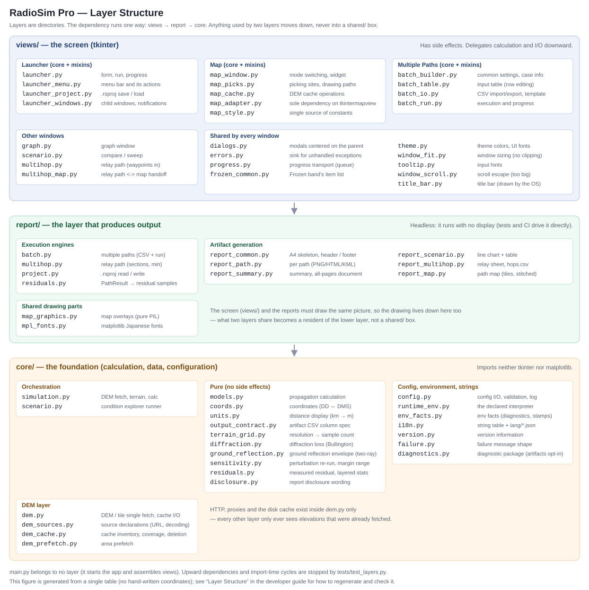

# RadioSim Pro 3.0

> **Intended reader**: developers who run it from source or work on the code.
> If you only want to know how to use the app, see [manual_en.md](manual_en.md).

A desktop simulator for screening radio link propagation characteristics before field surveys.
Automatically retrieves DEM (Digital Elevation Model) data from the Geospatial Information Authority of Japan (GSI) and visualizes terrain profiles, diffraction loss, vegetation attenuation, and link budgets in real time.

---

## Table of Contents

1. [Overview](#overview)
2. [Building the Windows Binary](#building-the-windows-binary)
3. [Requirements](#requirements)
4. [File Structure](#file-structure)
5. [Installation &amp; Launch (from source)](#installation--launch-from-source)
6. [Menus](#menus)
7. [Map](#map)
8. [Usage — Single Mode](#usage--single-mode)
9. [Usage — Multiple Paths](#usage--multiple-paths)
10. [Usage — Condition Explorer](#usage--condition-explorer-compare--sweep)
11. [Usage — Relay Path](#usage--relay-path)
12. [Input Parameters](#input-parameters)
13. [Calculation Models](#calculation-models)
14. [DEM Retrieval Logic](#dem-retrieval-logic)
15. [Save Package](#save-package)
16. [Project Files (.rsproj)](#project-files-rsproj)
17. [Architecture](#architecture)
18. [Development Environment](#development-environment)
19. [Testing](#testing)
20. [Known Limitations](#known-limitations)
21. [Copyright](#copyright)

---

## Overview

RadioSim Pro is a tool designed specifically for **pre-survey screening** in radio link design.
Enter the coordinates, antenna heights, and radio settings for the TX (transmitter) and RX (receiver) stations, and the tool automatically retrieves GSI elevation data, draws a terrain cross-section, and determines link budget viability within seconds.

### Key Features

#### Execution flows (four)

Also **the unit of class review** — when fixing a defect, always ask whether it applies to all four plus the map (five faces).

| Flow | Implementation | Source of truth for input |
| --- | --- | --- |
| **Single Mode** | `simulation.py` | The launcher's input fields |
| **Multiple Paths** | `batch.py` | The batch table (CSV I/O) |
| **Condition Explorer (compare / sweep)** | `scenario.py` | A pinned path plus a condition list. **One DEM fetch + N pure computations** (leaning on the pipeline being two-phase) |
| **Relay Path** | `multihop.py` | The waypoint list; sections are derived. Regenerative relay model, so **the overall verdict is the min** (the tightest section), reported alongside the per-section breakdown |

#### Map

- **Map** (`views/map_window.py`, a single app-wide instance, 4 modes): pick coordinates / place waypoints / continuously add paths into Multiple Paths / visualize, prefetch, and delete DEM cache

#### Calculation models (`models.py` — pure functions, zero side effects)

- Automatic terrain profile generation from GSI DEM PNG tiles (5 m / 10 m mesh)
- Earth curvature correction (standard atmosphere K = 4/3, fixed)
- Diffraction loss calculation using Bullington / Fresnel-Kirchhoff methods
- Vegetation attenuation (LoS intrusion depth model)
- Environmental loss (4 categories: Urban / Suburban / Rural / LoS)
- Rain attenuation (ITU-R P.838-3) and gaseous attenuation (ITU-R P.676-13 Annex 2)

#### Output and reports (`report_*.py` — all headless)

- **A4 reports (v2)**: per-path / summary in a print-ready A4 portrait frame (`@page A4` + Ctrl+P for zero-dependency PDF; self-identifying header/footer). ⚠️ **Only the per-path report is guaranteed to fit one page** — the ledger paginates (the per-path shrink-to-fit cannot be applied to it, as it cuts the table across a page break)
- **Antenna initial aim (AZ/EL)**: true azimuth/elevation to the far end, shown for both ends in per-path reports (geometry from existing data = initial values)
- Automatic path map in HTML reports (TX/RX, path, and distance overlaid on a map)
- **All-paths overview map** in the summary report (color-coded by verdict)
- **Everything concatenated**: `report_all.html` carries the summary plus every path (for relays, every section)
- Save results as a package (PNG / CSV / JSON / HTML / KML)

#### Reusing input

- **Project files (`.rsproj`)**: coordinates, all parameters, project info, batch rows, explorer conditions and the waypoint list bundled into one file (**never results, never app settings**)
- **Project info (name + free note)**: entered in the launcher and inherited by both Single and Multiple Paths reports

#### Interface

- Real-time antenna height and rain rate sliders in the graph window
- Switchable coordinate notation (DD / DMS; `coords.py` is pure)
- Japanese / English UI — switchable from the menu bar (`i18n.py` is the single source) — plus **user-supplied languages** (`lang/<code>.json`). `t()` has always fallen back to English per key, so an external table takes effect **only as far as it overrides**. ⛔ No plugin mechanism (one JSON shape, nothing else). ⚠️ **Artifact keys (`html_*` / `pl_*`) are not opened** — that would make the output contract vary per user. **A key whose placeholders (`{n}` …) differ from English is not applied, and the app says so at startup** (applying it would make `str.format` raise `KeyError` and take that screen down — nothing breaks silently)
- System-aware dark mode (Light / Dark / System auto)

### Accuracy Statement

The horizontal resolution of the DEM is 5–10 m, giving a practical accuracy of **±5–15 dB** for diffraction loss. ⚠️ **That range does not cover paths where several obstacles overlap** — the combined loss has not been checked against measurements or a reference implementation (described below).
This tool is intended solely for screening purposes — determining whether a field survey is necessary — and must not be used as the basis for final link design decisions.

---

## Building the Windows Binary

Uses PyInstaller to produce a self-contained EXE folder (onedir mode) that requires no Python installation on the target machine.

### Prerequisites

- Python 3.11 or later (developed and CI-tested on 3.14)
- **`RADIOSIM_PYTHON`** must point at the `python.exe` of the same virtual environment the tests run in (**required**). → [Development Environment](#development-environment)
- PyInstaller and all dependencies are installed at their pinned versions by `build.bat`

> **Why declare it instead of discovering it**: `build.bat` used to build with whatever Python was on `PATH`, so the binary shipped with transitive dependencies that differed from the ones pytest had verified — including the TLS CA bundle. Any search-or-fallback logic would make that mismatch succeed silently, so a missing `RADIOSIM_PYTHON` **stops the build**.

### Build Steps

```bat
build.bat
```

`build.bat` performs the following steps automatically:

| Step | Action |
| --- | --- |
| 1 | Validate `RADIOSIM_PYTHON` (abort if unset or missing) and report the Python version |
| 2 | Install pinned dependencies (`pip install -r requirements.txt -r requirements-dev.txt` — PyInstaller is pinned there too) |
| 3 | Remove old build artifacts (`build/RadioSimPro/` and `dist/RadioSimPro/` under the output root) |
| 4 | Run `python -m PyInstaller radiosim.spec --noconfirm --distpath … --workpath …` |
| 5 | **Check the bundle for missing imports** (`buildtools/check_bundle_imports.py`). **Aborts the build** if the exe excludes a module that bundled code imports unconditionally |
| 6 | Create `terrain_cache/` and `results/` in the output folder |

`build.bat clean` removes regenerable artifacts, caches, logs, and distribution zips.

- **Kept**: the virtual environment and the **repo-root** `terrain_cache/`, `results/`, `basemap_pale/` (data from source runs — expensive to refetch, or user-owned)
- **Removed**: everything under the build output root. ⚠️ **That includes the `terrain_cache/` and `results/` the built exe created next to itself** — they are part of the build output and a normal build recreates them anyway.

### Output

`dist/` next to the sources.

```
dist/
└── RadioSimPro/
    ├── RadioSimPro.exe   ← launch this
    ├── _internal/        ← Python runtime and dependencies
    ├── terrain_cache/
    └── results/
```

### Creating a Distribution Package

ZIP the `RadioSimPro/` folder from the build output:

```powershell
$dist = "dist"
# Put the version in the file name, so the asset is identifiable on the Releases page
# Read the version from version.py — do not copy it into this document (a copy goes stale on the next release)
$ver = (Select-String -Path core\version.py -Pattern 'APP_VERSION\s*=\s*"([^"]+)"').Matches[0].Groups[1].Value
Compress-Archive -Path "$dist\RadioSimPro" -DestinationPath "$dist\RadioSimPro-$ver.zip" -Force
```

> ⚠️ **Put the version in the ZIP name** — the published assets are named `RadioSimPro-<version>.zip` (for example `RadioSimPro-2.7.zip`). Building an unversioned name just means renaming it when attaching the release.

### Key `radiosim.spec` Settings

| Setting | Details |
| --- | --- |
| `icon.png` → `icon.ico` | Auto-converted at build time; skipped if `icon.png` is absent |
| EXE file properties | Auto-generated from `APP_VERSION` / `COPYRIGHT` in `version.py` |
| `console=False` | No console window shown to the user |
| UPX compression | Enabled only when UPX is installed |
| `docs/manual_*.md` / `docs/images/` / `logo.png` | Bundled into the binary; accessed via `sys._MEIPASS` |

### Troubleshooting

| Symptom | Fix |
| --- | --- |
| `ModuleNotFoundError` on launch | Remove the module from `excludes`, or add it to `hiddenimports` in `radiosim.spec`, then rebuild |
| Error messages not visible | Change `console=False` to `console=True` in `radiosim.spec` and rebuild |
| SmartScreen warning on target machine | Expected for unsigned executables — click "More info" → "Run anyway" |

---

## Requirements

| Item     | Requirement                                                   |
| -------- | ------------------------------------------------------------- |
| OS       | Windows 10/11 (macOS / Linux may work but are untested)       |
| Python   | 3.11 or later — required by pinned numpy 2.4 (tested on 3.14) |
| Internet | Required for DEM retrieval (fetched tiles are cached locally) |

### Dependencies

```
python -m pip install -r requirements.txt
```

**[`requirements.txt`](../requirements.txt) is the single source of versions** (pinned, so a source run gets what the binary ships). Installing by name leaves the versions floating and duplicates the table below.

| Library    | Purpose                                                                                     |
| ---------- | ------------------------------------------------------------------------------------------- |
| numpy      | Vector computation for terrain and propagation calculations                                 |
| matplotlib | Terrain profile graph and slider rendering                                                  |
| requests   | HTTP retrieval of GSI DEM tiles                                                             |
| Pillow     | PNG tile image decoding                                                                     |
| sv-ttk     | Windows 11-style UI theme                                                                   |
| darkdetect | System dark mode detection                                                                  |
| markdown   | Documentation viewer (optional — the app works without it)                                        |
| truststore | SSL certificate verification in corporate proxy environments (optional — works without it) |
| tkintermapview | Map window tile display (GSI pale map; the map feature degrades gracefully if absent) |

---

## File Structure

```
radiosim/
├── main.py               # Entry point (belongs to no layer — it just starts and wires the UI)
│
│   # Layers are directories. Dependencies run one way: views -> report -> core.
│   # Anything used by two layers goes to the lower one (no `shared/` catch-all).
│
├── core/                 # Foundation: calculation, data, config. Pulls neither tkinter nor matplotlib
│   ├── models.py         # Pure calculation logic (no side effects)
│   ├── diffraction.py    # Diffraction loss (Bullington edge + spherical-earth seat)
│   ├── simulation.py     # ViewModel / orchestrator
│   ├── config.py         # App config I/O, input validation, logging (minimal external deps)
│   ├── dem.py            # DEM/pale tile fetch, elevation decode, cache, proxy (external deps confined)
│   ├── dem_prefetch.py   # Area prefetch (bbox -> positions, priority descent, worker pool)
│   ├── terrain_grid.py   # DEM grid and terrain resolution (level -> sample count, pure functions)
│   ├── scenario.py       # Condition explorer runner (A-1 compare / A-2 sweep; phases; headless)
│   ├── coords.py         # Coordinate notation conversion (DD <-> DMS, pure functions)
│   ├── units.py          # Distance display formatting (internal km -> displayed m, pure functions)
│   ├── output_contract.py # Column spec of the artifact CSVs = single source of the output contract (pure data)
│   ├── disclosure.py     # Wording of the "Notes on handling this result" section in the reports (assumptions, scope notes, pure functions)
│   ├── runtime_env.py    # Runtime facts (frozen or not, bundle root, resolved write targets)
│   ├── i18n.py           # Multilingual string table + validation/loading of lang/*.json
│   ├── failure.py        # The shape of failure messages (what happened / what to do next / details)
│   └── version.py        # Version information
├── report/               # The layer that produces output: engines and artifacts (headless)
│   ├── batch.py          # Batch execution engine (CSV I/O, validation, run)
│   ├── multihop.py       # Relay path engine (A-3; waypoints to hops, min aggregation)
│   ├── project.py        # Project file (.rsproj) I/O — bundles the whole input set
│   ├── report_common.py  # Shared report parts (A4 skeleton CSS, header/footer, document shell; pure)
│   ├── report_path.py    # Per-path output generation (PNG/HTML/KML)
│   ├── report_summary.py # Batch summary output generation (CSV/HTML/KML, all-pages document)
│   ├── report_scenario.py # Condition explorer output (A4 line chart + table, CSV)
│   ├── report_multihop.py # Relay path output (route sheet + per-hop sheets, hops.csv)
│   ├── report_map.py     # Headless path-overlay map generation for reports
│   ├── map_graphics.py   # Pure-PIL map overlay drawing (shared by UI and reports)
│   └── mpl_fonts.py      # matplotlib Japanese font application (shared by graph/report)
├── views/                # Screens (tkinter)
│   ├── launcher.py       # Launcher window (core: input form, run, progress)
│   ├── launcher_menu.py  # Launcher menu bar and its actions (mixin)
│   ├── launcher_project.py # Project (.rsproj) collect / save / load (mixin)
│   ├── launcher_windows.py # Child windows and cross-window notifications (mixin)
│   ├── tooltip.py        # Input hint tooltip (standalone widget)
│   ├── graph.py          # Graph window (matplotlib + tkinter)
│   ├── map_window.py     # Map window (core: mode switching, map widget)
│   ├── map_picks.py      # Picking sites and drawing paths (mixin)
│   ├── map_cache.py      # DEM cache selection, download and overlay (mixin)
│   ├── map_style.py      # Single source of map drawing constants (colors, margins, zoom)
│   ├── dialogs.py        # Shared modal dialogs centered on the parent window
│   ├── errors.py         # Single sink that routes unhandled GUI exceptions to the log and a dialog
│   ├── progress.py       # Progress transport (worker thread -> main thread)
│   ├── theme.py          # Theme colors and UI fonts for plain tk widgets (sourced from sv_ttk)
│   ├── window_fit.py     # Single implementation of window size and position (clipping / off-screen guard)
│   ├── window_scroll.py  # Scroll escape for windows whose content is larger than the screen
│   ├── scenario.py       # Condition explorer window (compare / sweep)
│   ├── multihop.py       # Relay path window (waypoints are the input surface; hops are derived)
│   ├── multihop_map.py   # Relay path <-> map handoff (waypoint copy, append/move from the map; mixin)
│   ├── frozen_common.py  # Single source for what the frozen "common settings" band shows
│   ├── batch_builder.py  # Multiple Paths window (core: common settings, project info)
│   ├── batch_table.py    # Batch input table (add/duplicate/remove/reorder rows) (mixin)
│   ├── batch_io.py       # Batch CSV import/export and template (mixin)
│   └── batch_run.py      # Batch execution and progress (mixin)
├── docs/                 # Documentation (both developer- and user-facing; only README.md stays at the root)
│   ├── developer_ja.md   # Japanese developer documentation
│   ├── developer_en.md   # This file
│   ├── manual_ja.md      # Japanese user manual (bundled into the exe; opened by Help → Open Documentation)
│   ├── manual_en.md      # English user manual (same)
│   ├── glossary.md       # Glossary of on-screen terms, bilingual (enforced by tests/test_i18n_glossary.py)
│   ├── screenshots.md    # How to shoot the screenshots (coordinates, conditions, expected values)
│   └── images/           # Those screenshots and the figures (architecture_*.svg = the layer diagram); also bundled into the exe
├── README.md             # Repository entry point (the one read first on GitHub)
│
│   # Tests are listed by **name only** — the "Testing" table is the source of truth
│   # for what each one does (the same description must not live in two places).
│   # The exception is anything the table cannot list (files that are not `test_*.py`).
│
└── tests/
    ├── test_models.py
    ├── test_golden_links.py   # Regression corpus (golden link-budget values + purity invariants)
    ├── golden_corpus_gen.py  # Corpus generator (run manually; fetches real DEM)
    ├── test_simulation.py
    ├── test_config.py
    ├── test_dem.py
    ├── test_batch.py
    ├── test_report.py
    ├── test_scenario.py
    ├── test_multihop.py
    ├── test_project.py
    ├── test_report_map.py
    ├── test_map_window.py
    ├── test_coords.py
    ├── test_terrain_grid.py
    ├── test_units.py
    ├── test_version.py
    ├── test_output_contract.py
    ├── test_mpl_fonts.py
    ├── test_progress.py
    ├── test_runner_logging.py
    ├── test_theme.py
    ├── test_window_fit.py
    ├── test_errors.py
    ├── test_failure_messages.py
    ├── test_bundle_imports.py
    ├── test_ui_consistency.py
    ├── test_i18n_glossary.py
    ├── test_i18n_key_duplication.py
    ├── test_i18n_no_hardcoded_ui_text.py
    ├── test_i18n_external.py
    ├── test_layers.py
    ├── test_paths.py
    ├── test_write_locations.py
    ├── test_smoke.py
    ├── test_docs_consistency.py
    ├── test_env_consistency.py
    ├── test_repo_hygiene.py
    ├── test_dev_check.py
    ├── test_claude_hooks.py
    ├── test_codex_review_tool.py
    └── test_qa_gate_cache.py
```

---

## Installation & Launch (from source)

```bash
# Install dependencies (requirements.txt is the single source of versions —
# pinned so that a source run matches what ships in the binary)
python -m pip install -r requirements.txt

# For running the tests or building, add the development set
python -m pip install -r requirements-dev.txt

# Launch
cd radiosim
python main.py
```

The following directories are created automatically in the project root on first launch:

| Directory          | Contents                              |
| ------------------ | ------------------------------------- |
| `terrain_cache/` | Disk cache for DEM tiles              |
| `results/`       | Output destination for saved packages |

---

## Menus

Three menus — **File / Settings / Help** (built in `_build_menu`, [views/launcher_menu.py](../views/launcher_menu.py)). Labels come from the `i18n.py` dictionaries as the single source. Every item is listed below.

### File

Home for operations that **reach out of the app** (moved here from the launcher button row). ⚠️ Do not add buttons here — the button row already spends the FHD 100% (1080px screen) height budget and is a recurring source of clipping.

| Item                | Description                                                              |
| ------------------- | -------------------------------------------------------------------------- |
| Open Project...     | Loads a `.rsproj` and restores the whole input set → [Project Files (.rsproj)](#project-files-rsproj) |
| Save Project As...  | Writes the current input set to a `.rsproj` → same                        |
| Load Parameters...  | Imports **simulation parameters only** from a settings file              |
| Open Results Folder | Opens `results/` in Explorer                                             |

### Settings

Selections are persisted to `radiosim_conf.json`.

| Item                 | Options                     | Description                                                     |
| -------------------- | --------------------------- | ----------------------------------------------------------------- |
| Theme                | System / Light / Dark       | Window color theme                                                |
| Language             | English / 日本語            | UI language (requires restart)                                    |
| Export Translation Template... | —                 | Item inside the Language submenu. Writes every translatable key and its English value as JSON → [Adding your own UI language](../docs/manual_en.md#adding-your-own-ui-language) |
| Coordinate Display         | Decimal Degrees (DD) / Degrees Minutes Seconds (DMS) | How coordinates are **displayed** (`coords.py`) → below |
| Proxy Settings...    | URL entry                   | Explicit HTTP proxy URL (blank = OS proxy settings) → below       |
| Load App Settings... | —                           | Imports **only** theme, language and proxy from a settings file   |
| Delete All Cache...  | —                           | Deletes all downloaded DEM / map tiles (with confirmation)        |

### Help

| Item        | Description                          |
| ----------- | -------------------------------------- |
| Open Documentation | Opens this document in a browser       |
| About       | Shows the version from `version.py`    |

> **"Load Parameters" and "Load App Settings" are mutually exclusive in scope** — the former covers simulation parameters, the latter theme/language/proxy. **Neither writes the other's territory** (so opening someone else's file never flips your display language or network settings).

> **The Map is not in the menus** — it opens from the **"Map" button** at the bottom of the launcher (→ [Map](#map)).

### Coordinate Format (DD / DMS)

**A notation (display) setting, not an input mode.** `coords.parse_pair` accepts both DD and DMS leniently and everything is normalised to DD before the calculation (values reaching `simulation.SimParams` are always DD).

⚠️ Fields are reformatted in only three places — startup, notation switch, and settings/project load — **never on entry commit** (Enter / focus-out). So typing DD while DMS is selected leaves the text as typed: **not a fault**, but the screen gives no signal that the value was accepted (a known rough edge).

### Proxy Settings

If DEM tile retrieval requires an HTTP proxy (e.g. on a corporate network), open **Settings > Proxy Settings** and enter the proxy URL:

```
http://proxy.example.com:8080
```

- Changes take effect immediately — no restart required
- Leaving the field blank and clicking OK reverts to OS proxy settings (system settings / environment variables)
- `truststore` integration with the Windows certificate store is also active to handle corporate SSL inspection
- If the elevation server is entirely unreachable, the run **aborts on consecutive failures** and asks the user, instead of quietly finishing on flat terrain

---

## Map


The **"Map" button** in the launcher (`views/map_window.py`) opens an auxiliary window over the GSI pale map. The **map is a single app-wide instance owned by the launcher**, with a four-mode selector at the top (the batch window does not open its own map — the launcher is the main line and the batch is a subordinate sink). The core simulation works without the map; the map is a convenience layer. On opening it auto-zooms/centers to fit the path length of the current TX/RX.

**All four modes draw by one rule**: a **line, endpoint icons (TX = filled / RX = hollow / relay = diamond) and a horizontal-distance badge at the midpoint**. ⚠️ **Modes do not get their own look** (unified on 2026-08-14 after user feedback). Append mode used to draw RX as a bearing arrowhead — an exception that existed so TX and RX stayed distinguishable *at identical coordinates*, from the era when Multiple Paths doubled as a relay. The Relay Path window took that use over, and only the now-groundless exception was left as an inconsistency. ⚠️ Only Pick Coordinates mode prints the `TX`/`RX` text labels: elsewhere there are N paths, and a label on every endpoint fills the map with text (identification is carried by the path ID on the distance badge, and by waypoint names).

- **Pick Coordinates mode (default)**: click the map to fill **whichever site is still empty** (TX, then RX) and write it back to the launcher's TX / RX coordinate fields (the numeric fields are the source of truth). **Once both are set a plain click writes nothing** — from there you select a point and move it (below). Wired via `apply_map_pick` / `current_path_coords`, and edits to the fields (clearing, typing, loading a project) reach the map through `on_single_coords_changed` — the pick layer is a mirror of the numeric fields, like the other two layers. Without that notification, clearing a field left the marker on the map and the map kept believing both sites were set, so plain clicks stopped writing.
- **Append to Multiple Paths mode**: selecting it opens (or raises) the Multiple Paths window; each TX→RX pair placed on the map appends one batch row and auto-resets (no "add row" needed). RF (frequency, gains, antenna heights) is frozen from the launcher at the moment of adding. The distance badge of a committed path **carries its path ID**, so a path on the map can be traced back to its row in the batch. Path row edits (delete, edit-commit, import, etc.) reflect on the map in real time. Wired via `append_path` / `existing_paths` (plus `update_path_point` for moving an endpoint).
- **Add waypoints mode**: opened from the Relay Path window; every click appends one waypoint to the end of the list (this is not the alternating TX/RX pick). Draws a polyline through the waypoints plus a **horizontal-distance badge per section**. ⚠️ **That distance appears nowhere else on screen** — the section table holds frequency, gains and results but no distance, and the report carries the *slant* distance (a separate term in the glossary). The map is a copy and not the source of truth, so it is redrawn from the window's waypoint list every time. Wired via `append_waypoint` / `waypoint_markers` (plus `update_waypoint` for moving a point); implemented in `views/multihop_map.py`.
**Moving a point goes through a selection**: clicking a marker selects it (an amber ring, plus its name in the status bar), and **the next click on the map moves it there** (Esc cancels; a selection is spent by one move). ⛔ **Dragging is deliberately not used** — a plain drag is already the pan gesture, and taking it over would create the "I grabbed the map and a point moved" failure, i.e. input rewritten silently. One rule: **a plain click adds, a click after a selection edits**. ⚠️ **The marker must not be the only way in**: pan far enough and that single entry point sits off-screen, killing the whole re-placement flow. In Pick Coordinates and Append modes, **right-clicking the map** ("Place TX here" / "Place RX here") is an entry point that does not depend on where the marker is — you name the site, so nothing is rewritten silently. ⚠️ tkintermapview's own right-click menu (English, copy-coordinates) is **replaced**, not extended.

What the map hands back to a window is a **position in the copy** (the index within `existing_paths()` / `waypoint_markers()`), never the window's row number — rows with unreadable coordinates never make it into the copy. The window resolves that position by the same rule and **checks the name (path ID / waypoint name) before writing**, refusing the move when they disagree (the same "is this really that input?" check used when results are written back into a row). ⚠️ **When the move is smaller than the terrain mesh (5 m) the status bar says so**, because a finer nudge samples the same grid cell: the marker moves but the result does not.

- **Cache Management mode**: follows pan/zoom and shades cached areas by highest accuracy (green = 5 m LiDAR / yellow = 5 m photogrammetry / cyan = 10 m). Gestures: drag = pan / Ctrl + drag = download / Ctrl + Alt + drag = force re-download / Shift + Ctrl + drag = delete area, each with a confirmation dialog. Built on `dem_prefetch.prefetch_tiles` and related public APIs (moved out of `dem` in 3.0); tiles are never re-downloaded once present and readable. Clear everything via **Settings > Delete All Cache**.

---

## Usage — Single Mode


### 1. Launcher Window

An input form is displayed on startup.

#### Site Info

| Field                   | Description                                                   |
| ----------------------- | ------------------------------------------------------------- |
| TX Coords (Lat, Lon)    | TX station latitude and longitude (e.g.`34.5429, 132.4118`) |
| RX Coords (Lat, Lon)    | RX station latitude and longitude                             |
| TX Antenna Height (m)   | TX antenna height above ground                                |
| RX Antenna Height (m)   | RX antenna height above ground                                |

#### Radio Settings

| Field                    | Description                                  |
| ------------------------ | -------------------------------------------- |
| Frequency (MHz)          | Frequency (1–100,000 MHz)                   |
| TX Power (dBm)           | Transmit power                               |
| TX/RX Antenna Gain (dBi) | Antenna gain                                 |
| Sensitivity (dBm)        | Receiver sensitivity (minimum receive level) |

#### Environment

| Field                 | Description                                                                             |
| --------------------- | --------------------------------------------------------------------------------------- |
| Env Type              | Environment category (Urban / Suburban / Rural / LoS)                                   |
| Vegetation Height (m) | Average height of vegetation or buildings along the path                                |
| Rician K-Factor (initial) | LOS/scatter power ratio. Display only — does not affect link budget calculation (default = 10.0) |
| Terrain Resolution    | One of High ~4 m px / Medium ~8 m px / Low 20 m spacing. Note that the label names **the size of the pixel the samples are placed on**, not which elevation data is read: elevations always come from the finest layer available, whichever level you pick. The pixel is 3.3-4.4 m across Japan, hence the "~". **You pick the level; the app resolves the points.** "High" and "medium" place a sample at each edge of every DEM pixel the path crosses, so the samples are **not evenly spaced** and the count follows from the path's length, bearing and latitude ("low" alone keeps a 20 m even spacing and skips pixels by design). The resolved count and **the size of one pixel** are shown right below it. Default: Medium |

### 2. The "Run" Button (Single Mode)

Clicking the button runs data retrieval in two phases.

1. **DEM tile prefetch**: All tiles within the TX/RX bounding box are downloaded to the disk cache (up to 8 threads). Already-cached tiles are skipped, so subsequent runs complete instantly.
2. **Terrain elevation fetch**: Elevation is retrieved in parallel for each sample point (up to 8 threads). If the same TX/RX coordinates and sample count were used previously, cached data is loaded instantly.

### 3. Graph Window

After retrieval completes, the terrain cross-section graph is displayed.

#### Reading the Graph

| Element             | Description                                              |
| ------------------- | -------------------------------------------------------- |
| Brown fill          | Terrain (with earth curvature correction applied)        |
| Green fill          | Vegetation layer (terrain elevation + vegetation height) |
| Red dashed line     | Line of Sight (LoS)                                      |
| Cyan band           | 1st Fresnel Zone                                         |
| Black vertical bars | TX / RX antennas                                         |

#### Sliders

| Slider    | Range       | Description                           |
| --------- | ----------- | ------------------------------------- |
| TX Height | 0–150 m    | Adjust TX antenna height in real time |
| RX Height | 0–150 m    | Adjust RX antenna height in real time |
| Rain Rate | 0–100 mm/h | Adjust rain rate in real time         |

Moving a slider triggers automatic recalculation after a 50 ms debounce delay.

#### The "SAVE PACKAGE" Button

Saves the current display state to `results/YYYYMMDD_HHMMSS/` (see [Save Package](#save-package)).

### 4. Saving and Loading Settings

- Input values are automatically saved to `radiosim_conf.json` each time Single Mode is run
- **Load Settings**: Loads a previous `settings.json` and restores it to the input form
- **Open Results**: Opens the `results/` folder in Explorer

---

## Usage — Multiple Paths


Click the **Multiple Paths** button in the launcher to open the dedicated window.

### Design: refine in Single, finalize in Multiple Paths

**Single (the launcher) is where you refine conditions; Multiple Paths is where you produce deliverables from finalized conditions.** The launcher is the single source of truth, and each batch row is a **finalized link frozen by copying the launcher fields at the moment the row is added**.

### Input Methods

**Manual entry**: Type IDs, coordinates, antenna heights, frequencies, and TX/RX gains directly into the table. Rows can be added, deleted, reordered by drag and drop, and cells edited in place.

The **Dist(m)** column on the right is read-only and is computed from the TX/RX coordinates (refreshed whenever coordinates are committed). A mistyped coordinate shows up as an absurd distance, so the error is visible before you run the batch.

- **+ Add Row**: adds a row frozen from the current launcher fields (coordinates, frequency, gains, antenna heights).
- **Right-click a row**: opens the per-row menu.
  - **→ Send to Single**: loads that row's coordinates + RF into the launcher for adjustment.
  - **⟳ Update RF from Launcher**: writes the launcher's current RF back into that row (**coordinates are preserved**).
  - Duplicate / Delete.

**CSV import**: Click the Template button to save a sample CSV, edit it, then import.

#### CSV Format

Required columns: `id, start, end, h_tx, h_rx`

Optional columns: `freq, gain_tx, gain_rx, note`

```csv
id,start,end,h_tx,h_rx,freq,gain_tx,gain_rx,note
path01,"34.54, 132.41","34.53, 132.40",30.0,10.0,2400,12.5,8.0,Main link
path02,"34.55, 132.42","34.52, 132.39",20.0,15.0,,,,Sub link
```

- `start` / `end` must be quoted because they contain a comma
- `freq` / `gain_tx` / `gain_rx` fall back to the Common Settings value when omitted (they are **per-link identifying attributes** that may differ per path). Env type, rain rate, and diffraction model are set globally in Common Settings and apply to all paths
- Legacy CSVs without `gain_tx` / `gain_rx` columns still load (backward compatible; gains inherit Common Settings)
- Column names are **case-insensitive and ignore surrounding spaces** (`ID,Start,…` loads fine). `id` values must be unique **case-insensitively** (`p01` and `P01` would map to the same output folder, so they are rejected as duplicates)

### Common Settings (a snapshot of the launcher)

The **Common Settings** panel at the top defines default values used whenever a per-path override is not specified. It is **read-only** — a snapshot of the launcher (the source of truth). Use the **↻ From Launcher** button to pull in the launcher's current values.

### Running and Results

Click **Run** to process paths sequentially. The bar shows progress (done / total), and **each verdict is returned to the row that produced it**.

On completion, the following are saved to `results/batch_YYYYMMDD_HHMMSS/`:

| File                         | Contents                                                         |
| ---------------------------- | ---------------------------------------------------------------- |
| `summary.html`             | Summary report for all paths (with graph thumbnails)             |
| `summary.csv`              | Numerical results for all paths (spreadsheet-compatible)         |
| `summary.kml`              | Google Earth KML with OK / NG / Error color coding               |
| `report_all.html`          | Summary + every path in one document (Ctrl+P prints them all)    |
| `{id}/report.html`         | Per-path detailed report (terrain graph + path map embedded)     |
| `{id}/profile.png`         | Terrain cross-section graph                                      |
| `{id}/path.kml`            | 3D KML with terrain, LoS, Fresnel zone, and obstruction segments |
| `{id}/settings.json`       | Per-path input parameters                                        |
| `{id}/terrain_profile.csv` | Terrain profile data                                             |
| `{id}/report.txt`          | Text-format link budget report                                   |

---

## Usage — Condition Explorer (Compare / Sweep)


Open it with the **Condition Explorer** button in the launcher (`views/scenario.py`). It **takes one fixed path and digs into it under different conditions**; the computation lives in `core/scenario.py`. For the step-by-step operation see [manual_en.md](manual_en.md) — what follows is the implementation side.

- **Terrain is fetched once.** `run_scenario()` walks FETCH → CALC (→ RENDER), and the fetch happens once at the front. `_fetch_sync()` goes through `fetch_elevations_cached()`, so re-running the same path with different conditions never re-downloads DEM — which is exactly how this screen is used.
- **A condition is a delta.** `Condition` is an override dict on top of the base params, and `scenario.OVERRIDABLE` is the single source of what may be overridden. **Coordinates and terrain resolution are not in it** (comparing paths themselves is what Multiple Paths is for). Compare mode allows up to `MAX_COMPARE_CONDITIONS` columns.
- **Compare and sweep share one computation path.** A sweep is turned into conditions first: `linspace_values()` → `sweep_conditions(axis, values)` → `evaluate()`. Axes are `SWEEP_AXES`, point count is capped by `MAX_SWEEP_POINTS`. **Only the input construction branches**; evaluation and the result types (`ScenarioRun` / `ScenarioPoint`) are single.
- **Progress is declared as phases.** `Phase` / `Phases` (`FETCH`, `CALC`, `RENDER`) carry relative weights, and report generation runs inside the worker thread as the RENDER phase via `artifacts`. **Do not generate reports in the View after completion** — it freezes the GUI and that time never shows up in the progress bar (a defect this project has shipped twice).
- **Validation precedes the fetch.** `validate_base()` rejects bad base values before any download (failing after the fetch throws away the user's wait). Conditions validate themselves in `Condition`.
- **The window's own values are canonical.** Launcher values are frozen when the window opens and are **only pulled in when ↻ is pressed** — every window computes with the values you can see.

---

## Usage — Relay Path


Open it with the **Relay Path** button in the launcher (`views/multihop.py`). It assumes **regenerative relaying** (receive, then transmit again), so each section gets its own independent link budget. The model and the runner live in `report/multihop.py`.

- **A route is a point list plus a connection rule.** `MultiHopPath` holds `Waypoint`s and a per-section `HopRF`; sections are derived by `links(path)` so the meaning of the ordering is not re-spelled at every call site. **Height belongs to the waypoint only** — a relay has one antenna, so there is deliberately no way to give "RX height of the previous section" and "TX height of the next" different values. The cap is `MAX_HOPS`.
- **Topology is declared in one place.** `TOPOLOGIES` lists chain and star, but **only `SUPPORTED_TOPOLOGIES` may actually run**; the read, write and run layers all consult that one tuple, and `require_runnable()` is the gate. The aggregates (`ok` / `worst` / `overall_margin`) carry **chain semantics**, so for anything else they refuse rather than quietly return a number (a min over a star means nothing).
- **The runner reuses batch.** `hop_rows(path)` lowers sections into `batch.PathRow`, and `run_multihop()` takes the same callback shape as `batch.run_batch()` (same `ProgressPump` usage). ⚠️ **One section = one DEM fetch**, so download volume scales with section count (adjacent sections share an endpoint, so tile caching does help).
- **`batch.PathResult.status` is the single source of the verdict.** Not only a section whose computation failed but also **a section whose artifacts are missing** drops out of OK. The overall verdict is the tightest section — **losses are never summed**.
- **`overall_display()` owns the wording of the summary card.** The same number is labelled "overall margin (smallest headroom)" when OK and "largest shortfall" when NG (sign flipped). Screen and report both take the wording from that one function.
- **`overall_status()` owns the overall state word.** It returns the same **three values** a section does (`OK` / `NG` / `ERROR`), and it is `ERROR` whenever any section is. ⛔ Do not build the word out of the `run.ok` boolean — `ok` can only answer "did the chain close", so "could not be judged" collapses into "did not close" and the screen summary and the report card end up contradicting the section table and the ERR count inside the same deliverable (which is exactly how they were broken). Judge with `ok`; show `overall_status()`.
- **Inserting and deleting a waypoint are each other's inverse.** The `＋` on a row inserts "the section **leaving** that point" as blank; the `×` drops the same section. Section variables are **reused by position**, so moving waypoints alone shifts the frequency and gains after the edit by one — **the screen still looks natural while a different section's settings are used for the computation**. A round trip (insert, then delete at the same position) is required by test to return exactly to the previous state.
- **Relay points are meant to be placed, not dragged around to explore.** Moving one triggers a fresh fetch; sweeping heights or conditions is the Condition Explorer's job.

---

## Input Parameters

### Validation Ranges

| Parameter         | Min                            | Max     | Unit   |
| ----------------- | ------------------------------ | ------- | ------ |
| Frequency         | 1                              | 100,000 | MHz    |
| TX Power          | -30                            | 60      | dBm    |
| TX/RX Gain        | 0                              | 60      | dBi    |
| Sensitivity       | -130                           | -20     | dBm    |
| TX/RX Height      | 0                              | 500     | m      |
| Vegetation Height | 0                              | 100     | m      |
| Rician K-Factor   | 0                              | 30      | —     |
| Terrain Resolution | High / Medium / Low           | —       | —      |
| Rain Rate         | 0                              | 200     | mm/h   |
| Env Type          | Urban / Suburban / Rural / LoS | —      |        |
| Diff Method       | bullington / single            | —      |        |

---

## Calculation Models

### Earth Curvature Correction

Radio waves are refracted by the atmosphere and bend more than the Earth's curvature alone. This is modeled using the effective Earth radius factor K. This tool uses the standard atmosphere value (K = 4/3 ≈ 1.333) as a fixed internal constant.

```
Effective Earth radius  Re = R_earth × K  (K = 4/3, fixed)
Curvature correction   Δh(d) = d × (D - d) / (2 × Re)  [m]
```

| K value      | Meaning                                     |
| ------------ | ------------------------------------------- |
| 4/3 ≈ 1.333 | Standard atmosphere (value used by this tool) |
| K > 4/3      | Atmospheric duct (waves bend more strongly) |
| K < 4/3      | Sub-refractive conditions                   |

### Fresnel Zone

The 1st Fresnel zone radius (ITU-R P.526):

```
r₁(d) = √(λ × d₁ × d₂ / (d₁ + d₂))
```

When the 1st Fresnel zone is obstructed by terrain or vegetation, diffraction loss occurs.

### Diffraction Loss

#### Bullington Method (default, ITU-R P.526 4.5.1)

Replaces several obstacles with a single **equivalent knife edge**: two tangent lines are drawn from each end to the terrain point of maximum elevation angle, and their intersection becomes the obstacle. The standard correction term `(1 - exp(-Luc/6)) x (10 + 0.02 x d[km])` is then applied.

🔑 **Version 3.0 replaced the previous custom Deygout implementation with this** (history under Known Limitations). The reason was not accuracy but **continuity**: the old implementation counted obstacles, so **changing vegetation height or antenna height by 1 m could change the count and move the result by 84 dB** (raising an antenna by 1 m made the link 84 dB worse). The equivalent edge moves continuously as the terrain moves, so that jump cannot occur by construction.

⚠️ **This does not claim compliance with ITU-R P.526 or P.452.** Only this one method from P.526 4.5.1 is implemented; the **spherical-earth term** added by the full method of P.452 4.2.1 (Delta-Bullington), clutter, and ducting are not included.

#### Fresnel-Kirchhoff Loss J(ν)

```
J(ν) = 6.9 + 20 × log₁₀(√((ν - 0.1)² + 1) + ν - 0.1)  [dB]  (ν > -0.8)
J(ν) = 0                                                          (ν ≤ -0.8)
```

#### Single Method

Applies J(ν) only to the maximum ν across all sample points. Fast, but it does not represent the combined loss of multiple ridges.

### Vegetation Attenuation

```
Intrusion depth(d) = clip(veg_top(d) - LoS(d), 0, vegetation height)
Weight(d)          = clip(intrusion depth / r₁(d), 0, 1)
Effective length   = Σ[weight(d)] × sample spacing
Veg Loss           = min(effective length × coeff, 45 dB)
```

> ⚠️ **The intrusion depth is capped at the vegetation height.** The thickness of vegetation the
> signal can pass through is at most the canopy height; anything beyond that is the ground itself
> blocking the line of sight, which the diffraction loss already accounts for.
> **A vegetation height of 0 m therefore always yields 0 dB** (corrected in 3.0).

| Frequency band | coeff         |
| -------------- | ------------- |
| Below 1 GHz    | 0.12 × f^0.5 |
| 1–6 GHz       | 0.20 × f^0.7 |
| Above 6 GHz    | 0.35 × f^0.9 |

### Environmental Loss

```
Env Loss = base + slant_dist × dist_c
```

> ⚠️ **Shadowing-derived quantities (F1 obstruction ratio, diffraction loss) are not included.**
> Terrain blocking the line of sight is already expressed by the diffraction loss; folding it into
> the environmental loss as well would double-count it (removed in 3.0).

| Environment | base | dist_c | min | max  |
| ----------- | ---- | ------ | --- | ---- |
| Urban       | 10.0 | 1.20   | 6.0 | 30.0 |
| Suburban    | 6.0  | 0.80   | 3.0 | 30.0 |
| Rural       | 4.0  | 0.50   | 2.0 | 25.0 |
| LoS         | 2.0  | 0.30   | 1.0 | 15.0 |

### Rain Attenuation (ITU-R P.838-3)

```
γ_R = k × R^α  [dB/km]
Rain Loss = γ_R × d_slant
```

Rain sensitivity at 2.4 GHz is very low (≈ 0.1 dB/km at 100 mm/h). Practical impact begins above 10 GHz.

### Gaseous Attenuation (ITU-R P.676-13 Annex 2)

```
γ_total = γ_O₂ + γ_H₂O  [dB/km]
Gas Loss = γ_total × d_slant
```

### Link Budget

```
EIRP       = P_tx + G_tx                             [dBm]
FSPL       = 20×log₁₀(d) + 20×log₁₀(f) - 147.55   [dB]
Total Loss = FSPL + Diff + Veg + Env + Rain + Gas   [dB]
P_rx       = EIRP + G_rx - Total Loss               [dBm]
Act Margin = P_rx - Sensitivity                     [dB]
Status     = OK (≥ 0 dB) / NG (< 0 dB)
```

---

## DEM Retrieval Logic

### Data Sources

| Layer ID      | Resolution           | Zoom | Coverage                      |
| ------------- | -------------------- | ---- | ----------------------------- |
| `dem5a_png` | 5 m (airborne LiDAR) | 15   | Urban areas, mountain regions |
| `dem5b_png` | 5 m (photogrammetry) | 15   | Wider coverage than dem5a     |
| `dem_png`   | 10 m (base map)      | 14   | Nationwide                    |

Layers are tried in order: `dem5a_png` → `dem5b_png` → `dem_png`. If a higher-priority layer returns 404 or a missing-data pixel `(128, 0, 0)`, the next layer is used.

### Caching Strategy

- **Tile prefetch**: At simulation start, all tiles within the TX/RX bounding box are pre-downloaded to the disk cache (supports offline use and speeds up batch processing)
- **Memory cache**: Tiles stored in process memory (key: `(layer_id, xtile, ytile)`)
- **Disk cache**: Tiles saved to `terrain_cache/{layer_id}/{xtile}/{ytile}.png`, persists across sessions
- **Terrain cache**: If TX/RX coordinates and sample count match a previous run, DEM retrieval is skipped entirely

---

## Save Package

### Single Mode

Saves to `results/YYYYMMDD_HHMMSS/`:

| File                    | Contents                                                 |
| ----------------------- | -------------------------------------------------------- |
| `profile.png`         | Terrain cross-section graph (150 dpi)                    |
| `report.html`         | Detailed report with the terrain graph and a path map embedded |
| `path.kml`            | 3D KML for Google Earth                                  |
| `settings.json`       | Complete input parameters (reloadable via File > Load Parameters) |
| `terrain_profile.csv` | Terrain profile data                                     |
| `report.txt`          | Text-format link budget report                           |

### Multiple Paths

Saves to `results/batch_YYYYMMDD_HHMMSS/`:

| File             | Contents                                         |
| ---------------- | ------------------------------------------------ |
| `summary.html` | All-path summary with thumbnails                 |
| `summary.csv`  | Numerical results for all paths                  |
| `summary.kml`  | Google Earth KML for all paths                   |
| `report_all.html` | Summary + every path in one printable document |

### Condition Explorer (compare / sweep)

Saves to `results/scenario_YYYYMMDD_HHMMSS/`:

| File              | Contents                                                     |
| ----------------- | ------------------------------------------------------------ |
| `scenario.html` | Single-page A4 (compare = difference table with in-cell deltas / sweep = chart + table) |
| `scenario.csv`  | Numbers for every condition / point (machine-readable)        |
| `{id}/`        | Per-path package (same structure as Single Mode) |

### Relay Path

Saves to `results/multihop_YYYYMMDD_HHMMSS/`:

| File | Contents |
| --- | --- |
| `route.html` | Combined sheet (overall verdict = min, per-section breakdown, overview map) |
| `report_all.html` | Combined sheet + every section in one printable document |
| `hops.csv` | **One row per section** (a separate contract from the batch `summary.csv`; the file name and column names stay `hop*`) |
| `{id}/` | Per-section package (same structure as Single Mode) |


### Output column specification (the output contract) and its change policy

Spreadsheet formulas and roll-up scripts reference **column names and their order directly**. RadioSim therefore treats the **file name, column names, column order and value format of every machine-readable artifact as a contract**, governed by the following policy (written down in 3.0).

- **New columns are appended at the end only.** Existing columns never move (some readers address them by position).
- **Removing, renaming or redefining a column is announced one version ahead.** The announcement goes into both the CHANGELOG and this document (one alone does not reach a reader who only has the binary).
- **The value format (unit, decimals, clamping) is part of the contract too.** When a unit changes, the column name changes with it (e.g. `slant_km` → `slant_m` in 2.5), so an old formula fails loudly instead of reading the wrong number.
- **The file name is part of the contract.** When "what one row means" changes, we add a **new file** rather than new columns (e.g. the relay path writes `hops.csv` instead of pushing per-section columns into `summary.csv`).

⚠️ **This policy is not a promise never to change anything** — it is the road a change has to travel.

⚠️ **Free-text columns (`note` / `error` / `label`) are prefixed with `'` when the value starts with `=` `+` `@` and similar**, so spreadsheets do not evaluate them as formulas. Values that read as numbers (a negative margin, for instance) are written as they are.

#### `summary.csv` (Multiple Paths — **one row per path**)

| Column | Unit | Meaning |
| --- | --- | --- |
| `id` | — | Path ID (the `id` of the input CSV) |
| `status` | — | Status (`OK` / `NG` / `ERROR`) |
| `freq_mhz` | MHz | Frequency |
| `gain_tx_dbi` | dBi | TX antenna gain |
| `gain_rx_dbi` | dBi | RX antenna gain |
| `h_tx` | m | TX antenna height |
| `h_rx` | m | RX antenna height |
| `rx_dbm` | dBm | RX level |
| `margin_db` | dB | Margin (RX level − threshold) |
| `fspl_db` | dB | Free-space path loss |
| `diff_db` | dB | Diffraction loss |
| `veg_db` | dB | Vegetation attenuation |
| `env_db` | dB | Environmental loss |
| `rain_db` | dB | Rain attenuation |
| `gas_db` | dB | Gaseous attenuation |
| `total_loss_db` | dB | Total loss |
| `slant_m` | m | Slant distance (integer) |
| `f1_pct` | % | F1 obstruction (**clamped at 100%**) |
| `note` | — | The note from the input CSV (free text) |
| `error` | — | Why it failed; empty for a path that succeeded |
| `f1_depth_x` | ×F1 | F1 intrusion depth — how many F1 radii the obstruction reaches into the zone (**not capped**). When `f1_pct` reads 100, `1.00` means *exactly* full obstruction while `2.50` means it reaches 2.5 F1 radii past the line of sight |
| `samples` | points | How many terrain samples were taken for this link. It is **derived per row** from the resolution level and the path, so it differs from row to row within one CSV. Note that the samples are **not evenly spaced** ("high" and "medium" place them on DEM pixel edges), so **no spacing can be derived from this count**; the pixel size that actually applies is stated in the report's handling notes |
| `horiz_m` | m | Horizontal distance between the two ends (integer). `slant_m` includes the antenna-height and elevation difference, so use this — not `slant_m` — for effective spacing (`horiz_m ÷ (samples − 1)` is still only an approximation for resolution levels whose samples are not evenly spaced) |

⚠️ **A row may carry numbers even when `status` is `ERROR`** — the calculation went through and only the artifacts (graph, report) failed to be written. The `error` column says what is missing.

#### `hops.csv` (Relay Path — **one row per section**, N rows per path)

| Column | Unit | Meaning |
| --- | --- | --- |
| `group_id` | — | Path ID (the same value on every section of that path) |
| `hop_index` | — | Section number (starts at 1) |
| `hop_id` | — | Section ID |
| `from` | — | Name of the waypoint the section starts at |
| `to` | — | Name of the waypoint the section ends at |
| `status` | — | Status of the section (`OK` / `NG` / `ERROR`) |
| `freq_mhz` | MHz | Frequency |
| `gain_tx_dbi` | dBi | TX antenna gain |
| `gain_rx_dbi` | dBi | RX antenna gain |
| `h_tx` | m | TX antenna height |
| `h_rx` | m | RX antenna height |
| `rx_dbm` | dBm | RX level |
| `margin_db` | dB | Margin |
| `slant_m` | m | Slant distance (integer) |
| `f1_pct` | % | F1 obstruction (**clamped at 100%**) |
| `error` | — | Why it failed; empty for a section that succeeded |
| `f1_depth_x` | ×F1 | F1 intrusion depth — how many F1 radii the obstruction reaches into the zone (**not capped**). When `f1_pct` reads 100, `1.00` means *exactly* full obstruction while `2.50` means it reaches 2.5 F1 radii past the line of sight |
| `samples` | points | How many terrain samples were taken for this section. It is **derived per section** from the resolution level and the section length, so it differs between sections of one route |

⚠️ **Losses are never chained across sections** (a regenerative relay receives and transmits anew). The overall status is that of the section with the smallest margin, and it is **ERR whenever any section could not be judged (ERR)**.

#### `scenario.csv` (Condition Explorer — **one row per condition**, one per point in a sweep)

| Column | Unit | Meaning |
| --- | --- | --- |
| `label` | — | Condition name (the axis value in a sweep) |
| `axis_value` | — | The condition name in compare mode (same value as `label`), or the axis value in a sweep |
| `status` | — | Status (`OK` / `NG` / `ERROR`) |
| `rx_dbm` | dBm | RX level |
| `margin_db` | dB | Margin |
| `total_loss_db` | dB | Total loss |
| `fspl_db` | dB | Free-space path loss |
| `diff_db` | dB | Diffraction loss |
| `veg_db` | dB | Vegetation attenuation |
| `env_db` | dB | Environmental loss |
| `rain_db` | dB | Rain attenuation |
| `gas_db` | dB | Gaseous attenuation |
| `f1_pct` | % | F1 obstruction (**clamped at 100%**) |
| `slant_m` | m | Slant distance (integer) |
| `freq_mhz` | MHz | Frequency used for this condition |
| `p_tx_dbm` | dBm | TX power |
| `gain_tx_dbi` | dBi | TX antenna gain |
| `gain_rx_dbi` | dBi | RX antenna gain |
| `sens_dbm` | dBm | Threshold |
| `h_tx` | m | TX antenna height |
| `h_rx` | m | RX antenna height |
| `veg_h` | m | Vegetation height |
| `rain_mmh` | mm/h | Rain rate |
| `env_type` | — | Env type |
| `diff_method` | — | Diffraction model |
| `f1_depth_x` | ×F1 | F1 intrusion depth — how many F1 radii the obstruction reaches into the zone (**not capped**). When `f1_pct` reads 100, `1.00` means *exactly* full obstruction while `2.50` means it reaches 2.5 F1 radii past the line of sight |
| `axis` | — | Name of the sweep axis (e.g. `freq_mhz`); empty in compare mode |

⚠️ Sweeping `freq_mhz` / `h_tx` / `h_rx` / `veg_h` still puts a same-named fixed column (e.g. `freq_mhz`) alongside `axis_value` — they mean different things: `axis_value` is the value being swept, while the fixed column is **the actual value used for every parameter in that row**.

#### `terrain_profile.csv` (Single Mode — **one row per terrain sample**)

| Column | Unit | Meaning |
| --- | --- | --- |
| `Distance_m` | m | Horizontal distance from the TX site (0.1 m resolution) |
| `Elevation_m` | m | Elevation, raw — before the earth-curvature correction (0.01 m resolution) |

⚠️ **The row count is exactly the number of terrain samples taken for that run** (derived from the resolution level and the path).

⚠️ **"High" and "medium" produce a staircase.** Elevation is constant inside one DEM pixel, so each pixel the path crosses contributes **two rows — where the path enters it and where it leaves**. Distances are written at 0.1 m resolution, so **two neighbouring rows can show the same distance** (a different elevation on the second one is the pixel boundary). "Low" stays evenly spaced.

---

## Project Files (.rsproj)

A single JSON file that bundles **the whole input set**. Read and written from **File → Open Project / Save Project** in the launcher (implemented in [`project.py`](../report/project.py) — headless, never imports tkinter).

### What it bundles

| Section | Contents |
| --- | --- |
| `meta` | Project name and free note |
| `params` | Launcher sim parameters (coordinates always DD) |
| `batch` | Batch rows, keyed by `PathRow` attribute names (not CSV column names) |
| `scenario` | Explorer conditions, **kept as the on-screen strings** |
| `multihop` | Relay waypoints and per-section RF |

**Never included**: results (that is what `results/` is for), app settings (theme / language / proxy), window geometry or open/closed state. App settings are excluded so that opening someone else's project cannot silently switch your language or proxy — both the reader and the writer go through `config.select_sim`.

### Compatibility rules

- `schema_version` is **a single integer for the whole document** (no per-section versions).
- **Unknown keys are ignored, missing keys fall back to defaults, and a newer version is rejected** (the same style as `config.load_config`).
- `app_version` / `saved_at` are provenance stamps and are **never used to decide how to read the file**.
- **A missing section means "this window's state is unknown"**, not "the window is empty". The reader leaves it alone and the writer carries the previous value forward, so closing the batch window never produces a saved file with the rows deleted.
- Values that are not readable numbers (NaN / Inf) are never written: that section is skipped and the UI says so, rather than emitting non-standard JSON.

### How loading works

Loading closes the open windows (batch / explorer / relay path) after asking for confirmation, then they pick the new state up when reopened. This matches the app-wide rule that a window freezes its inputs when it opens, so no window needs a separate injection path.

---

## Architecture

### Layer Structure



<!-- The figure itself is docs/images/architecture_en.svg (Japanese: architecture_ja.svg).
     Add a module, add it to the figure too: tests/test_docs_consistency.py reads the
     text inside the SVG to check the listing (so the figure cannot go stale on its own). -->

---

## Development Environment

Dependencies are declared in **two files**:

| File | Contents | Ships in the binary? |
| --- | --- | --- |
| `requirements.txt` | Runtime dependencies (numpy / matplotlib / requests …) | **Yes** |
| `requirements-dev.txt` | Testing, static analysis, packaging (pytest / pytest-cov / pyright / ruff / bandit / PyInstaller) | **No** |

They are separate because mixing development tooling into the runtime dependency list risks bundling it into the EXE. **Both are pinned** — the PyInstaller pin matters most, since it decides the bootloader inside the shipped binary; leaving it unpinned means the release was built by whatever version was newest that day.

```bat
rem 1. Create the virtual environment (preferably outside any cloud-synced folder:
rem    a venv bakes in absolute paths, so syncing it is useless on another machine)
python -m venv D:\dev\radiosim\venv

rem 2. Install both dependency sets at their pinned versions
D:\dev\radiosim\venv\Scripts\python.exe -m pip install -r requirements.txt -r requirements-dev.txt

rem 3. Declare that interpreter as the single environment used for both
rem    verification and builds (reopen the shell afterwards)
setx RADIOSIM_PYTHON D:\dev\radiosim\venv\Scripts\python.exe
```

`tests/test_env_consistency.py` verifies that the versions actually installed in the interpreter running pytest match the pins in `requirements.txt`, so drift fails the suite the moment it appears.

Once declared, **launch the app with that interpreter too**:

```powershell
& "$env:RADIOSIM_PYTHON" main.py
```

Launching with a different interpreter logs a warning (to the log file and stderr) and **continues** — it does not stop. Two interpreters can share the same Python version while differing in library versions, so "it started" is not evidence that the environment matches. The warning never appears where the variable is not declared, including the packaged executable.

## Testing

**Run tests with the declared interpreter (`RADIOSIM_PYTHON`).**

```powershell
& "$env:RADIOSIM_PYTHON" -m pytest tests/ -v
& "$env:RADIOSIM_PYTHON" -m pytest tests/ --cov
```

> ⚠️ **Do not use a bare `python -m pytest`.** A different interpreter drifts from
> the pins in `requirements.txt`, so **the versions you verified stop matching the
> ones that go into the exe** (`build.bat` always builds with the declared
> interpreter). If `RADIOSIM_PYTHON` is set and you start pytest with another
> Python, `tests/conftest.py` stops the run and explains why. **Nothing happens
> where the variable is unset** (CI, a fresh clone), so `python -m pytest` is fine there.

> 🖥 **Declare `RADIOSIM_HEADLESS=1` where there is no display.** GUI tests stop
> when Tk cannot start: **with the declaration they skip, without it they fail.**
> Skipping on a machine that does have a display turns a run in which *no GUI
> wiring was checked at all* into a green one (observed 2026-08-07: 106 of 112
> tests skipped, exit code 0). A full run also **fails when more than 25% of the
> tests skip**, whatever the reason.

### One command for post-change verification (`dev-check`)

`bandit` and `git diff --check` are needed alongside `pytest`, so there is a single
entry point that runs them together.

```powershell
# Before committing (the real thing) — everything, with the same coverage gate as CI
& "$env:RADIOSIM_PYTHON" buildtools/dev_check.py

# While iterating — state the scope explicitly
& "$env:RADIOSIM_PYTHON" buildtools/dev_check.py --tests tests/test_multihop.py
```

- **`ruff` and `pyright` are not run here.** `pytest` already runs both from inside
  `tests/test_repo_hygiene.py`, so invoking them again would run the same checks
  twice and split the target list across two places.
- **`tests/test_repo_hygiene.py` is always added, even to a narrowed scope** — the
  static analysis lives there, so dropping it means *going green without running a
  single static check*.
- **Changed files are only ever read to ADD gates, never to remove them** (touching
  `docs/` adds `test_docs_consistency.py`). Guessing which tests are "related" and
  dropping the rest creates a path that silently falls out of the run.
- **The coverage gate applies to full runs only.** On a partial run the layers you
  did not exercise count as 0%, so it would fail every time.
- Output is **one line per check plus an excerpt of whatever failed**. Use
  `--full-output` for the raw text.

### Test Suite

| File                       | Coverage                                                                        |
| -------------------------- | ------------------------------------------------------------------------------- |
| `test_models.py`         | Terrain profile, diffraction, vegetation, rain, gas, link budget                |
| `test_scenario.py`       | Condition explorer (single DEM fetch + N conditions, phase progress, non-mutating overrides, A4 sheet/CSV output) |
| `test_multihop.py`       | Relay paths (waypoint-to-hop derivation, shared relay height, losses never chained, min aggregation, hops.csv / route sheet) |
| `test_project.py`        | Project files (`.rsproj` round-trip, app settings never imported, missing section means "not held", newer schema rejected, corrupt files) |
| `test_golden_links.py`   | Regression corpus: freezes every `LinkBudgetResult` field for 26 representative links (recomputed from stored real-DEM elevations, no network) plus the purity invariants A-1/A-2 rely on |
| `test_simulation.py`     | DEM fetch (parallel, cache, error handling), calculation, save (report coords)  |
| `test_config.py`         | Input validation, config I/O (app/sim split), i18n key coverage                 |
| `test_dem.py`            | DEM decoding, tile fetch/prefetch, proxy/session, cache deletion/stats, coverage outline |
| `test_batch.py`          | CSV parse, validation, _make_params, execution engine (run_batch/_process_one/_fetch_sync), HTML coords |
| `test_report.py`         | KML generation (per-path/summary, lon-lat order, obstruction, XML escaping), PNG/HTML smoke, combined report (sheet CSS scoping, in-document anchors) |
| `test_report_map.py`     | Report path-overlay map generation (zoom fit, tile stitch, rotation, crop)      |
| `test_map_window.py`     | Map window safe teardown (after-loop stop invariants) + static guard that all teardown paths go through close_map_safely |
| `test_coords.py`         | Coordinate conversion (DD/DMS parse, format, roundtrip, hemisphere sign, errors)|
| `test_terrain_grid.py`   | Terrain resolution (level -> sample positions, level ordering, **no DEM pixel skipped in real tile coordinates and both chord edges sampled**, where the ceiling bites, a single place that resolves it, no numeric sample-count input) |
| `test_units.py`          | Distance display formatting (km -> m, digit grouping, raw values for CSV, arrays)|
| `test_version.py`        | Version string -> the Windows 4-number version (`core.version.version_tuple`). Checks the **ordering** a -> b -> RC -> final, so a final release never looks numerically older than its own RCs (the conversion used to live inside the spec, out of reach of any test) |
| `test_output_contract.py`| Column spec of the artifact CSVs (the registry counts every writer, headers come from the contract, one value per column, the variable column of the explorer) |
| `test_mpl_fonts.py`      | matplotlib Japanese font application (language-aware, priority, no-font fallback)|
| `test_progress.py`       | Progress transport (start/stop lifecycle, stale poll after stop, latest-only delivery, thread safety) |
| `test_runner_logging.py` | Background runs (batch / explorer / relay) log their failures **with a traceback** |
| `test_theme.py`          | Plain tk widget colors (color source from sv_ttk, fg/bg contrast, applied to every menu and re-applied on theme switch) and UI fonts (labels match entries, dynamically created widgets, no hardcoded font families) |
| `test_ui_consistency.py` | Cross-window consistency gate (run button at the right end of the progress bar, Accent only on "run", verdict colors sourced from theme, **no bold on screen**) |
| `test_i18n_glossary.py`  | On-screen wording gate (checks the glossary in [glossary.md](glossary.md) — **bilingual: every rule carries its English counterpart, and each row's `定義` cell ends with an English sentence; the `en` column is the wording to use on screen** — against every i18n string: no avoided synonym reaches the screen, every listed term is actually in use, and the table does not contradict itself) |
| `test_i18n_key_duplication.py` | i18n key gate (**no two keys hold the same on-screen wording**; fixing only one of them would put two words on screen). Artifact wording — report HTML and plot images — is out of scope: aligning screen and artifact names belongs to the output-contract release |
| `test_i18n_external.py` | Gate for **user-supplied languages** (`lang/<code>.json`). **The rejection side is the point**: keys whose placeholders (`{n}` …) differ from English, keys unknown to English, artifact wording (`html_*` / `pl_*`) and non-string values are not applied, and the bundled `ja` / `en` cannot be overridden. Also checks that untranslated keys fall back to English and that one broken file does not stop the others. Includes **one test that demonstrates the `KeyError` you would get if the check were removed** — if that reason ever disappears, that test fails and says so |
| `test_i18n_no_hardcoded_ui_text.py` | i18n bypass gate (**no natural language reaches the screen without going through i18n**: literals passed to the four screen-text doors in `views/` — `text=`, `label=`, `.title()`, `dialogs.*()` — fail if they contain English words or kana/kanji. Verdict words, units, symbols and number formats are out of scope — they are identical in both languages) |
| `test_layers.py`         | Layering gate (dependencies flow one way: views -> report -> core; no import-time cycles; `core/` pulls no GUI toolkit or plotting library; no layer is empty, which would make the checks vacuous) |
| `test_window_fit.py`     | Cross-window clipping gate (every window fits its content, still fits after content grows, **stays inside the desktop where it is placed**, and **unregistered new windows** are caught statically) |
| `test_errors.py`         | Unhandled exceptions in GUI callbacks are logged **with a traceback** and surfaced in a dialog naming the log file (no stacked modals when errors repeat; the log survives even if the dialog cannot be shown) |
| `test_failure_messages.py` | Failure dialogs are built from the shared **shape** (what happened / what to do next / details); the "what to do next" vocabulary stays closed; CSV import validation goes through i18n |
| `test_bundle_imports.py` | Gate for the bundle-import gate itself (real warn lines from the failing `2.6RC1` build as fixtures; `(conditional)`, `missing module` and allowlisted pairs must stay silent; a missing report must not count as a pass) |
| `test_dev_check.py`      | Gate for the verification runner itself (`buildtools/dev_check.py`). Detects a **hand-written gate table that has rotted and silently adds nothing**, and pins that a narrowed scope still picks up the static-analysis gate, that the coverage gate applies to full runs only, and that the output stays a summary |
| `test_paths.py`          | Write-target path resolution (config, results, log and DEM cache do not depend on the current directory; portable installs resolve to the legacy locations; static guard that the resolver is not re-implemented elsewhere) **plus test-run isolation** (tests never read the developer's real settings nor write into the repository: constants, default arguments and the open log handler) |
| `test_write_locations.py` | Migration to OS-standard write locations (%APPDATA% etc.), portable detection (`portable.txt`), staged Known Folder fallback (API failure → env var → default), and migration from the legacy layout (copy only, legacy files kept, new files never overwritten, cache excluded from migration) (3.1) |
| `test_smoke.py`          | Import smoke for all modules, core headless purity (no tkinter leak) + tkinter root construction (skipped when headless) + network-block gate self-check + static guard on thread creation rules (no ThreadPoolExecutor, daemon=True) |
| `test_docs_consistency.py` | Docs vs code consistency (section-level module/test/dependency enumeration)     |
| `test_env_consistency.py` | Runtime environment vs requirements.txt pins (all lines pinned, installed versions match) |
| `test_repo_hygiene.py`   | Guard against files that must never be tracked (OneDrive sync-conflict copies, non-publishable classes, runtime logs, oversized files). Shares one decision path with `.git/hooks/pre-commit`, so commit time and CI enforce the same rule |
| `test_claude_hooks.py`   | Local dev hook (`.claude/`) issue-ledger parsing: state annotations, ID 000, archive placement, and done-item evidence (commit refs). **Skipped in CI** because the target is git-ignored (local pytest only) |
| `test_codex_review_tool.py` | Independent-review driver (`tools/codex_review/run.ps1`). Pins the **core of reviewer independence** (prompt read from a file, only the diff path and base substituted, `read-only` fixed, the raw answer written to a file before we read it) and the **claims the script must not make**: `-C` plus `read-only` do not narrow what Codex can read (measured with a canary), so an assertion to the contrary is banned — paired with a check that the honest disclosure has not been deleted |
| `test_qa_gate_cache.py`  | QA gate rerun-suppression cache (`tools/qa-hook/pytest-cache.mjs`): the key must track working-tree *content*, so any real change re-runs the suite and an unchanged tree does not. **Skipped in CI** because the target is git-ignored (local pytest only) |

### Independent review (showing the diff to an outside reviewer)

Green gates are a necessary condition, not a sufficient one. **Whoever wrote the code reads it for what it was meant to do**, which makes gaps in its guarantees structurally invisible to them. Before an RC or a release, hand the diff to an outside reviewer (Codex).

```powershell
& tools\codex_review\run.ps1 -Mode code -Base <previous tag>   # code
& tools\codex_review\run.ps1 -Mode docs                        # documents
```

- The prompt lives in `tools/codex_review/prompt_*.txt` and is **never retyped per run**. Only the diff path and the base are substituted, so there is no opening through which to inject a viewpoint ("look at X").
- What goes over is the raw `git diff` output — never summarised or excerpted.
- The answer lands verbatim in `.qa/codex_review/round<N>_<mode>_codex_raw.md` **before we read it**, so a summary can always be checked against the original.
- The reviewer cannot write (`-s read-only`). **Findings come from the reviewer, prescriptions from us** — it does not carry the project's design intent, so its prescriptions are often off.
- ⚠️ **`read-only` means "cannot write", not "can only read here"** (measured with a canary). The staging directory for the document pass makes the intended scope *explicit*; it does **not** guarantee that anything outside it stays hidden.
- The memory location can be declared with `RADIOSIM_MEMORY_DIR` (otherwise derived from the repository path).

---

## Known Limitations

### Accuracy

- DEM horizontal resolution (5–10 m) is the hard ceiling for accuracy; individual building obstructions are not modeled
- The Bullington method is an approximation; **on single-obstacle paths**, errors of ±5–15 dB relative to measurements are expected (**the range says nothing about the combined loss of several overlapping obstacles**)
- 🔴 **Diffraction loss can come out too high or too low, and there is no way to tell in advance which paths are trustworthy.** Version 3.0 replaced the diffraction model with the **Bullington equivalent knife edge (ITU-R P.526 4.5.1)**, removing two defects: the divergence that drove mountain paths to hundreds or thousands of dB, and a **discontinuity that moved the result by 84 dB when vegetation height or antenna height changed by 1 m** (raising an antenna by 1 m made the diffraction loss 84 dB worse). **The possibility of being wrong has not gone away**: (1) the combined loss has only been placed alongside two structurally different methods (Epstein-Peterson and the previous custom implementation) to check its order of magnitude — it has **not been checked against measurements or a reference implementation**; (2) **where two or more ridges are well separated the result reads low** (a known property of this method, accepted by the standard that defines it); (3) on a single hill it now reads **higher** than before, by the standard correction term; (4) **a finer terrain resolution raises the diffraction loss** (up to +407% from the 20 m "low" step to the pixel-edge "high" step); note that sampling *within* "high" no longer has a step size to tune - DEM elevations are constant inside a pixel, so placing the samples on the pixel edges removes that degree of freedom entirely (measured: 27.02 dB at 210 pixel-edge samples against a converged 27.014 dB at 250 000 samples); (5) the **spherical-earth term is not included**, so a **long, flat path with low antennas beyond the radio horizon** (over sea or tidal flats) can read low — none of the 26 representative paths met that condition, but **the product does not check for it**. ⚠️ **Neither the amount of relief nor the Fresnel blockage tells you which paths are affected** — relief is not a predictor. ⚠️ **Fresnel blockage is capped at 100% everywhere it is shown** (screen, report, CSV) even though the internal raw value goes above it, so the percentage will not warn you.
- 🛡 **What you can do about it**: switch "Diffraction Model" to `Single`, run the path again, and compare the two numbers. **Where they differ substantially, do not trust the default (Bullington) value** — the verdict may read NG, but **you cannot tell from these numbers whether that NG is correct**. ⚠️ **This does not tell you which one is right.** A large gap means the result **depends heavily on the choice of model** — that is the diagnosis. **A small gap does not guarantee accuracy either**, since neither value has been checked against measurements or a reference implementation. ⚠️ `Single` does not represent the combined loss of several obstacles (it looks at one point only) and does not apply the standard correction term, so it **comes out lower than Bullington**. ⚠️ How that relates to the true value is equally unknown — it does not mean `Single` is the safer side
- The vegetation model is empirical; species, density, and seasonal variation are not accounted for
- Environmental loss coefficients are empirical; suitability for specific regions is not guaranteed

### Data Coverage

- **DEM coverage is Japan only.** GSI tiles do not cover areas outside Japan; coordinates outside Japan will return elevation 0 m
- `dem5a_png` / `dem5b_png` (5 m) do not cover the entire country; missing areas fall back to `dem_png` (10 m)
- Ocean, lakes, and missing data areas are treated as elevation 0 m

### Path Length

- Paths up to 20 km are recommended for screening purposes
- Longer distances exceed the practical accuracy limits of this tool

### Operation

- Parameters cannot be changed while the graph window is open; close it first, then re-run
- The terrain cache is cleared on restart; the disk cache persists across sessions

---

## Copyright

© 2026 BearValley AI Craftworks. All rights reserved.

This software is distributed under the **MIT License** ([LICENSE](../LICENSE)), commercial use included.
