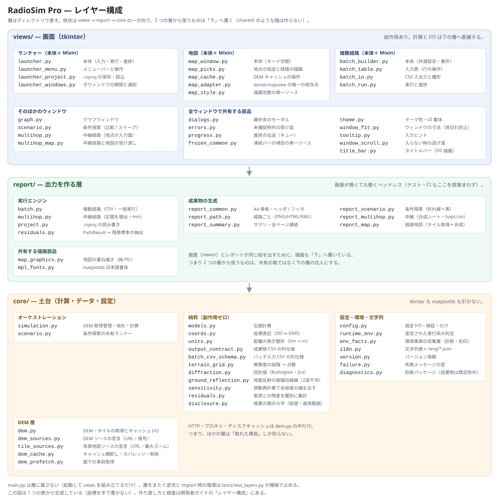

# RadioSim Pro 3.0

> **対象読者**: **ソースから動かす・中身に手を入れる方**向けの開発者ドキュメントです。
> アプリの使い方だけを知りたい場合は [manual_ja.md](manual_ja.md) を参照してください。

地上無線回線の伝搬特性を現地調査前にスクリーニングするデスクトップシミュレーターです。
国土地理院 DEM（数値標高モデル）を自動取得し、地形断面・回折損・植生減衰・リンクバジェットをリアルタイムに可視化します。

---

## 目次

1. [概要・用途](#概要用途)
2. [Windows バイナリのビルド](#windows-バイナリのビルド)
3. [動作環境・依存ライブラリ](#動作環境依存ライブラリ)
4. [ファイル構成](#ファイル構成)
5. [インストール・起動（ソースから実行）](#インストール起動ソースから実行)
6. [メニュー](#メニュー)
7. [地図](#地図)
8. [使い方 — 個別シミュレーション](#使い方--個別シミュレーション)
9. [使い方 — 複数経路](#使い方--複数経路)
10. [使い方 — 条件探索（比較 / スイープ）](#使い方--条件探索比較--スイープ)
11. [使い方 — 中継経路](#使い方--中継経路)
12. [入力パラメータ詳細](#入力パラメータ詳細)
13. [計算モデル詳細](#計算モデル詳細)
14. [DEM 取得ロジック](#dem-取得ロジック)
15. [保存パッケージ](#保存パッケージ)
16. [プロジェクトファイル（.rsproj）](#プロジェクトファイルrsproj)
17. [アーキテクチャ](#アーキテクチャ)
18. [開発環境のセットアップ](#開発環境のセットアップ)
19. [テスト](#テスト)
20. [既知の制限・注意事項](#既知の制限注意事項)
21. [著作権](#著作権)

---

## 概要・用途

RadioSim Pro は、無線回線設計における **現地調査前の概算スクリーニング** に特化したツールです。
TX（送信局）と RX（受信局）の座標・アンテナ高・無線設定を入力すると、国土地理院の標高データを自動取得して地形断面を描画し、リンクバジェットの成立可否を数秒で判定します。

### 主な機能

#### 実行フロー（4 つ）

**★クラス点検の単位**でもある＝欠陥を直すときは「この 4 つ＋地図の 5 面すべてに当てはまらないか」を必ず問う。

| フロー | 実装 | 入力の source of truth |
| --- | --- | --- |
| **個別シミュレーション** | `simulation.py` | ランチャーの入力欄 |
| **複数経路** | `batch.py` | バッチ表（CSV I/O） |
| **条件探索（比較 / スイープ）** | `scenario.py` | 固定した経路＋条件列。**DEM 取得 1 回＋純計算 N 回**（計算が 2 相であることを使う） |
| **中継経路** | `multihop.py` | waypoint 列（地点）。区間は導出。再生中継モデルで**全体判定は min**（最も余裕の少ない区間）、内訳と両方を出力 |

#### 地図

- **地図**（`views/map_window.py`・アプリ唯一のインスタンス／3 モード）: 座標入力／複数経路への連続追加／DEM キャッシュの可視化・事前取得・削除

#### 計算モデル（`models.py`＝純関数・副作用ゼロ）

- 国土地理院 DEM PNG タイル（5m / 10m メッシュ）から地形断面を自動生成
- 地球曲率補正（標準大気 K = 4/3 固定）
- Bullington 法 / Fresnel-Kirchhoff 法による回折損計算
- 植生減衰（LoS 侵入深さモデル）
- 環境損失（市街地 / 郊外 / 農村 / 見通し の 4 区分）
- 降雨減衰（ITU-R P.838-3）・大気減衰（ITU-R P.676-13 Annex 2）

#### 出力・レポート（`report_*.py`＝すべてヘッドレス）

- **A4 レポート（v2）**: per-path / summary を A4 縦 1 枚の印刷確定枠で出力（`@page A4`＋Ctrl+P でゼロ依存 PDF 化・自己同定ヘッダ/フッタ）
- **アンテナ初期指向 AZ/EL**: 相手局へ正対する真方位・仰角を per-path レポートに両端ぶん表示（既存データからの幾何計算＝初期値）
- HTML レポートへの経路地図の自動添付（TX/RX・経路・距離を地図に重ねて埋め込み）
- **全経路を 1 枚に俯瞰する地図**（summary・判定で色分け）
- **全ページ連結**: サマリ＋全経路を 1 文書にした `report_all.html`（中継は `report_all.html` に全区間）
- 結果のパッケージ保存（PNG / CSV / JSON / HTML / KML）

#### 入力の再利用

- **プロジェクトファイル（`.rsproj`）**: 座標・全パラメータ・案件情報・バッチ行・条件探索の条件・waypoint 列を 1 ファイルに束ねて保存／再開（**結果と app 設定は含めない**）
- **案件情報（案件名・自由メモ）**: ランチャーで入力し個別・複数経路どちらのレポートにも踏襲

#### 画面

- グラフウィンドウでのアンテナ高・降雨強度リアルタイムスライダー
- 座標表記の切り替え（DD / DMS・`coords.py` は純関数）
- 日本語 / 英語 UI 切替（`i18n.py` が単一ソース）＋**利用者が言語を足せる**（`lang/<コード>.json`）。`t()` は前からキー単位で英語へフォールバックするので、外部の表は**上書きできた分だけ**効く。⛔ プラグイン機構は作らない（読むのは JSON 1 種類だけ）。⚠️ **成果物の語（`html_*` / `pl_*`）は開かない**＝出力契約が利用者ごとに変わるため。**差し込み（`{n}` など）が英語と違うキーは採用せず、そのことを起動時に画面で言う**（採用すると `str.format` が `KeyError` を投げてその画面で落ちる＝黙って壊れさせない）
- システム連動ダークモード（ライト / ダーク / システム自動）

### 精度の位置付け

DEM の水平解像度は 5〜10m であり、回折損の実質精度は **±5〜15 dB** 程度です。⚠️ **この範囲は、複数の障害物が重なる経路には当てはまりません**——合成損失は実測とも基準実装とも突き合わせていません（後述）。
本ツールはあくまで「現地調査が必要かどうかを判断する」スクリーニング用途を目的としており、回線設計の最終判断には使用しないでください。

---

## Windows バイナリのビルド

PyInstaller を使って Python 不要の単体 EXE フォルダ（onedir）を生成します。

### 前提条件

- Python 3.11 以上（開発・CI は 3.14 で検証）
- **環境変数 `RADIOSIM_PYTHON`** に、テストを走らせている仮想環境の `python.exe` を指定してあること（**必須**）。→ [開発環境のセットアップ](#開発環境のセットアップ)
- PyInstaller・依存ライブラリは `build.bat` が固定版で導入します

> **なぜ環境変数で明示させるのか**：以前 `build.bat` は `PATH` の Python でビルドしており、pytest が検証した環境と推移的依存が食い違ったまま配布していました（TLS の CA バンドルを含む）。探索やフォールバックを持たせると食い違っても黙って成功するため、**未設定なら止める**設計にしています。

### ビルド手順

```bat
build.bat
```

`build.bat` は以下を自動で実行します。

| ステップ | 内容 |
| --- | --- |
| 1 | `RADIOSIM_PYTHON` の検証（未設定・実体なしなら中止）と Python 版の表示 |
| 2 | 依存ライブラリを固定版で導入（`pip install -r requirements.txt -r requirements-dev.txt`。PyInstaller もこのピンに含まれる） |
| 3 | 旧ビルド成果物の削除（出力先の `build/RadioSimPro/` `dist/RadioSimPro/`） |
| 4 | `python -m PyInstaller radiosim.spec --noconfirm --distpath … --workpath …` |
| 5 | **同梱漏れの検査**（`buildtools/check_bundle_imports.py`）。同梱物が無条件に import するモジュールが exe から除外されていたら**ビルドを中止**する |
| 6 | `terrain_cache/` `results/` ディレクトリを出力先に作成 |

`build.bat clean` は再生成可能な生成物・キャッシュ・ログ・配布 zip を一掃します。

- **残すもの**: 仮想環境と、**リポジトリ直下の** `terrain_cache/` `results/` `basemap_pale/`（ソース実行で貯めたデータ＝取り直しが高価、または利用者のもの）
- **消すもの**: ビルド出力の下は**すべて**。⚠️ **ビルドした exe が自分の隣に作った `terrain_cache/` `results/` も消えます**（これらはビルド出力の一部で、通常のビルドでも作り直されます）。

### 出力

既定はリポジトリ直下の `dist/`。環境変数 **`RADIOSIM_BUILD_ROOT`** を設定するとその配下の `dist/` `build/` へ出力します（クラウド同期フォルダの中でビルドしていて、毎回の作り直しを同期させたくない場合に使います）。

```
dist/
└── RadioSimPro/
    ├── RadioSimPro.exe   ← 起動ファイル
    ├── _internal/        ← Python ランタイム・依存ライブラリ
    ├── terrain_cache/
    └── results/
```

### 配布パッケージの作成

ビルド出力の `RadioSimPro/` フォルダをそのまま ZIP 圧縮して配布します。

```powershell
# 出力先は RADIOSIM_BUILD_ROOT に従う（未設定ならリポジトリ直下の dist/）
$dist = if ($env:RADIOSIM_BUILD_ROOT) { "$env:RADIOSIM_BUILD_ROOT\dist" } else { "dist" }
# 配布物の名前には版を入れる（Releases に並んだとき、どの版か見て分かるように）
Compress-Archive -Path "$dist\RadioSimPro" -DestinationPath "$dist\RadioSimPro-2.8.zip" -Force
```

> ⚠️ **ZIP の名前に版を入れる**＝公開している資産名は `RadioSimPro-<版>.zip`（例: `RadioSimPro-2.7.zip`）です。版なしの名前で作ると、Releases に添付するときに付け直すことになります。
>
> ⚠️ **`dist\RadioSimPro` と直書きしない**＝`RADIOSIM_BUILD_ROOT` を設定している環境では、失敗するか**リポジトリ側の古い成果物を誤って圧縮**します。

### `radiosim.spec` の主な設定

| 設定 | 内容 |
| --- | --- |
| `icon.png` → `icon.ico` | ビルド時に自動変換。`icon.png` がなければスキップ |
| EXE ファイルプロパティ | `version.py` の `APP_VERSION` / `COPYRIGHT` から自動生成 |
| `console=False` | コンソールウィンドウを非表示 |
| UPX 圧縮 | インストール済みの場合のみ有効 |
| `docs/manual_*.md` / `docs/images/` / `logo.png` | バイナリに同梱（`sys._MEIPASS` で参照） |

### トラブルシューティング

| 症状 | 対処 |
| --- | --- |
| `ModuleNotFoundError` が起動時に発生 | `radiosim.spec` の `excludes` から該当モジュールを外すか `hiddenimports` に追加してリビルド |
| エラーメッセージが見えない | `radiosim.spec` の `console=False` を `console=True` に変更してリビルド |
| SmartScreen 警告（配布先） | 署名なし EXE のため正常。「詳細情報」→「実行」で続行 |

---

## 動作環境・依存ライブラリ

| 項目           | 要件                                                  |
| -------------- | ----------------------------------------------------- |
| OS             | Windows 10/11（macOS / Linux でも動作しますが未検証） |
| Python         | 3.11 以上（固定版 numpy 2.4 の要件。3.14 で動作確認済み） |
| インターネット | DEM 取得時に必要（取得済みタイルはキャッシュ）        |

### 必要ライブラリ

```
python -m pip install -r requirements.txt
```

**版は [`requirements.txt`](../requirements.txt) が単一ソース**です（固定＝ソース実行と配布バイナリで同じ版が入る）。名前を並べて入れると版が固定されず、下表と二重管理になります。

| ライブラリ | 用途                                                              |
| ---------- | ----------------------------------------------------------------- |
| numpy      | 地形・伝搬計算のベクトル演算                                      |
| matplotlib | 地形断面グラフ・スライダー描画                                    |
| requests   | 国土地理院タイル HTTP 取得                                        |
| Pillow     | PNG タイル画像デコード                                            |
| sv-ttk     | Windows 11 スタイルの UI テーマ                                   |
| darkdetect | システムのダークモード設定検出                                    |
| markdown   | ドキュメントビューア（省略可、なくても動作します）                     |
| truststore | 企業プロキシ環境での SSL 証明書検証（省略可、なくても動作します） |
| tkintermapview | 地図タイルの表示（GSI 淡色地図。無い場合は地図機能のみ自動的に無効化） |

---

## ファイル構成

```
radiosim/
├── main.py               # エントリーポイント（層には属さない＝起動して画面を組み立てるだけ）
│
│   # 層はディレクトリで表す。依存は views → report → core の一方向。
│   # 2 つの層から使われるものは「下」へ置く（`shared/` のような箱は作らない）。
│
├── core/                 # 土台＝計算・データ・設定。tkinter も matplotlib も引かない
│   ├── models.py         # 純粋計算ロジック（副作用ゼロ）
│   ├── diffraction.py    # 回折損（Bullington 等価ナイフエッジ・球面回折の席）
│   ├── simulation.py     # ViewModel / オーケストレーター
│   ├── config.py         # アプリ設定 I/O・入力バリデーション・ロギング（外部依存は最小）
│   ├── dem.py            # DEM/淡色タイル取得・標高デコード・キャッシュ・プロキシ（外部依存を閉じ込め）
│   ├── dem_prefetch.py   # 面での事前取得（bbox → 位置の列挙・優先順位つき降下・ワーカープール）
│   ├── terrain_grid.py   # DEM の格子と地形の解像度（段階→点数の解決・純関数）
│   ├── scenario.py       # 条件探索の共有ランナー（A-1 比較 / A-2 スイープ・相の宣言・ヘッドレス）
│   ├── coords.py         # 座標表記変換（DD ⇔ DMS・純関数）
│   ├── units.py          # 距離の表示整形（内部 km → 表示 m・純関数）
│   ├── output_contract.py # 成果物 CSV の列仕様＝出力契約の単一ソース（純データ）
│   ├── disclosure.py     # 帳票の「結果の取扱に関する補足」の字（前提・適用範囲の刻印・純関数）
│   ├── runtime_env.py    # 実行環境の事実（frozen か・同梱物の根・書き込み先の解決）
│   ├── i18n.py           # 多言語文字列テーブル＋外部言語（lang/*.json）の検証と読み込み
│   ├── failure.py        # 失敗メッセージの型（何が起きた／次に何をすべきか／詳細）
│   └── version.py        # バージョン情報
├── report/               # 出力を作る層＝実行エンジンと成果物の生成（ヘッドレス）
│   ├── batch.py          # 複数経路の実行エンジン（CSV I/O・バリデーション・実行）
│   ├── multihop.py       # 中継経路（A-3）の実行エンジン（waypoint→ホップ導出・min 集約）
│   ├── project.py        # プロジェクトファイル（.rsproj）の読み書き＝入力一式を束ねる
│   ├── report_common.py  # レポート共有部品（A4 骨格 CSS・ヘッダ/フッタ・文書外枠・純関数）
│   ├── report_path.py    # 経路ごとの出力生成（PNG/HTML/KML）
│   ├── report_summary.py # バッチのサマリ出力生成（CSV/HTML/KML・全ページ連結）
│   ├── report_scenario.py # 条件探索の出力生成（A4 の折れ線＋表・CSV）
│   ├── report_multihop.py # 中継経路の出力生成（合成シート＋ホップ別連結・hops.csv）
│   ├── report_map.py     # レポート用 経路オーバーレイ地図のヘッドレス生成
│   ├── map_graphics.py   # 地図オーバーレイ描画の純 PIL 実装（UI とレポートで共有）
│   └── mpl_fonts.py      # matplotlib 日本語フォント適用（グラフ/レポート共通）
├── views/                # 画面（tkinter）
│   ├── launcher.py       # ランチャーウィンドウ（本体＝入力フォーム・実行・進捗）
│   ├── launcher_menu.py  # ランチャーのメニューバーとその操作（Mixin）
│   ├── launcher_project.py # プロジェクト（.rsproj）の収集・保存・読込（Mixin）
│   ├── launcher_windows.py # 子ウィンドウの開閉とウィンドウどうしの通知（Mixin）
│   ├── tooltip.py        # 入力ヒントのツールチップ（ウィンドウに依存しない部品）
│   ├── graph.py          # グラフウィンドウ（matplotlib + tkinter）
│   ├── map_window.py     # 地図（本体＝モード切替・地図ウィジェット）
│   ├── map_picks.py      # 地点の指定と経路の描画（Mixin）
│   ├── map_cache.py      # DEM キャッシュの範囲選択・取得・オーバーレイ（Mixin）
│   ├── map_style.py      # 地図ウィンドウの描画定数（色・余白・ズーム）の単一ソース
│   ├── dialogs.py        # 親ウィンドウ中央表示の共通モーダルダイアログ
│   ├── errors.py         # GUI の未捕捉例外をログ＋ダイアログへ流す単一の受け皿
│   ├── progress.py       # 進捗トランスポート（ワーカースレッド → メインスレッド）
│   ├── theme.py          # 素の tk ウィジェットへ渡すテーマ色・UI フォント（sv_ttk 由来）
│   ├── window_fit.py     # ウィンドウの寸法と位置を決める唯一の実装（見切れ・画面外防止）
│   ├── window_scroll.py  # 入らないときの逃げ道（中身が画面より大きい窓のスクロール受け皿）
│   ├── scenario.py       # 条件探索ウィンドウ（比較 / スイープ）
│   ├── multihop.py       # 中継経路ウィンドウ（地点＝入力面・区間は導出）
│   ├── multihop_map.py   # 中継経路と地図の受け渡し（地点列の写し・地図からの追加/置き直し・Mixin）
│   ├── frozen_common.py  # 凍結帯「共通設定」に何を出すかの単一ソース（複数経路・中継経路）
│   ├── batch_builder.py  # 複数経路ウィンドウ（本体＝共通設定・案件情報）
│   ├── batch_table.py    # バッチの入力表（行の生成/複製/削除/並べ替え・Mixin）
│   ├── batch_io.py       # バッチの CSV 入出力とテンプレート（Mixin）
│   └── batch_run.py      # バッチの実行と進捗（Mixin）
├── docs/                 # 読み物（開発者向け・利用者向けとも、入口の README.md を除いてここ）
│   ├── developer_ja.md   # このファイル
│   ├── developer_en.md   # 英語版の開発者ドキュメント
│   ├── manual_ja.md      # 利用者向けマニュアル（exe に同梱・ヘルプ「ドキュメントを開く」が開く）
│   ├── manual_en.md      # 英語版の利用者向けマニュアル（同上）
│   ├── glossary.md       # 用語集（画面・レポートに出る語）＝tests/test_i18n_glossary.py が守る
│   ├── screenshots.md    # スクショの撮り方（座標・条件・期待値・配置先の正典）
│   └── images/           # そのスクショと図（architecture_*.svg＝層構成図）。exe にも同梱
├── README.md             # リポジトリの入口（GitHub で最初に読まれる 1 本）
│
│   # テストは**名前だけ**＝説明は「テスト」節の表が正典（同じ説明を 2 か所で持たない）。
│   # 例外は表に載らないもの＝`test_*.py` でないファイルで、そこだけここに説明を付ける。
│
└── tests/
    ├── test_models.py
    ├── test_golden_links.py   # 回帰コーパス（代表回線のゴールデン値＋純関数の不変条件）
    ├── golden_corpus_gen.py  # 同コーパスの生成器（手動実行・実 DEM を取得）
    ├── test_simulation.py
    ├── test_config.py
    ├── test_dem.py
    ├── test_batch.py
    ├── test_report.py
    ├── test_scenario.py
    ├── test_multihop.py
    ├── test_project.py
    ├── test_report_map.py
    ├── test_map_window.py
    ├── test_coords.py
    ├── test_terrain_grid.py
    ├── test_units.py
    ├── test_output_contract.py
    ├── test_mpl_fonts.py
    ├── test_progress.py
    ├── test_runner_logging.py
    ├── test_theme.py
    ├── test_window_fit.py
    ├── test_errors.py
    ├── test_failure_messages.py
    ├── test_bundle_imports.py
    ├── test_ui_consistency.py
    ├── test_i18n_glossary.py
    ├── test_i18n_key_duplication.py
    ├── test_i18n_no_hardcoded_ui_text.py
    ├── test_i18n_external.py
    ├── test_layers.py
    ├── test_paths.py
    ├── test_smoke.py
    ├── test_docs_consistency.py
    ├── test_env_consistency.py
    ├── test_repo_hygiene.py
    ├── test_dev_check.py
    ├── test_claude_hooks.py
    ├── test_codex_review_tool.py
    └── test_qa_gate_cache.py
```

---

## インストール・起動（ソースから実行）

```bash
# 依存ライブラリのインストール（版は requirements.txt が単一ソース＝固定して配布物と揃える）
python -m pip install -r requirements.txt

# テスト・ビルドもする場合は開発用も
python -m pip install -r requirements-dev.txt

# 起動
cd radiosim
python main.py
```

初回起動時にプロジェクトルートへ以下のディレクトリが自動作成されます。

| ディレクトリ       | 内容                           |
| ------------------ | ------------------------------ |
| `terrain_cache/` | DEM タイルのディスクキャッシュ |
| `results/`       | 保存パッケージの出力先         |

---

## メニュー

メニューバーは **ファイル / 設定 / ヘルプ** の 3 つ（実装＝[views/launcher_menu.py](../views/launcher_menu.py) の `_build_menu`）。ラベルは `i18n.py` の辞書が単一ソース。以下がその全項目です。

### ファイル

**ファイル／OS の外へ出る操作**の置き場（ランチャーのボタン列から移してきたもの）。⚠️ ここへボタンは足さない＝ボタン列は FHD 100%（画面高 1080px）の高さ予算を使い切っており、見切れの再発源になる。

| 項目                  | 説明                                                                     |
| --------------------- | -------------------------------------------------------------------------- |
| プロジェクトを開く... | `.rsproj` を読み込み入力一式を復元 → [プロジェクトファイル（.rsproj）](#プロジェクトファイルrsproj) |
| プロジェクトを保存... | 現在の入力一式を `.rsproj` へ書き出す → 同上                             |
| パラメータ読込...     | 設定ファイルから**シミュレーション条件だけ**を入力フォームへ取り込む     |
| 結果フォルダを開く    | `results/` をエクスプローラーで開く                                      |

### 設定

選択内容は `radiosim_conf.json` に保存されます。

| 項目                  | 選択肢                      | 説明                                                          |
| --------------------- | --------------------------- | --------------------------------------------------------------- |
| テーマ                | システム / ライト / ダーク  | ウィンドウのカラーテーマ                                        |
| 言語                  | 日本語 / English            | UI の表示言語（再起動で反映）                                   |
| 座標の表示形式              | 十進度（DD）/ 度分秒（DMS） | 座標の**表示**表記（`coords.py`）→ 下記                        |
| プロキシ設定...       | URL 入力                    | HTTP プロキシを明示指定（空欄 = OS のプロキシ設定を使用）→ 下記 |
| アプリ設定を読込む... | —                           | 設定ファイルからテーマ・言語・プロキシ**だけ**を取り込む        |
| 全キャッシュ削除...   | —                           | 取得済みの全 DEM / 地図タイルを削除（確認あり）                 |

### ヘルプ

| 項目           | 説明                                 |
| -------------- | -------------------------------------- |
| ドキュメントを開く | このドキュメントをブラウザで表示       |
| バージョン情報 | `version.py` の版数を表示              |

> **「パラメータ読込」と「アプリ設定を読込む」は領分が排他**＝前者はシミュレーション条件、後者はテーマ・言語・プロキシ。**互いに相手を書き換えません**（他人のファイルを開いた瞬間に表示言語やネットワーク設定が変わらないための設計）。

> **地図はメニューに無い**＝ランチャー下部の**「地図」ボタン**から開きます（→ [地図](#地図)）。

### 座標の表示形式（DD / DMS）

**表記（表示）の設定であって入力モードではありません。** 入力は `coords.parse_pair` が DD / DMS の双方を寛容に受理し、計算前に必ず DD へ正規化されます（`simulation.SimParams` へ渡る値は常に DD）。

⚠️ 欄の整形が走るのは**起動時・表記の切替時・設定/プロジェクトの読込時**の 3 か所だけで、**入力の確定（Enter / focus 離脱）では走りません**。そのため DMS 表記のまま DD を打つと打った形のまま残ります＝**不具合ではない**が、画面から受理の可否が読めない（既知の課題）。

### プロキシ設定

企業ネットワーク等でプロキシを経由して DEM タイルを取得する場合は、**設定 > プロキシ設定** からプロキシ URL を入力してください。

```
http://proxy.example.com:8080
```

- OK を押すと即時反映されます（アプリの再起動は不要）
- 空欄で OK を押すと OS のプロキシ設定（システム設定 / 環境変数）に戻ります
- SSL インターセプトを行う企業プロキシ向けに `truststore` による Windows 証明書ストア連携も有効です
- プロキシ未設定で標高サーバーへ一切到達できない場合、**連続失敗で打ち切り**て問いかけます（平坦な地形として黙って完走しない）

---

## 地図


ランチャーの**「地図」ボタン**（`views/map_window.py`）で、国土地理院の淡色地図を使う補助ウィンドウを開きます。**地図はアプリ唯一のインスタンス（ランチャー所有）**で、上部のモードセレクタで 4 モードを切り替えます（複数経路のウィンドウからは地図を開きません＝ランチャーが本筋・複数経路は従属する受け皿）。コアのシミュレーションは地図なしで完結し、地図は便利機能です。開いたとき設定中 TX/RX の経路長に合わせて自動ズーム・センタリングします。

**描き方は 4 モードで 1 つの規則**＝**線 ＋ 端点アイコン（TX=塗り / RX=白抜き・中継点=ひし形）＋ 中点に水平距離バッジ**。⚠️ **モードごとに描き分けない**（2026-08-14 にユーザー指摘で統一）。以前は連続追加だけ RX を方位矢じりにしていたが、それは *TX/RX が同一座標に重なっても判別する* ための例外で、複数経路を中継の代わりに使っていた時期のもの。中継経路ウィンドウができて使い方が移り、**根拠が消えた例外だけが不統一として残っていた**。⚠️ 文字ラベル（`TX`/`RX`）を出すのは座標入力モードだけ＝他は経路が N 本あるので、全端点に字を出すと地図が埋まる（識別は距離バッジに添える経路 ID・地点名が担う）。

- **座標入力モード（既定）**: 地図クリックで**空いている方**（TX → RX）を指定し、ランチャーの座標欄（start/end）へ書き戻す（数値欄が source of truth）。**両方そろったら素のクリックは何も書かない**＝そこからは「選んでから置き直す」（下記）。`apply_map_pick`/`current_path_coords` で連携し、**座標欄の変更（消去・手入力・プロジェクト読み込み）は `on_single_coords_changed` で地図へ届く**＝ピック層はあくまで数値欄の写し（他の 2 層と同じ扱い。通知が無かったため、欄を消してもマーカーが残り、置く先も戻らなかった）。
- **連続追加モード**（モードセレクタの「複数経路へ連続追加」）: 選ぶと複数経路のウィンドウを開き（前面化し）、地図で TX→RX ペアを置くたびに複数経路へ 1 行を自動追加・自動リセットします（+行 追加不要）。RF（周波数・利得・アンテナ高）は追加時点のランチャー値で凍結。確定パスの距離バッジには**経路 ID を添える**（複数経路の表のどの行かを地図から引けるように）。複数経路の行変更（削除・編集確定・インポート等）は地図へリアルタイム反映。`append_path`/`existing_paths`（＋置き直しの `update_path_point`）で連携。
- **中継点モード**（モードセレクタの「中継点を追加」）: 中継経路のウィンドウから開き、クリックのたびに地点を 1 つずつ末尾へ足します（TX/RX の交互ピックではない）。地点列を結ぶ折れ線と、**区間ごとの水平距離バッジ**を描きます。⚠️ **この距離は画面のここにしか出ない**＝区間表の列は周波数・利得・結果だけで距離を持たず、レポートに出るのは**斜距離**（用語集で別語）。地図は写しであって source of truth ではないので、毎回ウィンドウの地点列から引き直します。`append_waypoint`/`waypoint_markers`（＋置き直しの `update_waypoint`）で連携＝実装は `views/multihop_map.py`。
**置き直しは「選んでから」**＝マーカーをクリックするとその点が選択状態になり（琥珀のリング＋状態バーに呼び名）、**次の地図クリックでそこへ移ります**（Esc で取り消し・選択は 1 回で使い切る）。⛔ **ドラッグにはしない**＝素のドラッグはパン（地図の移動）で埋まっており、奪うと「地図を掴もうとしたら点が動いていた」＝*入力が黙って書き換わる*誤操作を作る。規則は 1 つ＝**素のクリックは足す・選んでからのクリックは直す**。⚠️ **マーカーだけを入口にしない**＝地図を遠くへ送ると唯一の入口が画面の外に出て、置き直しの動線ごと死ぬ。座標入力・連続追加モードでは**地図の右クリック**（「ここに TX を置く」「ここに RX を置く」）が、マーカーの位置に依存しない入口になる（役割を名指しするので「黙って書き換えない」も保てる）。⚠️ tkintermapview の既定の右クリックメニュー（英語・座標コピー）は**張り替えて置き換えている**。

地図がウィンドウへ渡すのは**写しの並びでの位置**（`existing_paths()` / `waypoint_markers()` の何番目か）で、ウィンドウの行番号ではありません（読めない座標の行は写しに出ない）。ウィンドウの側は同じ規則で位置を解き、**書き戻す前に名前（経路 ID・地点名）を照合**して、食い違えば動かさずに断ります（実行結果を行へ返すときの「その入力の結果か」を確かめる形と同じ）。⚠️ **移動量が地形メッシュ（5m）より小さいときは状態バーでそう言う**＝それより細かく詰めても標高は同じ格子から拾われ、画面は動いたのに結果が変わらないため。

- **キャッシュ管理モード**: パン/ズーム追従でキャッシュ済み領域を最高精度で色分け表示（緑=5m航空レーザ / 黄=5m写真測量 / 水色=10m）。ジェスチャ＝ドラッグ=移動 / Ctrl+ドラッグ=DL / Ctrl+Alt+ドラッグ=強制再取得 / Shift+Ctrl+ドラッグ=範囲削除。DL・削除は確認ダイアログあり。実装は `dem_prefetch.prefetch_tiles` ほかの公開 API（⚠️ **3.0 で `dem` から `dem_prefetch` へ移した**）。取得済みで**読めるもの**は再 DL しない（外部サーバー配慮。読めなくなっていたタイルは取り直す＝3.0）。全キャッシュ削除は **設定 > 全キャッシュ削除**。

---

## 使い方 — 個別シミュレーション


### 1. ランチャーウィンドウ

起動すると入力フォームが表示されます。

#### サイト情報

| フィールド             | 説明                                          |
| ---------------------- | --------------------------------------------- |
| 送信座標（緯度, 経度） | TX 局の緯度・経度（例:`34.5429, 132.4118`） |
| 受信座標（緯度, 経度） | RX 局の緯度・経度                             |
| 送信アンテナ高（m）    | TX アンテナの地上高                           |
| 受信アンテナ高（m）    | RX アンテナの地上高                           |

#### 無線設定

| フィールド                     | 説明                       |
| ------------------------------ | -------------------------- |
| 周波数（MHz）                  | 周波数（1〜100,000 MHz）   |
| 送信電力（dBm）                | 送信電力                   |
| 送信 / 受信アンテナ利得（dBi） | アンテナ利得               |
| 受信感度（dBm）                | 受信感度（最小受信レベル） |

#### 伝搬環境

| フィールド            | 説明                                       |
| --------------------- | ------------------------------------------ |
| 環境区分              | 市街地 / 郊外 / 農村 / 見通し の 4 区分   |
| 植生高（m）           | 樹木・建物等の平均高さ                     |
| ライスKファクター（初期値） | 見通し/散乱電力比の初期値。表示用のみで計算には影響しない（デフォルト = 10.0） |
| 地形の解像度          | 高 5m メッシュ/ 中 10m メッシュ/ 低 20m 刻みの 3 段階。**入れるのは段階だけで、点数はアプリが解きます**。「高」「中」は**経路が通る DEM 画素の縁ごと**に標本を置くので**等間隔ではなく**、点数は経路の長さ・向き・緯度から決まります（「低」だけは 20m の等間隔＝*粗いが速い*段階なので画素を飛ばします）。解決後の点数と**1 画素の寸法**はすぐ下に出ます。既定は「中」 |

### 2. 「実行」ボタン（個別シミュレーション）

ボタンを押すと 2 段階でデータを取得します。

1. **DEMタイル事前取得**: TX/RX 間のバウンディングボックス内の全タイルをディスクキャッシュに保存します（最大 8 並列）。キャッシュ済みタイルはスキップされるため 2 回目以降は即完了します。
2. **標高データ取得**: サンプル点ごとに標高を並列取得します（最大 8 並列）。同じ TX/RX 座標・サンプル数であれば前回のキャッシュを即時使用します。

### 3. グラフウィンドウ

取得完了後、地形断面グラフが表示されます。

#### グラフの見方

| 表示要素   | 説明                      |
| ---------- | ------------------------- |
| 茶色の塗り | 地形（地球曲率補正済み）  |
| 緑色の塗り | 植生層（地表高 + 植生高） |
| 赤の破線   | 見通し線（LoS）           |
| シアンの帯 | 第 1 Fresnel ゾーン       |
| 黒の縦棒   | TX / RX アンテナ          |

#### スライダー

| スライダー     | 範囲        | 説明                            |
| -------------- | ----------- | ------------------------------- |
| 送信アンテナ高 | 0〜150 m    | TX アンテナ高をリアルタイム変更 |
| 受信アンテナ高 | 0〜150 m    | RX アンテナ高をリアルタイム変更 |
| 降雨量         | 0〜100 mm/h | 降雨強度をリアルタイム変更      |

スライダーを動かすと 50ms のデバウンス後に自動再計算されます。

#### 保存ボタン

現在の表示状態を `results/YYYYMMDD_HHMMSS/` に保存します（→ [保存パッケージ](#保存パッケージ)）。

### 4. 入力値の自動保存

個別シミュレーションの実行時に入力値が `radiosim_conf.json` へ自動保存され、次回起動時に復元されます（明示的な保存操作は不要）。

ファイルからの取り込み・持ち運びは[ファイルメニュー](#ファイル)（**パラメータ読込** / **プロジェクトを保存・開く**）です。

---

## 使い方 — 複数経路


ランチャーの **複数経路** ボタンで専用ウィンドウを開きます。

### 設計思想 — 個別で詰め、複数経路で確定する

**個別（ランチャー）＝条件を詰める場／複数経路＝確定した条件で成果物を作る場**です。ランチャーが唯一の「真実の源（source of truth）」で、複数経路の各行は **行を追加した時点のランチャー欄を文字列コピーして凍結した確定リンク** になります。

### 入力方法

**手動入力**: テーブルに直接 ID・座標・アンテナ高・周波数・送受信利得を入力します。行の追加・削除・ドラッグ並べ替え・セルの直接編集ができます。

表の右端の **水平距離(m)** 列は TX/RX 座標から自動計算される読み取り専用の表示です（座標を確定するたびに更新）。座標の打ち間違いは距離が極端な値になって現れるため、実行前に気づく手がかりになります。

- **+ 行を追加**: その時点のランチャー欄（座標・周波数・利得・アンテナ高）をコピーして凍結した行を追加します。
- **行を右クリック**: per-row メニューが開きます。
  - **→ 個別へ送る**: その行の座標＋RF をランチャーへ読み込み、調整できます。
  - **⟳ RF をランチャーで更新**: ランチャーの現在の RF をその行へ書き戻します（**座標は保持**）。
  - 複製 / 削除。

**CSV インポート**: テンプレートボタンでサンプル CSV を保存し、編集後にインポートします。

#### CSV フォーマット

必須列: `id, start, end, h_tx, h_rx`

省略可能列: `freq, gain_tx, gain_rx, note`

```csv
id,start,end,h_tx,h_rx,freq,gain_tx,gain_rx,note
path01,"34.54, 132.41","34.53, 132.40",30.0,10.0,2400,12.5,8.0,メイン回線
path02,"34.55, 132.42","34.52, 132.39",20.0,15.0,,,,サブ回線
```

- `start` / `end` は「緯度, 経度」の形式でダブルクォートで囲んでください
- `freq` / `gain_tx` / `gain_rx` を省略した場合は共通設定の値が使われます（**リンク識別属性**＝経路ごとに変えられる）。環境区分・降雨強度・回折モデルは共通設定で一括指定します
- `gain_tx` / `gain_rx` 列のない旧 CSV もそのまま読めます（後方互換・利得は共通設定を継承）
- 列名は**大小文字と前後の空白を区別しません**（`ID,Start,…` でも読めます）。`id` は**大小文字を区別せず**一意である必要があります（`p01` と `P01` は同じ出力フォルダになるため重複として弾かれます）

### 共通設定（ランチャーのスナップショット）

ウィンドウ上部の **共通設定** は、経路ごとの個別設定が指定されていない場合に使われるデフォルト値です。**読み取り専用**で、ランチャー（真実の源）のスナップショットです。**↻ ランチャーから更新** ボタンでランチャーの現在値を取り込めます。

### 実行と結果

**実行** ボタンを押すと経路を順次処理します。処理中は進捗（処理済み / 全体）が帯に出て、**判定は終わった経路の行へ返ります**。

完了後、`results/batch_YYYYMMDD_HHMMSS/` に以下が保存されます。

| ファイル                     | 内容                                               |
| ---------------------------- | -------------------------------------------------- |
| `summary.html`             | 全経路のサマリーレポート（グラフのサムネイル付き） |
| `summary.csv`              | 全経路の数値結果（スプレッドシートで開けます）     |
| `summary.kml`              | OK / NG / エラーを色分けした Google Earth 用 KML   |
| `report_all.html`          | サマリ＋全経路を 1 文書へ連結（Ctrl+P 一発で全ページ分の PDF）|
| `{id}/report.html`         | 経路ごとの詳細レポート（地形断面グラフ＋経路地図を埋め込み）|
| `{id}/profile.png`         | 地形断面グラフ                                     |
| `{id}/path.kml`            | 地形・LoS・Fresnel ゾーン・遮蔽区間の 3D KML       |
| `{id}/settings.json`       | 経路ごとの入力パラメータ                           |
| `{id}/terrain_profile.csv` | 地形断面データ                                     |
| `{id}/report.txt`          | テキスト形式のリンクバジェットレポート             |

---

## 使い方 — 条件探索（比較 / スイープ）


ランチャーの **条件探索** ボタンで開きます（`views/scenario.py`）。**1 本の確定した経路を、条件を変えて掘る**画面で、計算側は `core/scenario.py` が持ちます。操作手順は [manual_ja.md](manual_ja.md) が詳しいので、ここでは実装の勘所を挙げます。

- **地形は 1 回だけ取る**: `run_scenario()` は FETCH → CALC（→ RENDER）の順に進み、取得は先頭で 1 回。`_fetch_sync()` は `fetch_elevations_cached()` を通すので、同じ経路で条件を振り直しても DEM の再取得は起きません（＝この画面の使い方そのもの）。
- **条件は「差分」で持つ**: `Condition` はベースからの上書き辞書で、変えられる欄は `scenario.OVERRIDABLE` が単一ソース。**座標と地形の解像度は入っていません**（経路そのものを比べるのは複数経路の仕事）。比較は最大 `MAX_COMPARE_CONDITIONS` 列。
- **比較とスイープは同じ計算路を通る**: スイープは `linspace_values()` → `sweep_conditions(axis, values)` で `Condition` 列に落としてから `evaluate()` に渡します。軸は `SWEEP_AXES`、点数は `MAX_SWEEP_POINTS` が上限。**分岐しているのは入力の作り方だけ**で、評価と結果型（`ScenarioRun` / `ScenarioPoint`）は 1 本です。
- **進捗は「相」を宣言する**: `Phase` / `Phases`（`FETCH` `CALC` `RENDER`）に重みを宣言し、レポート生成も `artifacts` としてワーカースレッド内の RENDER 相で回します。**完了後に View 側で生成しない**＝GUI が固まるうえ、その時間が進捗率に現れないため（過去に 2 度踏んだ欠陥）。
- **検証は DEM 取得より前**: `validate_base()` はベース値を取得前に弾きます（取得後に落ちると待ち時間を捨てさせる）。条件側は `Condition` が自分で検査済み。
- **ウィンドウの値が正典**: ランチャーの値はウィンドウを開いた時点で凍結され、**↻ を押すまで取り込まれません**（見えている値で計算する＝すべてのウィンドウ共通の流儀）。

---

## 使い方 — 中継経路


ランチャーの **中継経路** ボタンで開きます（`views/multihop.py`）。**再生中継**（受けて送り直す）前提で、区間ごとに独立したリンクバジェットを計算します。モデルと実行は `report/multihop.py`。

- **経路は点列＋接続規則で持つ**: `MultiHopPath` は `Waypoint` の列と区間ごとの `HopRF` を持ち、区間は `links(path)` が導出します（並びの意味を各所で書かない）。**高さは `Waypoint` にだけ**あり——中継点のアンテナは 1 本なので、前の区間の受信高と次の区間の送信高を別々に持てない形にしてあります。上限は `MAX_HOPS`。
- **トポロジーの宣言は 1 か所**: `TOPOLOGIES` に鎖と星があり、**実際に走れるのは `SUPPORTED_TOPOLOGIES` だけ**。読む・書く・実行するの 3 層がこの 1 つを参照し、門は `require_runnable()`。集約（`ok` / `worst` / `overall_margin`）は**鎖の意味論**なので、鎖以外では黙って数字を返さず止めます（星の min は意味を持たない）。
- **実行層はバッチを流用する**: `hop_rows(path)` が区間を `batch.PathRow` へ落とし、`run_multihop()` のコールバックは `batch.run_batch()` と同じ形（`ProgressPump` の使い方も同じ）。⚠️ **1 区間 = 1 回の DEM 取得**なので取得量は区間数に比例します（隣接区間は端点を共有するのでタイルのキャッシュは効きます）。
- **判定の単一ソースは `batch.PathResult.status`**: 計算に失敗した区間だけでなく、**成果物が欠けた区間**もここで OK から外れます。全体判定は「一番余裕の少ない区間」＝最小値で、**損失は足し合わせません**。
- **集約カードの語は `overall_display()` が返す**: 同じ数字でも OK なら「全体マージン（最小余裕）」、NG なら「最大不足」（符号反転）。**画面・レポートとも語の出所はこの 1 か所**です。
- **全体判定の状態語は `overall_status()` が返す**: 区間と同じ **3 値**（`OK` / `NG` / `ERROR`）で、**ERR の区間が 1 つでもあれば全体も `ERROR`**。⛔ `run.ok` の真偽から語を組み立てないでください——`ok` は「鎖が成立したか」しか答えられないので、判定不能が不成立に潰れ、**同じ成果物の中で区間表・件数カードと食い違います**（画面のサマリ 1 行とレポートの集約カードが、実際にこの形で壊れていました）。判定に使うのが `ok`、人に見せるのが `overall_status()` です。
- **地点の追加と削除は互いの逆写像**: 行の `＋` は「その地点から**出ていく**区間を空欄で挿す」、`×` は「同じ区間を落とす」。区間の変数は**位置で再利用される**ので、地点だけを増減させると挿した／消した位置より後ろの周波数・利得が 1 つずれ、**画面は自然なまま別の区間の設定で計算します**。⇒ 往復（挿して同じ位置を消す）で完全に元へ戻ることをテストで縛っています。
- **中継点は「置く」もので「動かして探る」ものではありません**: 動かすたびに新しい取得が走るため、高さや条件を振るのは条件探索の役目です。

---

## 入力パラメータ詳細

### バリデーション範囲

| パラメータ   | 最小                           | 最大    | 単位 |
| ------------ | ------------------------------ | ------- | ---- |
| 周波数       | 1                              | 100,000 | MHz  |
| 送信電力     | -30                            | 60      | dBm  |
| 送受信利得   | 0                              | 60      | dBi  |
| 受信感度     | -130                           | -20     | dBm  |
| アンテナ高   | 0                              | 500     | m    |
| 植生高       | 0                              | 100     | m    |
| ライスK      | 0                              | 30      | —   |
| 地形の解像度 | 高 / 中 / 低                  | —      | —   |
| 降雨強度     | 0                              | 200     | mm/h |
| 環境区分     | 市街地 / 郊外 / 農村 / 見通し | —      |      |
| 回折モデル   | bullington / single            | —      |      |

---

## 計算モデル詳細

### 地球曲率補正

実際の電波伝搬では大気の屈折により電波は地球の曲率より大きく曲がります。これを等価地球半径係数 K でモデル化します。本ツールでは標準大気（K = 4/3 ≈ 1.333）を内部固定値として使用します。

```
等価地球半径 Re = R_earth × K  （K = 4/3 固定）
曲率補正量 Δh(d) = d × (D - d) / (2 × Re)  [m]
```

| K の値       | 意味                                 |
| ------------ | ------------------------------------ |
| 4/3 ≈ 1.333 | 標準大気（本ツール使用値）           |
| K > 4/3      | 大気ダクト（電波がより大きく曲がる） |
| K < 4/3      | 負の屈折（電波が地面側に曲がる）     |

### Fresnel ゾーン

電波は幾何光学的な直線だけでなく、その周囲の楕円体状の領域（Fresnel ゾーン）を伝搬します。第 1 Fresnel ゾーンが地形・植生に遮蔽されると回折損が発生します。

```
r₁(d) = √(λ × d₁ × d₂ / (d₁ + d₂))
```

### 回折損

#### Bullington 法（デフォルト・ITU-R P.526 §4.5.1）

複数の障害物をまとめて 1 枚の**等価ナイフエッジ**に置き換えるモデルです。両端から地形を見た仰角が最大の点へ引いた 2 本の接線の交点を障害物の位置とし、標準の補正項 `(1 - exp(-Luc/6)) × (10 + 0.02 × d[km])` を掛けます。

🔑 **3.0 で従来の独自 Deygout 実装から差し替えました**（履歴は「既知の制限」）。理由は精度ではなく**連続性**です＝従来の実装は「障害物を数える」構成だったため、**植生高やアンテナ高を 1m 動かすだけで障害物の枚数が変わり、回折損が 84 dB 跳ぶ**ことがありました（アンテナを 1m 上げたら 84 dB 悪くなる）。等価ナイフエッジの位置は地形が動けば連続に動くので、この跳びが構造的に起きません。

⚠️ **「ITU-R P.526 準拠」とも「P.452 準拠」とも名乗りません**。採ったのは P.526 §4.5.1 の**この 1 手法だけ**で、P.452 §4.2.1 の完全法（Delta-Bullington）が足す**球面回折の項**も、clutter も ducting も持ちません。⇒ **標準の手法と同じ値にはなりません**（上の「既知の制限」を参照）。

#### Fresnel-Kirchhoff 損失 J(ν)

```
J(ν) = 6.9 + 20 × log₁₀(√((ν - 0.1)² + 1) + ν - 0.1)  [dB]  （ν > -0.8）
J(ν) = 0                                                          （ν ≤ -0.8）
```

#### Single 法

全サンプル点の ν を計算し、最大値のみで J(ν) を算出するシンプルなモデルです。

### 植生減衰

LoS 線が植生頂点に侵入した深さから経験的に推定します。

```
侵入深さ(d)   = clip(veg_top(d) - LoS(d), 0, 植生高)
重み(d)       = clip(侵入深さ / r₁(d), 0, 1)
有効植生長    = Σ[重み(d)] × サンプル間隔
Veg Loss      = min(有効植生長 × coeff, 45 dB)
```

> ⚠️ **侵入深さの上限は植生高です**＝電波が植生の中を通る厚みは高々キャノピー高であり、
> それを超える分は地表そのものが見通しを切った量＝回折損の担当です。
> **植生高 0m なら植生減衰は必ず 0 dB**になります（3.0 で是正）。

| 周波数帯   | coeff         |
| ---------- | ------------- |
| 1 GHz 未満 | 0.12 × f^0.5 |
| 1〜6 GHz   | 0.20 × f^0.7 |
| 6 GHz 超   | 0.35 × f^0.9 |

### 環境損失

地形・植生損失では捉えきれないマルチパス・散乱等を経験的に補正します。

```
Env Loss = base + slant_dist × dist_c
```

> ⚠️ **遮蔽に由来する量（F1 遮蔽率・回折損）は含みません**。地形が見通しを切ったことは
> 回折損がすでに表しており、環境損失に再び換算すると二重計上になるためです（3.0 で除外）。

| 環境区分 | base | dist_c | min | max  |
| -------- | ---- | ------ | --- | ---- |
| 市街地   | 10.0 | 1.20   | 6.0 | 30.0 |
| 郊外     | 6.0  | 0.80   | 3.0 | 30.0 |
| 農村     | 4.0  | 0.50   | 2.0 | 25.0 |
| 見通し   | 2.0  | 0.30   | 1.0 | 15.0 |

### 降雨減衰（ITU-R P.838-3）

```
γ_R = k × R^α  [dB/km]
Rain Loss = γ_R × d_slant
```

2.4 GHz では降雨の影響は非常に小さく（100 mm/h で約 0.1 dB/km 程度）、実用的な影響が出るのはおおむね 10 GHz 以上からです。

### 大気減衰（ITU-R P.676-13 Annex 2 簡易式）

```
γ_total = γ_O₂ + γ_H₂O  [dB/km]
Gas Loss = γ_total × d_slant
```

### リンクバジェット

```
EIRP      = P_tx + G_tx                             [dBm]
FSPL      = 20×log₁₀(d) + 20×log₁₀(f) - 147.55   [dB]
Total Loss = FSPL + Diff + Veg + Env + Rain + Gas   [dB]
P_rx      = EIRP + G_rx - Total Loss                [dBm]
Act Margin = P_rx - Sensitivity                     [dB]
Status    = OK（≥ 0 dB）/ NG（< 0 dB）
```

---

## DEM 取得ロジック

### 使用データソース

| レイヤー ID   | 解像度               | ズーム | カバレッジ     |
| ------------- | -------------------- | ------ | -------------- |
| `dem5a_png` | 5m（航空レーザ測量） | 15     | 都市部・山地   |
| `dem5b_png` | 5m（写真測量）       | 15     | dem5a より広域 |
| `dem_png`   | 10m（基盤地図情報）  | 14     | 全国           |

`dem5a_png` → `dem5b_png` → `dem_png` の順に試みます。上位レイヤーで 404 またはデータ欠損の場合は次のレイヤーに降格します。

### キャッシュ戦略

- **タイル事前取得**: シミュレーション実行時に TX/RX のバウンディングボックス内の全タイルを事前にディスクキャッシュへ保存（オフライン利用・複数経路の実行の高速化に寄与）
- **メモリキャッシュ**: プロセス内にタイルを保持（キー: `(layer_id, xtile, ytile)`）
- **ディスクキャッシュ**: `terrain_cache/{layer_id}/{xtile}/{ytile}.png` に保存、セッションをまたいで有効
- **地形キャッシュ**: 同じ TX/RX 座標・サンプル数なら DEM 再取得をスキップ

---

## 保存パッケージ

### 個別シミュレーション

保存ボタンで `results/YYYYMMDD_HHMMSS/` に以下を保存します。

| ファイル                | 内容                                   |
| ----------------------- | -------------------------------------- |
| `profile.png`         | 地形断面グラフ（150 dpi）              |
| `report.html`         | 詳細レポート（地形断面グラフ＋経路地図を埋め込んだ HTML）|
| `path.kml`            | Google Earth 用 3D KML                 |
| `settings.json`       | 入力パラメータ一式（再読み込み可）     |
| `terrain_profile.csv` | 地形断面データ                         |
| `report.txt`          | テキスト形式のリンクバジェットレポート |

### 複数経路

`results/batch_YYYYMMDD_HHMMSS/` に保存します。

| ファイル         | 内容                                 |
| ---------------- | ------------------------------------ |
| `summary.html` | 全経路サマリー（サムネイル付き）     |
| `summary.csv`  | 全経路の数値結果                     |
| `summary.kml`  | 全経路の Google Earth 用 KML         |
| `report_all.html` | サマリ＋全経路の連結レポート（一括印刷用）|

### 条件探索（比較 / スイープ）

`results/scenario_YYYYMMDD_HHMMSS/` に保存します。

| ファイル          | 内容                                                       |
| ----------------- | ---------------------------------------------------------- |
| `scenario.html` | A4 縦 1 枚（比較＝差分表・Δ をセル内併記 / スイープ＝折れ線＋表）|
| `scenario.csv`  | 全条件・全点の数値（機械可読・桁区切りなし）                 |
| `{id}/`        | 経路ごとのパッケージ（個別と同構成） |

### 中継経路

`results/multihop_YYYYMMDD_HHMMSS/` に保存します。

| ファイル | 内容 |
| --- | --- |
| `route.html` | 合成シート（全体判定＝min ＋区間別の内訳＋俯瞰地図） |
| `report_all.html` | 合成シート＋全区間のシートを 1 文書へ連結（一括印刷用） |
| `hops.csv` | **1 行 = 1 区間**の台帳（バッチの `summary.csv` とは別契約。ファイル名と列名は出力契約なので `hop*` のまま） |
| `{id}/` | 区間ごとのパッケージ（個別と同構成） |


### 出力列の仕様（出力契約）と変更規約

集計スクリプトや表計算の数式は、**列の名前と並びをそのまま参照します**。そこでこのアプリは、成果物 CSV の**ファイル名・列名・列の並び・値の書式を「契約」として扱い**、次の規約で運用します（3.0 で明文化）。

- **列の追加は末尾のみ。** 既存の列の位置は動かしません（位置で読む相手が居るため）。
- **列の削除・改名・意味の変更は、1 つ前の版で予告してから。** 予告は CHANGELOG と本書の両方に載せます（片方だけだと、配布版だけを見る方に届きません）。
- **値の書式（単位・桁・頭打ち）も契約です。** 単位を変えるときは列名も変えます（例＝2.5 の `slant_km` → `slant_m`）。名前が変われば、古い数式は黙って通らず落ちます。
- **ファイル名も契約です。** 「1 行が何を表すか」が変わるときは、列を足さずに**別のファイル**にします（例＝中継経路の `hops.csv` は、`summary.csv` に区間の列を足す代わりに切り出したものです）。

⚠️ **この規約は「二度と変えない」約束ではなく、変えるときに通る道です。**

⚠️ **自由文字列の列（`note` / `error` / `label`）は、`=` `+` `@` などで始まる値に `'` を前置します**（表計算ソフトが数式として解釈するのを防ぐため）。数値として読める値（マージンのような負の数）はそのまま書きます。

#### `summary.csv`（複数経路 ／ **1 行 = 1 経路**）

| 列 | 単位 | 内容 |
| --- | --- | --- |
| `id` | — | 経路 ID（入力 CSV の `id`） |
| `status` | — | 判定（`OK` / `NG` / `ERROR`） |
| `freq_mhz` | MHz | 周波数 |
| `gain_tx_dbi` | dBi | 送信アンテナ利得 |
| `gain_rx_dbi` | dBi | 受信アンテナ利得 |
| `h_tx` | m | 送信側アンテナ高 |
| `h_rx` | m | 受信側アンテナ高 |
| `rx_dbm` | dBm | 受信レベル |
| `margin_db` | dB | マージン（受信レベル − 受信感度） |
| `fspl_db` | dB | 自由空間損失 |
| `diff_db` | dB | 回折損 |
| `veg_db` | dB | 植生減衰 |
| `env_db` | dB | 環境損失 |
| `rain_db` | dB | 降雨減衰 |
| `gas_db` | dB | 大気減衰 |
| `total_loss_db` | dB | 総損失 |
| `slant_m` | m | 斜距離（整数） |
| `f1_pct` | % | F1遮蔽率（**100% で頭打ち**） |
| `note` | — | 入力 CSV の備考（自由文字列） |
| `error` | — | 失敗の理由。成功した経路では空 |
| `f1_depth_x` | ×F1 | F1侵入深さ＝障害物が F1 半径の**何倍**まで食い込んでいるか（**頭打ちしません**）。`f1_pct` が 100 のとき、`1.00` なら*ちょうど*完全遮蔽、`2.50` なら F1 半径の 2.5 倍まで突き抜けています |
| `samples` | 点 | その回線で地形を刻んだ点数。**解像度の段階と経路から行ごとに決まる**ので、同じ CSV でも行によって違います。⚠️ **標本は等間隔ではありません**（「高」「中」は DEM 画素の縁ごとに置きます）＝**点数から間隔は求められません**。効いている刻みは帳票の「結果の取扱に関する補足」に出る 1 画素の寸法です |

⚠️ **`status` が `ERROR` でも数値列が埋まっていることがあります**＝計算は通り、成果物（グラフ・レポート）の生成だけが失敗した場合です。何が欠けたかは `error` 列が持ちます。

#### `hops.csv`（中継経路 ／ **1 行 = 1 区間**・N 行で 1 経路）

| 列 | 単位 | 内容 |
| --- | --- | --- |
| `group_id` | — | 経路 ID（同じ経路の全区間で同じ値） |
| `hop_index` | — | 区間の番号（1 始まり） |
| `hop_id` | — | 区間の ID |
| `from` | — | 区間の始点の地点名 |
| `to` | — | 区間の終点の地点名 |
| `status` | — | 区間の判定（`OK` / `NG` / `ERROR`） |
| `freq_mhz` | MHz | 周波数 |
| `gain_tx_dbi` | dBi | 送信アンテナ利得 |
| `gain_rx_dbi` | dBi | 受信アンテナ利得 |
| `h_tx` | m | 送信側アンテナ高 |
| `h_rx` | m | 受信側アンテナ高 |
| `rx_dbm` | dBm | 受信レベル |
| `margin_db` | dB | マージン |
| `slant_m` | m | 斜距離（整数） |
| `f1_pct` | % | F1遮蔽率（**100% で頭打ち**） |
| `error` | — | 失敗の理由。成功した区間では空 |
| `f1_depth_x` | ×F1 | F1侵入深さ＝障害物が F1 半径の**何倍**まで食い込んでいるか（**頭打ちしません**）。`f1_pct` が 100 のとき、`1.00` なら*ちょうど*完全遮蔽、`2.50` なら F1 半径の 2.5 倍まで突き抜けています |
| `samples` | 点 | その区間で地形を刻んだ点数。**解像度の段階と区間の長さから区間ごとに決まる**ので、同じ経路でも区間によって違います |

⚠️ **区間をまたいで損失は足しません**（再生中継＝受けて送り直すため）。全体判定は最もマージンの小さい区間のもので、**判定できなかった区間（ERR）が 1 つでもあれば全体も ERR** です。

#### `scenario.csv`（条件探索 ／ **1 行 = 1 条件**・スイープでは 1 点）

| 列 | 単位 | 内容 |
| --- | --- | --- |
| `label` | — | 条件名（スイープでは軸の値） |
| `condition` | — | ⚠️ **2 列目だけは名前が変わります**＝スイープでは軸の名前（`freq_mhz` など）になり、値はその軸の値です。比較では `condition` のまま、値は条件名です |
| `status` | — | 判定（`OK` / `NG` / `ERROR`） |
| `rx_dbm` | dBm | 受信レベル |
| `margin_db` | dB | マージン |
| `total_loss_db` | dB | 総損失 |
| `fspl_db` | dB | 自由空間損失 |
| `diff_db` | dB | 回折損 |
| `veg_db` | dB | 植生減衰 |
| `env_db` | dB | 環境損失 |
| `rain_db` | dB | 降雨減衰 |
| `gas_db` | dB | 大気減衰 |
| `f1_pct` | % | F1遮蔽率（**100% で頭打ち**） |
| `slant_m` | m | 斜距離（整数） |
| `freq_mhz` | MHz | その条件で使った周波数 |
| `p_tx_dbm` | dBm | 送信出力 |
| `gain_tx_dbi` | dBi | 送信アンテナ利得 |
| `gain_rx_dbi` | dBi | 受信アンテナ利得 |
| `sens_dbm` | dBm | 受信感度 |
| `h_tx` | m | 送信側アンテナ高 |
| `h_rx` | m | 受信側アンテナ高 |
| `veg_h` | m | 植生高 |
| `rain_mmh` | mm/h | 降雨強度 |
| `env_type` | — | 環境区分 |
| `diff_method` | — | 回折モデル |
| `f1_depth_x` | ×F1 | F1侵入深さ＝障害物が F1 半径の**何倍**まで食い込んでいるか（**頭打ちしません**）。`f1_pct` が 100 のとき、`1.00` なら*ちょうど*完全遮蔽、`2.50` なら F1 半径の 2.5 倍まで突き抜けています |

⚠️ **軸に `freq_mhz` / `h_tx` / `h_rx` / `veg_h` を選ぶと、同じ名前の列が 2 つ出ます**（2 列目＝軸、後ろ＝その条件で使った値）。列を名前で引く読み方だと後ろの列が勝つので、**2 列目は位置で読んでください**。

> 📣 **予告（3.1 で直します）**: この重複は**こちら側の落ち度**なので、**3.1 で 2 列目の列名を固定の名前に変え、同じ名前が 2 回出る形をやめます**（軸の名前は別の場所で持ちます）。新しい列名は 3.1 の CHANGELOG で示します。
> - **2 列目を位置で読んでいる場合は、そのままで影響ありません。**
> - **列を名前で引いている場合は、3.1 で 1 度だけ見直しが要ります**（いま `condition` で引いている比較モードの読み方も含みます）。
> - ⚠️ **3.0 では何も変わりません**（この版は予告だけです）＝変更規約 2「**削除・改名・意味の変更は1 つ前の版で予告してから**」に従っています。

#### `terrain_profile.csv`（個別シミュレーション ／ **1 行 = 地形断面の 1 点**）

| 列 | 単位 | 内容 |
| --- | --- | --- |
| `Distance_m` | m | 送信点からの水平距離（0.1 m 刻み） |
| `Elevation_m` | m | 標高（地球曲率の補正を掛ける前の生の値・0.01 m 刻み） |

⚠️ **行数は、その実行で地形を刻んだ点数そのものです**（解像度の段階と経路で決まります）。

⚠️ **「高」「中」では階段状に並びます**——標高データは 1 画素の中では一定の値なので、経路が通る画素ごとに**その画素に入る位置と出る位置の 2 行**が入ります。距離は 0.1 m 刻みで書くため、**同じ距離の行が 2 つ隣り合って見えることがあります**（標高が違えば、それが画素の境目です）。「低」は従来どおり等間隔に並びます。

---

## プロジェクトファイル（.rsproj）

**入力一式**を 1 つの JSON へ束ねる形式です。ランチャーの **ファイル → プロジェクトを開く / 保存** から読み書きします（実装は [`project.py`](../report/project.py)＝ヘッドレス・tkinter に依存しません）。

### 束ねる範囲

| 節 | 内容 |
| --- | --- |
| `meta` | 案件名・自由メモ |
| `params` | ランチャーの sim パラメータ（座標は DD 固定） |
| `batch` | バッチ行（`PathRow` の属性名で持つ＝CSV 列名ではない） |
| `scenario` | 条件探索の条件セット（**画面の文字列のまま**） |
| `multihop` | 中継経路の waypoint 列と区間別 RF |

**含めないもの**: 計算結果（`results/` 側の仕事）、app 設定（テーマ・言語・プロキシ）、ウィンドウの位置/大きさ/開閉状態。app 設定を含めないのは、他人のプロジェクトを開いた瞬間に言語やプロキシが変わるのを防ぐためで、読み書きの両側で `config.select_sim` を通します。

### 互換性の規則

- `schema_version` は**ドキュメント全体で整数 1 つ**（節ごとの版は持ちません）。
- **未知キーは無視／欠損キーは既定値／自分より新しい版は拒否**（`config.load_config` と同じ流儀）。
- `app_version` / `saved_at` は刻印であって**読込の判定には使いません**。
- **節が無い（キーが無い）＝「そのウィンドウの情報を持たない」**であって「空のウィンドウ」ではありません。したがって読込側は触らず、保存側は前回値を持ち越します（複数経路のウィンドウを閉じただけで行が消えたファイルを書かないため）。
- 数値として読めない値（NaN / Inf）は書きません。該当する節は保存せず、UI がその旨を知らせます（規格外の JSON を作らない）。

### 読込の流儀

読込時は**ウィンドウを閉じません**（2.7 で変更）。開いているウィンドウの上に `views.dialogs.show_notice` の帯を出し、**押されたときだけ** `replace_rows` / `apply_project_spec` / `apply_project_path` で差し替えます。

⚠️ **既存の `↻ ランチャーから更新` には載せていません**。あちらは凍結帯（共通設定・案件情報）だけを触り、利用者が入れた行・地点には手を出さないボタンで、そこへ差し替えを足すと「共通設定を更新するつもりで押したら行が消えた」という事故になります。

⚠️ **節が `None` のファイルでは帯を出しません**＝`None` は「そのウィンドウの情報を持たない」で、空にする指示ではないためです（出すと「取り込む」が全消しとして働く）。取り込まないままウィンドウを閉じた場合は、閉じる処理が今までどおりそのウィンドウの節を持ち越すので、**画面に見えていた内容が残ります**（凍結方式と同じ向き）。

---

## アーキテクチャ

### レイヤー構成



<!-- 図の実体は docs/images/architecture_ja.svg（英語版は architecture_en.svg）。
     モジュールを足したら図にも足すこと＝tests/test_docs_consistency.py が
     SVG の中の字を読んで網羅を検査する（図だけ古くなる壊れ方を止めるため）。 -->

---

## 開発環境のセットアップ

依存の宣言は **2 ファイルに分かれています**。

| ファイル | 中身 | 配布物に入るか |
| --- | --- | --- |
| `requirements.txt` | 実行時依存（numpy / matplotlib / requests …） | **入る** |
| `requirements-dev.txt` | テスト・静的解析・パッケージング（pytest / pytest-cov / pyright / ruff / bandit / PyInstaller） | **入らない** |

分けてある理由は、開発用の道具を実行時依存に混ぜると EXE に同梱され得るためです。**どちらもピン留め**しており、`requirements-dev.txt` の PyInstaller は配布 EXE のブートローダを決めるため、ここが無ピンだと「その日の最新」で焼いた出荷物になります。

```bat
rem 1. 仮想環境を作る（クラウド同期フォルダの外に置くのを推奨。venv は絶対パスが
rem    焼き込まれるため同期しても他マシンでは使えず、同期する意味がありません）
python -m venv D:\dev\radiosim\venv

rem 2. 実行時依存と開発依存の両方を、ピンどおりに入れる
D:\dev\radiosim\venv\Scripts\python.exe -m pip install -r requirements.txt -r requirements-dev.txt

rem 3. その python.exe を「検証にもビルドにも使う唯一の環境」として宣言する
rem    （設定後はシェルを開き直すこと。ビルドとローカル QA フックがこれを見ます）
setx RADIOSIM_PYTHON D:\dev\radiosim\venv\Scripts\python.exe

rem 4. 任意：dist / build もクラウド同期の外へ出す
setx RADIOSIM_BUILD_ROOT D:\dev\radiosim
```

`tests/test_env_consistency.py` が、pytest を走らせている環境の実版と `requirements.txt` のピンの一致を検証します（ずれた瞬間にテストが落ちます）。

宣言したあとは、**アプリの起動もその python で行ってください**。

```powershell
& "$env:RADIOSIM_PYTHON" main.py
```

宣言と違う python で起動した場合は、警告をログと標準エラー出力に出して**そのまま起動します**（止めません）。同じ版の Python でもライブラリの版だけが違う状態は起こり得るため、「起動できたから同じ環境」とは言えないためです。この警告は環境変数を宣言していない環境（配布版の exe を含む）では出ません。

## テスト

**宣言した環境（`RADIOSIM_PYTHON`）で回してください。**

```powershell
& "$env:RADIOSIM_PYTHON" -m pytest tests/ -v
& "$env:RADIOSIM_PYTHON" -m pytest tests/ --cov
```

> ⚠️ **裸の `python -m pytest` では回さないこと。** 別の環境で回すと依存の版が
> `requirements.txt` のピンとずれ、**検証した版と exe に入る版が食い違います**
> （`build.bat` は宣言された環境で焼きます）。`RADIOSIM_PYTHON` が設定されている
> のに別の Python で pytest を起動すると、`tests/conftest.py` が理由を示して止めます。
> **未設定の環境（CI・他マシンの clone）では何も起きません**ので、そこでは
> `python -m pytest` で構いません。

> 🖥 **表示のない環境（ヘッドレス）では `RADIOSIM_HEADLESS=1` を宣言してください。**
> GUI テストは Tk を起こせないと止まりますが、**宣言があれば skip・無ければ失敗**
> します。表示があるはずの機械で skip へ倒すと、**GUI 配線を 1 つも検査しないまま
> 「緑」**になるためです（2026-08-07 に 112 本中 106 本 skip・終了コード 0 を実測）。
> あわせて、**全体実行の skip が 25% を超えると失敗**します（理由を問わない網）。

### 実装後の検証を 1 コマンドで（`dev-check`）

`pytest` のほかに `bandit` と `git diff --check` が要るので、まとめて回す入口を置いてあります。

```powershell
# コミット前（本番）＝全件。CI と同じくカバレッジ門も掛かる
& "$env:RADIOSIM_PYTHON" buildtools/dev_check.py

# 実装の反復中＝範囲を明示する
& "$env:RADIOSIM_PYTHON" buildtools/dev_check.py --tests tests/test_multihop.py
```

- **`ruff` と `pyright` はここでは回しません**。どちらも既に `tests/test_repo_hygiene.py` の中から `pytest` が回しているので、別に呼ぶと同じ検査が 2 回走り、対象の指定も 2 か所に割れます。
- **範囲を絞っても `tests/test_repo_hygiene.py` は必ず足されます**。上のとおり静的検査がそこに同居しているためで、外れると *静的検査を 1 つも回さないまま緑* になります。
- **変更ファイルは「足す」ためだけに見ます。「減らす」判断には使いません**（例＝`docs/` を触っていれば `test_docs_consistency.py` が足される）。関連テストを推定して減らすと、黙って外れる経路ができるためです。
- **カバレッジ門は全件のときだけ**掛かります。部分実行に掛けると、回していない層が 0% で数えられて必ず割れます。
- 出力は**検査ごとに 1 行＋落ちた検査の抜粋**です。全文は `--full-output`。

### テスト構成

| テストファイル             | 主な対象                                                                   |
| -------------------------- | -------------------------------------------------------------------------- |
| `test_models.py`         | 地形プロファイル・回折損・植生・雨・大気・リンクバジェット                 |
| `test_scenario.py`       | 条件探索（DEM 取得 1 回 + N 条件・相の進捗・上書きの非破壊・A4 シート/CSV 出力）|
| `test_multihop.py`       | 中継経路（waypoint→ホップ導出・中継点の高さ共有・損失を連結しない・全体判定 min・hops.csv／合成シート）|
| `test_project.py`        | プロジェクトファイル（`.rsproj` の往復・app 設定を取り込まない・節の欠損は「持たない」・新しい schema の拒否・破損の扱い）|
| `test_golden_links.py`   | 回帰コーパス＝代表回線 26 本の `LinkBudgetResult` 全項目を凍結（実 DEM 由来の標高配列から再計算・ネットワーク非依存）＋ terrain 固定で `run_calculation` を N 回まわす前提（決定性・非破壊・順序非依存）|
| `test_simulation.py`     | DEM 取得（並列・キャッシュ・エラー）・計算・保存（report.txt 座標表記）    |
| `test_config.py`         | 入力バリデーション・設定 I/O（app/sim 分離）・i18n キー網羅性                |
| `test_dem.py`            | DEM デコード・タイル取得/事前取得・プロキシ/セッション・キャッシュ削除/統計・カバレッジ輪郭 |
| `test_batch.py`          | CSV パース・バリデーション・_make_params・実行エンジン（run_batch/_process_one/_fetch_sync）・HTML 座標表記 |
| `test_report.py`         | KML 生成（per-path/サマリ・lon,lat 順・遮蔽区間・XML エスケープ）・PNG/HTML スモーク・連結レポート（シート CSS のスコープ・文書内アンカー） |
| `test_report_map.py`     | レポート経路地図の生成（ズーム選択・タイルステッチ・回転・クロップ）       |
| `test_map_window.py`     | 地図の安全破棄（after ループ停止の不変条件）＋破棄経路が close_map_safely に集約されていることの静的ガード |
| `test_coords.py`         | 座標表記変換（DD/DMS パース・整形・往復・半球符号・不正入力）              |
| `test_terrain_grid.py`   | 地形の解像度（段階→標本位置の解決・段階の順序・**実タイル座標で画素を飛ばさないこと／画素の縁の両方に標本が入ること**・天井の効く距離・解き方の口が 1 つであること・数で入れる口が復活しないこと） |
| `test_units.py`          | 距離の表示整形（km → m 換算・桁区切り・CSV 用の生値・配列換算）            |
| `test_output_contract.py`| 成果物 CSV の列仕様（台帳が全書き手を数えているか・見出しが契約由来か・値の数が列数と合うか・条件探索の可変列） |
| `test_mpl_fonts.py`      | matplotlib 日本語フォント適用（言語連動・優先順・フォント不在時の挙動）    |
| `test_progress.py`       | 進捗トランスポート（開始/停止のライフサイクル・停止後の残存ポーリング・最新値のみ描画・スレッド安全性） |
| `test_runner_logging.py` | バックグラウンド実行（バッチ / 条件探索 / 中継経路）の失敗が **traceback つき**でログに残ること |
| `test_theme.py`          | 素の tk ウィジェットの配色（sv_ttk からの色取得・前景/背景のコントラスト・全メニューへの適用とテーマ切替追従）と UI フォント（ラベルと入力欄の一致・動的生成ウィジェット・書体の直書き禁止） |
| `test_ui_consistency.py` | ウィンドウをまたいで同じであるべきものの横断ゲート（実行ボタンは進捗バーの右端・Accent は「走らせる」だけ・判定色の出所は theme・**画面で太字を使わない**） |
| `test_i18n_glossary.py`  | 画面語彙のゲート（[glossary.md](glossary.md) の用語集と i18n の全文言を突き合わせる。使わない言い換えが画面に出ていないか・用語集が製品から浮いていないか・表自身が自己矛盾していないか） |
| `test_i18n_key_duplication.py` | i18n キーのゲート（**画面に出る同じ字を 2 つのキーで持たない**。片方だけ直すと画面に 2 通りの語が出るため。成果物＝レポート HTML・グラフ画像の語は対象外＝画面と成果物の名前を揃えるのは出力の版の仕事） |
| `test_i18n_external.py` | **利用者が足す言語**（`lang/<コード>.json`）のゲート。**採用しない側が芯**＝差し込み（`{n}` など）が英語と違うキー・英語に無いキー・成果物の語（`html_*` / `pl_*`）・文字列でない値は採用せず、同梱の `ja` / `en` は上書きさせない。未訳キーが英語へ落ちること、1 本が壊れていても他の言語が読めることも見る。**「弾かなければ実際に `KeyError` になる」ことを毎回実演する 1 本**を含む（この検査が要る理由そのものが消えたら、その 1 本が落ちて教える） |
| `test_i18n_no_hardcoded_ui_text.py` | i18n 迂回のゲート（**画面に出る自然言語を、i18n を通さずに書かない**。`views/` が字を出す 4 つの口＝`text=` / `label=` / `.title()` / `dialogs.*()` に渡るリテラルを見て、英単語や仮名漢字が直書きされていれば赤。判定の 3 値・単位・記号・数値書式は両言語で同じなので対象外） |
| `test_layers.py`         | 層の約束のゲート（依存は views → report → core の一方向・import 時に閉じる循環が無い・`core/` が GUI ツールキットと作図ライブラリを引かない・層が空になって検査が空振りしていない） |
| `test_window_fit.py`     | 見切れの横断ゲート（すべてのウィンドウが中身を収めているか・中身が増えたあとも収まるか・**置かれた場所ごとデスクトップの中に収まっているか**・**新しいウィンドウの登録漏れ**を静的に検出） |
| `test_errors.py`         | GUI のコールバックで起きた未捕捉例外が、**traceback 付きでログに残り**、ログの場所を書いたダイアログが出ること（連続発生でモーダルを積み上げない・ダイアログが出せなくてもログは残る） |
| `test_failure_messages.py` | 失敗ダイアログの本文が**型**（何が起きた／次に何をすべきか／詳細）で組まれていること・「次の一手」の語彙が閉じていること・CSV 取り込みの検証が i18n を通っていること |
| `test_bundle_imports.py` | 同梱漏れゲート自身のゲート（`2.6RC1` が落ちた実物の warn 行を fixture にし、`(conditional)`・`missing module`・許可リストでは鳴らないこと／レポート欠落を「合格」にしないことを固定） |
| `test_dev_check.py`      | 検証ランナー自身のゲート（`buildtools/dev_check.py`）。**手書きの対応表が腐って黙って何も足さなくなる**のを検出し、範囲を絞っても静的検査のゲートが必ず足されること・カバレッジ門が全件のときだけ掛かること・出力が要約に収まることを固定 |
| `test_paths.py`          | 書き込み先パスの基準（設定・結果・ログ・DEM キャッシュがカレントディレクトリに依存しないこと・通常起動では従来と同じ場所を指すこと・解決器を各所で再実装していないことの静的ガード）＋**テスト実行の隔離**（テストが開発機の実設定を読まず、実リポジトリへ書かないこと＝定数・既定引数・ログの出口の 3 面） |
| `test_smoke.py`          | 全モジュールの import 疎通・コアのヘッドレス純度（tkinter 不混入）＋tkinter ルート生成（ヘッドレスは skip）＋ネットワーク遮断ゲートの自己検査＋スレッド生成規約（ThreadPoolExecutor 不使用・daemon=True）の静的ガード |
| `test_docs_consistency.py` | ドキュメントと実装の整合（モジュール/テスト/依存の列挙網羅をセクション単位で検証） |
| `test_env_consistency.py` | 実行環境と requirements.txt ピンの整合（全行ピン形式・実インストール版の一致） |
| `test_repo_hygiene.py`   | 追跡してはいけないファイルの門（OneDrive の同期競合コピー・公開できないクラス・実行時ログ・巨大ファイルが追跡下に無いこと）。`.git/hooks/pre-commit` と**同じ判定を共有**し、コミット前とCIの二重で守る |
| `test_claude_hooks.py`   | ローカル開発フック（`.claude/`）の課題台帳パース。状態の註釈・ID 000・アーカイブ節の置き場・済の裏取り（コミット参照）を検証。**対象が git-ignore のため CI では skip**（ローカル pytest のみ） |
| `test_codex_review_tool.py` | 独立レビュー駆動スクリプト（`tools/codex_review/run.ps1`）。**独立性の芯**（入力文はファイルから読む・差し込みは差分パスと比較元だけ・`read-only` 固定・返答は原文でファイルへ）と、**書いてはいけない主張**（`-C` と `read-only` は読み取り範囲を狭めない＝canary で実測した事実に反する断定を禁止し、その開示が消えていないことも対で検査）。**対象が git-ignore ではないが実行は Windows 前提** |
| `test_qa_gate_cache.py`  | QA ゲート（`tools/qa-hook/pytest-cache.mjs`）の再実行抑止キャッシュ。鍵が「作業ツリーの中身」で動くこと＝内容が変われば必ず走り、変わらなければ走らないことを検証。**対象が git-ignore のため CI では skip**（ローカル pytest のみ） |

### 独立レビュー（外部のレビュアーに差分を見せる）

自動ゲートが緑なのは必要条件であって十分条件ではありません。**実装した本人は「何を意図したか」で読む**ので、保証の穴は構造的に見えません。RC・正式の前に、外部のレビュアー（Codex）へ差分を渡します。

```powershell
& tools\codex_review\run.ps1 -Mode code -Base <前のタグ>   # コード面
& tools\codex_review\run.ps1 -Mode docs                    # 文書面
```

- 入力文は `tools/codex_review/prompt_*.txt` に固定してあり、**実行のたびに書き起こしません**。差し込むのは差分のパスと比較元だけで、観点（「ここを見て」）を混ぜる口がありません。
- 渡すのは `git diff` の生出力です（要約・抜粋しない）。
- 返答は**読む前に** `.qa/codex_review/round<N>_<mode>_codex_raw.md` へ原文で落ちます。後から要約と原文を突き合わせられます。
- レビュアーには書き込みを許しません（`-s read-only`）。**発見はレビュアー、処方はこちら**——プロジェクトの設計意図を持たないので、処方はしばしば外れます。
- ⚠️ **`read-only` は「書けない」であって「ここしか読めない」ではありません**（canary で実測）。文書面の staging は渡す範囲を*明示*する仕掛けであって、**それ以外を秘匿する保証ではありません**。
- memory の場所は `RADIOSIM_MEMORY_DIR` で宣言できます（未設定ならリポジトリのパスから導出）。

---

## 既知の制限・注意事項

### 精度

- DEM の水平解像度（5〜10m）が伝搬計算精度の上限です。建物単体の遮蔽は考慮されません
- Bullington 法は複数障害物の近似であり、**障害物が 1 つの経路では**±5〜15 dB 程度の誤差があります（**複数の障害物が重なる経路の合成損失は、この範囲では語れません**）
- 🔴 **回折損は過大にも過小にも出ることがあり、どの経路で信頼できるかを事前に見分ける方法がありません。** 3.0 で回折モデルを **Bullington 等価ナイフエッジ（ITU-R P.526 §4.5.1）** に替え、①山越えで数百〜数千 dB になる**発散**と、②**植生高やアンテナ高を 1m 動かすだけで 84 dB 跳ぶ不連続**（アンテナを 1m 上げたら回折損が 84 dB 増える形）の 2 つを解消しました。ただし**外れる可能性そのものが消えたわけではありません**＝①合成損失は、系統の違う 2 手法（Epstein-Peterson 法・従来の独自実装）と並べて桁を確かめただけで、**実測とも基準実装とも突き合わせていません**。②**離れた 2 つ以上の尾根がある経路では小さめに出ます**（この手法の既知の性質で、標準もそれを承知で採っています）。③**単一の丘では、標準の補正項のぶん従来より大きめに出ます**。④**地形の解像度を上げると回折損が増えます**（「低」の 20m 間隔 →「高」の画素の縁ごとで最大 +407%）。⚠️ ただし**「高」の中でさらに細かく刻んでも動きません**＝DEM の標高は画素の中で一定の階段状の場なので、**画素の縁に標本を置いた時点で「刻みの細かさ」という自由度そのものが消えます**（実測＝25 万点まで刻んだ収束値 27.014 dB に対し、画素の縁 210 点で 27.02 dB）。⑤**平滑地球の球面回折の項を持ちません**＝**低いアンテナで見通し距離を超える長い平坦路**（海上・干潟など）では過小になりえます。⚠️ 代表 26 経路では 1 本も該当しませんでしたが、**この製品はその条件を検査していません**。⚠️ **起伏の大きさでも F1 遮蔽率でも、どの経路が外れるかは判定できません**（起伏は予測子ではありません）。⚠️ **F1 遮蔽率は画面・レポート・CSV とも 100% で頭打ち**（内部の生値は 100% を超えます）なので、率の側からは異常に気づけません。
- 🛡 **上の限界に対する自衛策**＝**「回折モデル」を `Single` に切り替えてもう一度計算し、2 つの値を見比べてください。**大きく食い違う経路では、**既定（Bullington）の値を信用しないでください**——判定が NG でも、**その NG が正しいかどうかはこの値からは分かりません**。⚠️ **これは「どちらが正しいか」を決める手段ではありません**＝2 つの差が大きければ**結果がモデルの選び方に強く依存している**と分かる、という診断です。**差が小さくても正しさは保証されません**（どちらの値も実測や基準実装と突き合わせていないため）。⚠️ `Single` は**複数障害物の合成損失を表現せず**（最大の 1 点しか見ない）、**標準の補正項も掛けない**ので、**Bullington より小さく出ます**。⚠️ これも**真の値との関係は分かりません**（「`Single` 側が安全寄り」という意味ではありません）
- 植生減衰モデルは経験的近似です。樹種・密度・季節変動は考慮されません
- 環境損失係数は経験値であり、特定地域・用途への適合は保証されません

### データカバレッジ

- **本ツールのDEMは日本国内限定です。** 国土地理院タイルは日本国外をカバーしないため、日本国外の座標を入力すると標高 0m が返ります
- `dem5a_png` / `dem5b_png`（5m）は全国カバーではありません。未整備地域は自動的に `dem_png`（10m）にフォールバックします
- 海上・湖沼・データ欠損箇所は標高 0m として扱います

### 距離

- 実用上は 20 km 以内を推奨します。それを超える距離はスクリーニング用途の精度限界を超えます

### 操作

- グラフウィンドウを開いている間は同じルートのパラメータ変更ができません
- 地形キャッシュはアプリ再起動でリセットされます（ディスクキャッシュはセッションをまたいで有効です）

---

## 著作権

© 2026 BearValley AI Craftworks. All rights reserved.

本ソフトウェアは **MIT ライセンス**で配布しています（[LICENSE](../LICENSE)）。商用利用も可能です。
