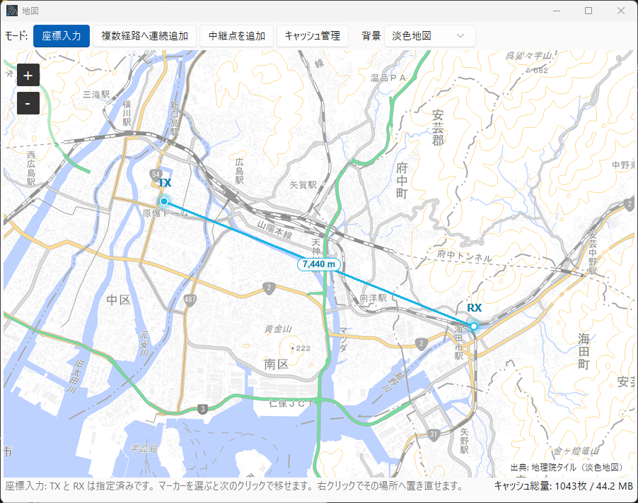
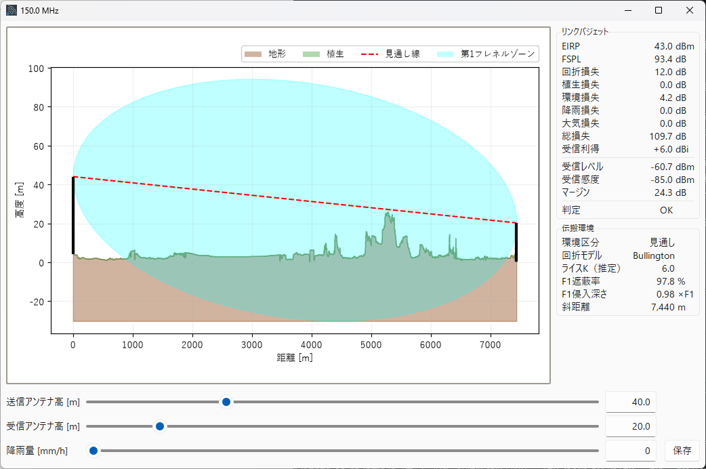
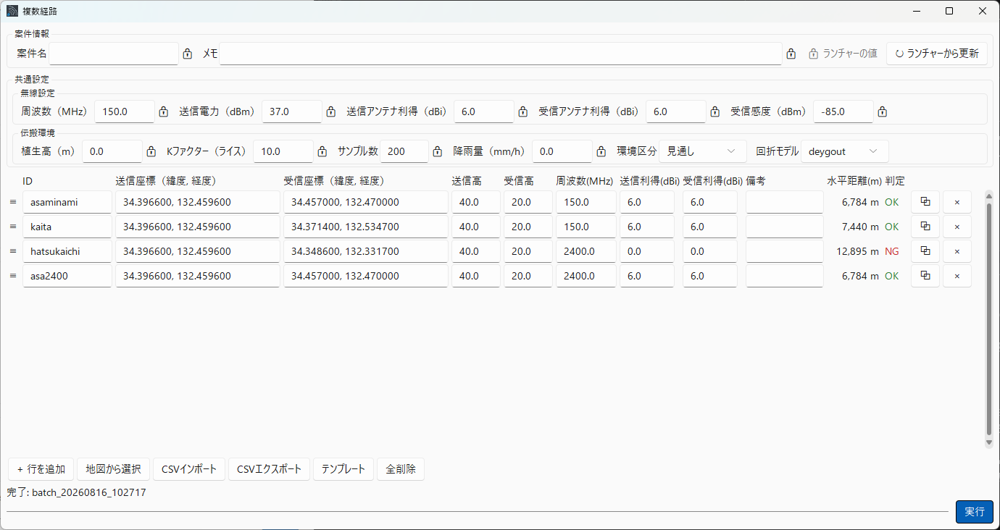
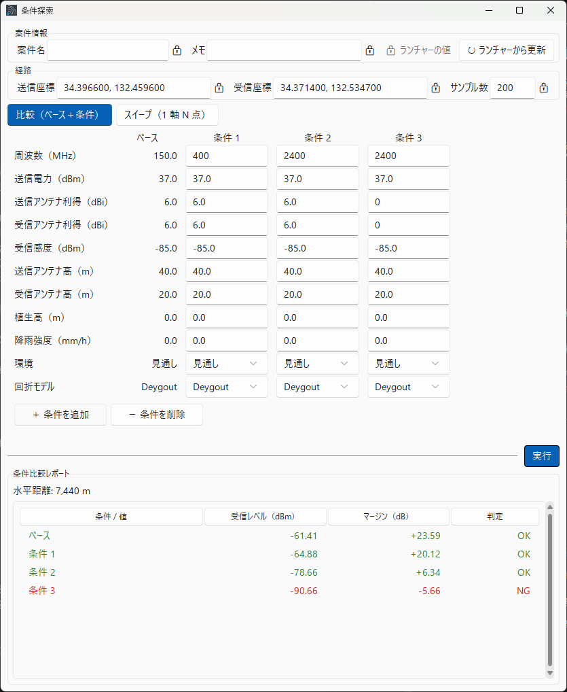
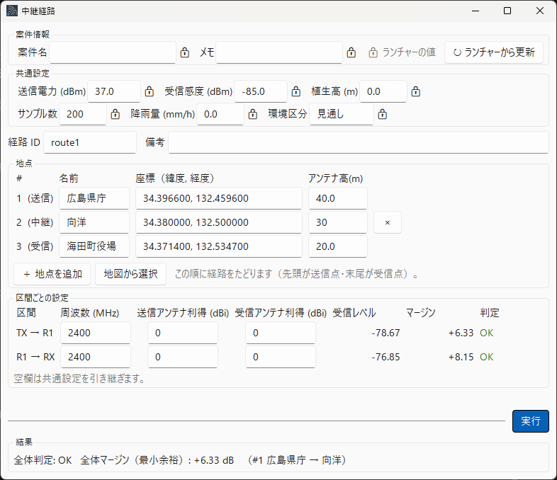

# RadioSim Pro 2.8


> **Intended reader**: users of the **Windows binary (`RadioSimPro.exe`)**. This is also the document that Help → Open Documentation shows inside the app.
> To run it from source or work on the code, see [developer_en.md](developer_en.md).

A desktop simulator for screening radio link propagation characteristics before field surveys.
Automatically retrieves DEM (Digital Elevation Model) data from the Geospatial Information Authority of Japan (GSI) and visualizes terrain profiles, diffraction loss, vegetation attenuation, and link budgets in real time.

---

## Table of Contents

1. [Overview](#overview)
2. [Requirements](#requirements)
3. [Installation &amp; Launch](#installation--launch)
4. [Menus](#menus)
5. [Map](#map)
6. [Usage — Single Mode](#usage--single-mode)
7. [Usage — Multiple Paths](#usage--multiple-paths)
8. [Usage — Condition Explorer](#usage--condition-explorer-compare--sweep)
9. [Usage — Relay Path](#usage--relay-path)
10. [Project Files (.rsproj)](#project-files-rsproj)
11. [Input Parameters](#input-parameters)
12. [Calculation Models](#calculation-models)
13. [DEM Retrieval Logic](#dem-retrieval-logic)
14. [Save Package](#save-package)
15. [Uninstall](#uninstall)
16. [Known Limitations](#known-limitations)
17. [Copyright](#copyright)

---

## Overview

RadioSim Pro is a tool designed specifically for **pre-survey screening** in radio link design.
Enter the coordinates, antenna heights, and radio settings for the TX (transmitter) and RX (receiver) stations, and the tool automatically retrieves GSI elevation data, draws a terrain cross-section, and determines link budget viability within seconds.

### Key Features

#### Workflows — four, by what you want to find out

| Workflow | What it answers |
| --- | --- |
| **Single Mode** | Does this one link close? Watch the terrain profile while you move antenna heights and rain rate on the spot |
| **Multiple Paths** | Many links at once, with CSV in and out |
| **Condition Explorer (compare / sweep)** | **Digs into one path.** Line up results under different conditions (base + up to 5), or sweep one axis over N points to see where the link starts to close — chart plus table. Terrain is fetched once |
| **Relay Path** | Bridges a link that will not close directly. Up to 7 relay points, a link budget per section, and **the overall verdict decided by the tightest section** (regenerative relay — each relay receives and transmits again) |

#### Map

- **Map** (4 modes): pick coordinates by clicking the map / continuously add paths from the map into Multiple Paths / place waypoints for a relay route / visualize, prefetch, and delete DEM cache

#### Calculation models

- Automatic terrain profile generation from GSI DEM PNG tiles (5 m / 10 m mesh)
- Earth curvature correction (standard atmosphere K = 4/3, fixed)
- Diffraction loss calculation using Deygout / Fresnel-Kirchhoff methods
- Vegetation attenuation (LoS intrusion depth model)
- Environmental loss (4 categories: Urban / Suburban / Rural / LoS)
- Rain attenuation (ITU-R P.838-3) and gaseous attenuation (ITU-R P.676-13 Annex 2)

#### Output and reports

- **A4 reports (v2)**: per-path / summary rendered as a single print-ready A4 page. Export to PDF straight from the browser with Ctrl+P (no extra software). Self-identifying header/footer carrying the project name, timestamp, and ID
- **Antenna initial aim (AZ/EL)**: true azimuth and elevation to point at the far end, shown for both ends in per-path reports (initial values; do the final tuning on-site by maximizing RSSI)
- **Automatic path map** in HTML reports (TX/RX, path, and distance overlaid on a map)
- **All-paths overview map** in the summary report (color-coded by verdict)
- **Print the whole batch at once**: `report_all.html` concatenates the summary and every path into one document — a single Ctrl+P produces the PDF for all pages
- Save results as a package (PNG / CSV / JSON / HTML / KML)

#### Reusing your input

- **Project files (`.rsproj`)**: bundle coordinates, all parameters, project info, batch rows, explorer conditions and the relay path into **one file** and pick the work up later
- **Project info (name + free note)**: entered in the launcher and inherited by both Single and Multiple Paths reports

#### Interface

- Real-time antenna height and rain rate sliders in the graph window
- Switchable coordinate notation (Decimal Degrees / Degrees Minutes Seconds)
- Japanese / English UI — switchable from the menu bar
- System-aware dark mode (Light / Dark / System auto)

### Accuracy Statement

The horizontal resolution of the DEM is 5–10 m, giving a practical accuracy of **±5–15 dB** for diffraction loss. ⚠️ **That range only holds for paths where the diffraction loss has not diverged** — on diverging paths the error is orders of magnitude larger, and **there is no way to tell in advance which paths diverge** (known defect, described below).
This tool is intended solely for screening purposes — determining whether a field survey is necessary — and must not be used as the basis for final link design decisions.

---

## Requirements

| Item     | Requirement                                                   |
| -------- | ------------------------------------------------------------- |
| OS       | Windows 10 / 11 (64-bit)                                      |
| Internet | Required for DEM retrieval (fetched tiles are cached locally) |

> **You do not need to install Python.** Everything required to run the app is bundled.

---

## Installation & Launch

### Installation

1. Extract the distribution ZIP file to any folder.
2. Place the extracted folder wherever you like. The app can be moved freely.

> **Note**: Do not modify the folder structure. `RadioSimPro.exe` cannot run as a standalone file.

### Launch

Double-click `RadioSimPro.exe`.

On first launch, the following directories and files are created automatically in the same folder as the exe:

| Path                   | Contents                                            |
| ---------------------- | --------------------------------------------------- |
| `terrain_cache/`     | Disk cache for DEM tiles (persists across sessions) |
| `results/`           | Output destination for saved packages               |
| `radiosim_conf.json` | UI settings and last-used input values              |

---

## Menus

The menu bar has three menus — **File / Settings / Help**. Every item is listed below.

### File

Operations that reach out to files or to the OS.

| Item                | Description                                                                                     |
| ------------------- | ------------------------------------------------------------------------------------------------- |
| Open Project...     | Loads a saved `.rsproj` and restores the whole input set → [Project Files (.rsproj)](#project-files-rsproj) |
| Save Project As...  | Writes the current input set to a `.rsproj` → [Project Files (.rsproj)](#project-files-rsproj)   |
| Load Parameters...  | Imports **simulation parameters only** from a settings file into the input form                 |
| Open Results Folder | Opens the `results/` folder in Explorer                                                         |

### Settings

Your choices are saved to `radiosim_conf.json` and persist across restarts.

| Item               | Options                          | Description                                                        |
| ------------------ | -------------------------------- | -------------------------------------------------------------------- |
| Theme              | System / Light / Dark            | Window color theme                                                   |
| Language           | English / 日本語 (plus your own) | UI language (requires restart) → [Adding your own UI language](#adding-your-own-ui-language) |
| Coordinate Display       | Decimal Degrees (DD) / Degrees Minutes Seconds (DMS) | How coordinates are **displayed** → see the note below |
| Proxy Settings...  | URL entry                        | Explicit HTTP proxy URL (blank = use OS proxy settings) → see below  |
| Load App Settings... | —                              | Imports **only** theme, language and proxy from a settings file      |
| Delete All Cache... | —                               | Deletes all downloaded DEM / map tiles (with confirmation)           |

### Help

| Item         | Description                          |
| ------------ | -------------------------------------- |
| Open Documentation | Opens this document in a browser       |
| About        | Shows the installed version            |

> **"Load Parameters" vs "Load App Settings"** — the former imports **simulation parameters** (coordinates, frequency, antenna heights, …); the latter imports **how the app looks and connects** (theme, language, proxy). **Neither touches the other's territory**, so opening a file you received from someone else will never silently change your display language or network settings.

> **The Map is not in the menus** — open it from the **"Map" button** at the bottom of the launcher (→ [Map](#map)).

### Adding your own UI language

Besides Japanese and English you can **add a translation of your own**. Create a `lang` folder next to the app, put `<language-code>.json` in it, and restart — the language then appears under Settings > Language.

```json
{
  "_name": "Français",
  "btn_run": "Exécuter",
  "menu_help": "Aide"
}
```

- `_name` is **the name shown in the language menu**. Write it in the language's own script — someone looking for their language is reading a screen they cannot read yet. Without it the file's code is shown instead.
- **You do not have to translate everything.** Only the keys you write are replaced; **the rest stay in English**. New keys added in later versions will not break your file.
- The most reliable key list is the bundled `core/i18n.py` (source distribution).
- **Keep the placeholders — `{n}`, `{dir}` and friends — exactly as they appear in the English text.** A key whose placeholders differ **is not applied** (it stays English), and at startup you are told what was skipped **grouped by reason** (how many per reason, with up to three examples). ⚠️ **Nothing appears when everything was applied** — silence means "no problems", not "the file was ignored" (whether it loaded is visible in **Settings > Language**). ⚠️ Applying such a translation would crash the app the moment that screen opens; **skipping it is what prevents that**. ⚠️ **The format spec inside a placeholder (the `.2f` in `{n:.2f}`) must match English too** — only the **position** in the sentence is yours to move.
- **Words that appear in artifacts are out of scope.** This covers reports (HTML) and KML, and also **the wording inside the terrain profile and comparison graphs** (axis names, legends, titles, the way units are bracketed) and **the environment types** (Urban / Suburban / Rural / LoS). Artifact wording is a contract with whatever reads the files, so it does not move for the screen's convenience. ⚠️ **These also show on screen with the same wording**: a figure becomes an artifact as soon as you save it, and the environment wording is written into reports and profiles, so the on-screen side cannot be translated on its own.
- The bundled `ja` / `en` cannot be overridden (a `ja.json` is ignored).

> ⚠️ **Layout is not guaranteed for languages you add.** Window sizes are verified against the length of the Japanese and English wording; longer wording may be clipped. Treat it as an **unofficial translation**.

### Coordinate Format (DD / DMS)

This selects **how coordinates are displayed**. It is not an input mode switch.

- **Input fields accept either notation.** With DMS selected you can still type `34.8, 132.6` (DD), and with DD selected you can still type `34°48'00.0"N, 132°36'00.0"E`. Everything is normalised to decimal degrees before the calculation runs.
- **Fields are reformatted into the selected notation when you switch the format, or when settings/a project are loaded.** Committing an entry does not reformat it, so **what you just typed stays in the form you typed it** — this is not a fault.

### Proxy Settings

If DEM tile retrieval requires an HTTP proxy (e.g. on a corporate network), open **Settings > Proxy Settings** and enter the proxy URL (e.g. `http://proxy.example.com:8080`). Changes take effect immediately (no restart needed). Leave blank and click OK to revert to OS proxy settings.

> If no proxy is configured and the elevation server is completely unreachable, the run **aborts after a dozen seconds or so** and a dialog asks you to check the proxy settings — it will not quietly finish and hand you flat terrain.

---

## Map



The **"Map" button** at the bottom of the launcher opens an auxiliary window over the GSI pale map. The map is a single app-wide instance (owned by the launcher), and a **mode selector** at the top switches between four modes (Pick Coordinates / Continuous Add / Waypoints / Cache). The core simulation works without ever opening the map; the map is a convenience layer.

> On opening, it auto-zooms and centers to fit the path length of the currently set TX/RX.

### Pick Coordinates mode (default)

Click the map to fill **whichever site is still empty** (TX first, then RX); the picked points are written back to the launcher's start/end coordinate fields (the numeric fields are always the source of truth). Once both are set, a plain click no longer writes anything — select the marker you want to move (see below) so that re-placing one site never wipes the other.

- Shows cyan endpoint markers (TX filled / RX hollow), a path line, and a distance label at the midpoint.
- Dragging pans the map (coordinates update only on a committed click).

### Continuous Add mode

A mode for stacking paths into Multiple Paths straight from the map. Selecting the **Append to Multiple Paths** mode opens (and raises) the Multiple Paths window; every time you place a **TX → RX** pair on the map, one row is appended to the batch and the map auto-resets for the next entry (no need to press "+ Add row" in the batch).

- Each row's RF settings (frequency, antenna gains, antenna heights) are **frozen from the launcher values at the moment of adding**. The workflow is to fix your conditions in the launcher first, then stack paths.
- All paths in the batch are drawn on the map, **drawn exactly as in Pick Coordinates mode**: a filled marker for TX, a hollow one for RX, the path line, and a distance label at its midpoint. The label carries the path ID, so you can tell which row of the batch each path belongs to. ⚠️ **Where TX and RX sit at nearly the same place the two markers overlap and cannot be told apart** — use the Relay Path window for those.
- Row changes on the batch side (delete, clear all, CSV import, add, duplicate, committing a coordinate-cell edit) are reflected on the map in real time.
- Closing the Multiple Paths window returns the map to Pick Coordinates mode.

### Waypoints mode

A mode for placing the points of a relay route from the map. Open the map from the Relay Path window and select the **Add waypoints** mode; each click appends **one point to the end** of the list (this is not the alternating TX → RX pick of Pick Coordinates mode).

- The map draws the polyline through the points and a **horizontal-distance badge for every hop**.
- ⚠️ **That horizontal distance appears on the map only.** The hop table has no distance column, and the report carries the **slant distance** (a different quantity).
- The map is a mirror of the Relay Path window. Adding and removing points is driven from that window, and the map follows it.

### Moving a point you have already placed

In all three input modes you can adjust a point on the map: **click its marker to select it** — it gets an amber ring and the status bar names it ("waypoint R1 selected", "RX of path p1 selected") — then **click the map where it should go**. The selection is used up by that one move, and **Esc** cancels it.

- The rule is one line: **a plain click adds a point, a click after a selection moves the selected one.**
- Dragging is still the map pan, on purpose: if dragging moved points, grabbing the map to scroll would silently rewrite your input.
- The window remains the source of truth. If the point you selected has been deleted or reordered in the window meanwhile, the map refuses the move and asks you to select again — it never moves a different point instead.
- ⚠️ **Terrain is sampled on a 5–10 m mesh.** If you move a point less than that, the status bar says so: the marker moves but the calculation can sample exactly the same ground and return the same result.

### Cache Management mode

Review the DEM tile cache and prefetch or delete tiles for any area — intended for downloading what you need for offline use before heading to a site with poor connectivity. Normal simulations already cache the tiles around each path automatically, so **you do not need to open this for everyday use**.

**Coverage display (automatic)** — As you pan or zoom, cached areas are continuously shaded. The color reflects the highest accuracy already cached.

| Color  | Accuracy                        |
| ------ | ------------------------------- |
| Green  | 5 m mesh (from airborne LiDAR)  |
| Yellow | 5 m mesh (from photogrammetry)  |
| Cyan   | 10 m mesh                       |

Unshaded areas are not yet cached.

**Controls (mouse gestures)**

| Gesture                       | Action                                  |
| ----------------------------- | --------------------------------------- |
| Drag                          | Pan the map                             |
| Ctrl + drag                   | Select an area and download             |
| Ctrl + Alt + drag             | Force re-download an area (re-fetch all)|
| Shift + Ctrl + drag           | Delete the cache for an area            |

Downloads and deletions show a confirmation dialog with the estimated number of areas and size. Progress and results appear in the status bar. Use **Settings > Delete All Cache** to clear the entire cache.

> **Be considerate of the tile server**: Tiles are fetched from GSI's public servers. Tiles already cached are never re-downloaded. Use force re-download over wide areas only when necessary.

---

## Usage — Single Mode



### 1. Launcher Window

An input form is displayed on startup.

#### Site Info

| Field                   | Description                                                   |
| ----------------------- | ------------------------------------------------------------- |
| Start Coords (Lat, Lon) | TX station latitude and longitude (e.g.`34.5429, 132.4118`) |
| End Coords (Lat, Lon)   | RX station latitude and longitude                             |
| TX Antenna Height (m)   | TX antenna height above ground                                |
| RX Antenna Height (m)   | RX antenna height above ground                                |

#### Radio Settings

| Field                    | Description                                  |
| ------------------------ | -------------------------------------------- |
| Frequency (MHz)          | Frequency (1–100,000 MHz)                   |
| TX Power (dBm)           | Transmit power                               |
| TX/RX Antenna Gain (dBi) | Antenna gain                                 |
| Sensitivity (dBm)        | Receiver sensitivity (minimum receive level) |

#### Environment

| Field                 | Description                                                                             |
| --------------------- | --------------------------------------------------------------------------------------- |
| Env Type              | Environment category (Urban / Suburban / Rural / LoS)                                   |
| Vegetation Height (m) | Average height of vegetation or buildings along the path                                |
| Rician K-Factor (initial) | LOS/scatter power ratio. Display only — does not affect link budget calculation (default = 10.0) |
| Sampling Points       | Number of terrain sample points (10–2000; more = higher accuracy but longer retrieval) |

#### Project Info (optional)

| Field   | Description                                                             |
| ------- | ---------------------------------------------------------------------- |
| Project | Project name shown in the report header (applies to both Single and Multiple Paths reports) |
| Note    | Free note. Shown on the **Single Mode report and the Multiple Paths summary page** (`summary.html` / `report_all.html`). **Not shown on per-path reports** — it describes the survey as a whole, so it is not repeated per path |

> Project Info is entered in the **launcher, which is the single source of truth**. Both Single Mode's saved report and Multiple Paths inherit these values. In Multiple Paths they are shown read-only (🔒) and pulled in with **"↻ From Launcher"**.

### 2. The "Run" Button (Single Mode)

Clicking the button runs data retrieval in two phases.

1. **DEM tile prefetch**: All tiles within the TX/RX bounding box are downloaded to the disk cache (up to 8 threads). Already-cached tiles are skipped, so subsequent runs complete instantly.
2. **Terrain elevation fetch**: Elevation is retrieved in parallel for each sample point (up to 8 threads). If the same TX/RX coordinates and sample count were used previously, cached data is loaded instantly.

### 3. Graph Window

After retrieval completes, the terrain cross-section graph is displayed.

#### Reading the Graph

| Element             | Description                                              |
| ------------------- | -------------------------------------------------------- |
| Brown fill          | Terrain (with earth curvature correction applied)        |
| Green fill          | Vegetation layer (terrain elevation + vegetation height) |
| Red dashed line     | Line of Sight (LoS)                                      |
| Cyan band           | 1st Fresnel Zone                                         |
| Black vertical bars | TX / RX antennas                                         |

#### Sliders

| Slider    | Range       | Description                           |
| --------- | ----------- | ------------------------------------- |
| TX Height | 0–150 m    | Adjust TX antenna height in real time |
| RX Height | 0–150 m    | Adjust RX antenna height in real time |
| Rain Rate | 0–100 mm/h | Adjust rain rate in real time         |

Moving a slider triggers automatic recalculation after a 50 ms debounce delay.

#### The "SAVE PACKAGE" Button

Saves the current display state to `results/YYYYMMDD_HHMMSS/` (see [Save Package](#save-package)).

### 4. Automatic Saving of Input Values

Each time you run a Single Mode simulation, the input values are saved to `radiosim_conf.json` and restored on the next launch. **No explicit save action is needed.**

To pull past conditions in from a file, or to carry a whole input set around, use the [File menu](#file) (**Load Parameters** / **Save Project As** / **Open Project**).

---

## Usage — Multiple Paths



Click the **Multiple Paths** button in the launcher to open the dedicated window.

### Design — refine in Single, commit in Multiple Paths

**Single (the launcher) is where you refine conditions; Multiple Paths is where you turn committed conditions into deliverables.** The launcher is the single source of truth, and each batch row is a **committed link frozen by copying the launcher fields at the moment the row was added**.

### Input Methods

**Manual entry**: Type IDs, coordinates, antenna heights, frequencies, and TX/RX gains directly into the table. Rows can be added, deleted, reordered by drag and drop, and edited cell by cell.

The **Dist (m)** column on the right is read-only and computed from the TX/RX coordinates (updated whenever a coordinate is committed). A mistyped coordinate shows up as an absurd distance, so it can be caught before running.

- **+ Add row**: Adds a row that freezes a copy of the current launcher fields (coordinates, frequency, gains, antenna heights).
- **Pick on map**: Opens the map in "Append to Multiple Paths" mode; every **TX → RX** pair you place adds one row (opening the map from this window is new in 2.7 — previously the flow could only be started from the map side).
- **Right-click a row**: Opens a per-row menu.
  - **→ Send to Single**: Loads that row's coordinates + RF into the launcher for adjustment.
  - **⟳ Update RF from Single**: Writes the launcher's current RF back into that row (**coordinates are kept**).
  - Duplicate / Delete.

**CSV import**: Click the Template button to save a sample CSV, edit it, then import.

#### CSV Format

Required columns: `id, start, end, h_tx, h_rx`

Optional columns: `freq, gain_tx, gain_rx, note`

```csv
id,start,end,h_tx,h_rx,freq,gain_tx,gain_rx,note
path01,"34.54, 132.41","34.53, 132.40",30.0,10.0,2400,12.5,8.0,Main link
path02,"34.55, 132.42","34.52, 132.39",20.0,15.0,,,,Sub link
```

- `start` / `end` must be quoted because they contain a comma
- `freq` / `gain_tx` / `gain_rx` fall back to the Common Settings values when omitted (they are **per-link identifying attributes** that may differ per path). Env type, rain rate, and diffraction model are set globally in Common Settings
- Legacy CSVs without `gain_tx` / `gain_rx` columns still load (backward compatible; gains inherit Common Settings)
- Column names are **case-insensitive and ignore surrounding spaces** (`ID,Start,…` loads fine). `id` values must be unique **case-insensitively** (`p01` and `P01` would map to the same output folder, so they are rejected as duplicates)

### Common Settings (a snapshot of the launcher)

The **Common Settings** panel at the top defines default values used whenever a per-path override is not specified. It is **read-only**, shown as a snapshot of the launcher (the source of truth). Use the **↻ From Launcher** button to pull in the launcher's current values.

### Running and Results

Click **Run** to process paths sequentially. The bar shows progress (done / total), and **each verdict is returned to the row that produced it**.

On completion, the following are saved to `results/batch_YYYYMMDD_HHMMSS/`:

| File                         | Contents                                                         |
| ---------------------------- | ---------------------------------------------------------------- |
| `summary.html`             | Summary report for all paths (with graph thumbnails)             |
| `summary.csv`              | Numerical results for all paths (spreadsheet-compatible; distances in metres) |
| `summary.kml`              | Google Earth KML with OK / NG / Error color coding               |
| `report_all.html`          | Summary + every path in one document (Ctrl+P prints them all)    |
| `{id}/report.html`         | Per-path detailed report (terrain graph + path map embedded)     |
| `{id}/profile.png`         | Terrain cross-section graph                                      |
| `{id}/path.kml`            | 3D KML with terrain, LoS, Fresnel zone, and obstruction segments |
| `{id}/settings.json`       | Per-path input parameters                                        |
| `{id}/terrain_profile.csv` | Terrain profile data                                             |
| `{id}/report.txt`          | Text-format link budget report                                   |

---

## Usage — Condition Explorer (Compare / Sweep)



A screen for **taking one fixed path and digging into it under different conditions**. Open it with the "Condition Explorer" button in the launcher. The path (coordinates) and sample count are fixed to the launcher values, so **terrain is fetched only once** and the N conditions are then computed on top of it (repeat runs on the same path do not re-fetch DEM).

The toggle at the top switches between two modes. After changing coordinates or parameters in the launcher, press **"↻ From Launcher"** at the top right to pull them in (**until you do, the run uses the values shown on screen** — what you see is what is computed).

### Compare (base + N conditions)

- The leftmost **Base** column is the launcher's current values (read-only) — the reference never moves.
- In columns **Cond 1 ... Cond 5**, change only the fields you care about (they start as copies of the base). "+ Condition" adds up to 5 columns.
- You can vary frequency, TX power, TX/RX antenna gain, RX sensitivity, TX/RX antenna height, vegetation height, rain rate, environment and diffraction model. **Coordinates and sample count cannot be varied** (comparing different paths is what Multiple Paths is for).
- The report is a difference table with **the delta from the base shown inside each cell** (e.g. `-76.44 (+13.56)`). Rows that differ are tinted.

### Sweep (one axis, N points)

- Pick an **axis** (antenna height, frequency, rain rate, ...), a range, and **Points** (2-41).
- The range can be entered two ways: **From / To** (absolute values) or **Base ±** (swing around the current value). **Base ±** matches how the question is usually asked — "what happens within ±10 m of the current 30 m?". Switching between them keeps the span, and the range is always normalised to From / To internally (that is also what a project file stores).
- The report contains **a line chart and a numeric table**. The chart draws the verdict threshold (0 dB margin) and colours each point by verdict (OK = green / NG = orange); the colour change is where the link starts to close. Even at the maximum 41 points the report stays on **a single A4 page** — the table stays a single column (rows are simply tightened), so the progression can be read straight down.
- When the margin spans a huge range (deeply obstructed paths), the vertical axis switches to a log-like scale so the region around the threshold stays readable.

### Running and results

**Run** proceeds through terrain fetch -> condition calculation -> report generation, with the progress bar covering all three. On completion a dialog reports the output directory and offers to open the report (same flow as Single and Multiple Paths). To look at it later, use "Open Results" in the launcher.

The following are saved to `results/scenario_YYYYMMDD_HHMMSS/`:

| File              | Contents                                                          |
| ----------------- | ----------------------------------------------------------------- |
| `scenario.html` | Single-page A4 report (compare = difference table / sweep = chart + table) |
| `scenario.csv`  | Numbers for every condition / point (spreadsheet-compatible)      |

---

## Usage — Relay Path



For **one link carried over relay points**. Open it with the **Relay Path** button in the launcher. Use it when two points cannot see each other directly and a ridge (or another site) in between can carry the traffic.

### Assumption — regenerative relay

Each relay point **receives and then transmits again**. That means:

- Every section gets its own independent link budget — **section losses are never added together**.
- **The overall verdict is decided by the tightest section.** The report shows the overall verdict **and** the per-section breakdown, because "it fails" is not actionable unless you can see which section is short.
- **Passive reflectors are out of scope.** Their losses combine differently and are not part of this tool's calculation.

### Waypoints and sections

- The **waypoint table** is the input surface. **The first point is the transmitter and the last is the receiver**; "Add point" inserts a relay **before the receiver**, so the order on screen is the order of the route. Each row shows its role (TX / relay / RX).
- **The `＋` on a row inserts a relay directly below it** — to add one point in the middle you no longer have to delete the ones after it and retype them. The receiver row has no `＋` because the last point is fixed as the receiver. ⚠️ **Default names are not renumbered** (that would overwrite the entry of anyone who renamed `R1` to something meaningful); the order is carried by the rows and the role shown on each of them.
- Each waypoint has **coordinates and an antenna height**. **Relay rows carry an `×` so you can delete any single point** (TX and RX cannot be deleted, so they have no `×`). Deleting a relay also drops the settings of the section leaving that point; inserting one adds an empty section leaving it, so inserting and deleting at the same position returns you to where you were.
- Coordinates accept **either decimal degrees or degrees/minutes/seconds**; committing an entry reformats it to the notation chosen in Settings > Coordinate Display. **Height belongs to the point, not to the section** — a relay has one antenna, so it must not be possible to enter one height as "section 1 RX" and a different one as "section 2 TX".
- The **section table** lets you override **frequency and TX/RX gain per section** (blank = use the common settings from the launcher), because the two antennas at a relay are often different.
- **Pick on map** switches the map into waypoint mode; each click fills the next waypoint. The map draws a polyline through the points in order and puts the **horizontal distance of each section** at the midpoint of its line — the section table has no distance column, so this is where you read how long a section is.
- TX and RX start from **the launcher's coordinates as they were when the window opened** (relay points start empty).
- Up to 7 relay points (8 sections).

> **⚠️ Relay points are meant to be placed, not dragged around to explore.** Each section fetches its own terrain data, so moving a point triggers a new download. Use the [Condition Explorer](#usage--condition-explorer-compare--sweep) to explore heights and conditions.

### Running the route

**Run** processes the sections in order, filling the result list section by section (received level, margin, verdict), and finishes with the overall verdict (the tightest section).

The following are saved to `results/multihop_YYYYMMDD_HHMMSS/`:

| File | Contents |
| --- | --- |
| `route.html` | Combined sheet: overall verdict, per-section breakdown, overview map |
| `report_all.html` | Combined sheet + every section in one document (Ctrl+P for a single PDF) |
| `hops.csv` | One row per section (spreadsheet-compatible) |
| `{id}/` | Per-section package (same structure as Single Mode) |

---

## Project Files (.rsproj)

Bundles **the whole input set into one file** so you can pick the work up later. Use **File → Save Project / Open Project**.

### What is included

| Included | Not included |
| --- | --- |
| Coordinates and all parameters (the launcher inputs) | **Results** (those belong to `results/`) |
| Project info (name and free note) | **App settings** (theme, language, proxy) |
| Multiple Paths rows | Window positions, sizes, open/closed state |
| Explorer conditions (compare columns / sweep axis and range) | |
| Relay path waypoints and sections | |

**Leaving out theme, language and proxy is deliberate** — opening a project you received from someone else must not switch your display language or your network settings.

### Saving

- Open windows (batch / explorer / relay path) contribute their **current** values.
- **Closed windows keep their contents too** — the previous values are carried forward, so closing the batch window before saving does not delete your rows.
- Anything that is not a readable number is not written; the dialog tells you which part was skipped (so a broken file is never produced silently).

### Opening

- **Open windows are not closed.** A bar appears at the top of each of them, and the window's contents are replaced **only when you press "Apply to this window"** (nothing changes until you do). Dismiss the bar with `×`.
- The launcher fields and project info are replaced immediately.
- **Contents for closed windows appear when you open them** — this app freezes a window's inputs when it opens, and loading follows the same rule.
- If you close a window without applying, **what you saw on screen wins** (that is what gets written on the next save).
- A file saved by a newer version of RadioSim will not be opened (you are told, rather than having it silently mangled).

---

## Input Parameters

### Validation Ranges

| Parameter         | Min                            | Max     | Unit   |
| ----------------- | ------------------------------ | ------- | ------ |
| Frequency         | 1                              | 100,000 | MHz    |
| TX Power          | -30                            | 60      | dBm    |
| TX/RX Gain        | 0                              | 60      | dBi    |
| Sensitivity       | -130                           | -20     | dBm    |
| TX/RX Height      | 0                              | 500     | m      |
| Vegetation Height | 0                              | 100     | m      |
| Rician K-Factor   | 0                              | 30      | —     |
| Sampling Points   | 10                             | 2,000   | points |
| Rain Rate         | 0                              | 200     | mm/h   |
| Env Type          | Urban / Suburban / Rural / LoS | —      |        |
| Diff Method       | deygout / single               | —      |        |

---

## Calculation Models

### Earth Curvature Correction

Radio waves are refracted by the atmosphere and bend more than the Earth's curvature alone. This is modeled using the effective Earth radius factor K. This tool uses the standard atmosphere value (K = 4/3 ≈ 1.333) as a fixed internal constant.

```
Effective Earth radius  Re = R_earth × K  (K = 4/3, fixed)
Curvature correction   Δh(d) = d × (D - d) / (2 × Re)  [m]
```

| K value      | Meaning                                     |
| ------------ | ------------------------------------------- |
| 4/3 ≈ 1.333 | Standard atmosphere (value used by this tool) |
| K > 4/3      | Atmospheric duct (waves bend more strongly) |
| K < 4/3      | Sub-refractive conditions                   |

### Fresnel Zone

The 1st Fresnel zone radius (ITU-R P.526):

```
r₁(d) = √(λ × d₁ × d₂ / (d₁ + d₂))
```

When the 1st Fresnel zone is obstructed by terrain or vegetation, diffraction loss occurs.

### Diffraction Loss

#### Deygout Method (default, **custom implementation**)

A recursive model that handles multiple diffraction edges: the worst obstruction is taken as the main obstacle, the path is split around it, and losses are summed recursively.

⚠️ **This is not "ITU-R P.526 compliant"** (wording corrected 2026-08-09). The only thing taken from P.526 is the **knife-edge loss function J(ν)**. The current P.526-16 specifies a **cylinder model** for multiple obstacles and **Bullington** for general terrain, plus standard correction terms — **none of which are implemented here**. ⇒ **Broad obstacles are over-estimated** (known defect — see Known Limitations above).

#### Fresnel-Kirchhoff Loss J(ν)

```
J(ν) = 6.9 + 20 × log₁₀(√((ν - 0.1)² + 1) + ν - 0.1)  [dB]  (ν > -0.8)
J(ν) = 0                                                          (ν ≤ -0.8)
```

#### Single Method

Applies J(ν) only to the maximum ν across all sample points. Fast, but it does not represent the combined loss of multiple ridges.

### Vegetation Attenuation

```
Intrusion depth(d) = max(0, veg_top(d) - LoS(d))
Weight(d)          = clip(intrusion depth / r₁(d), 0, 1)
Effective length   = Σ[weight(d)] × sample spacing
Veg Loss           = min(effective length × coeff, 45 dB)
```

| Frequency band | coeff         |
| -------------- | ------------- |
| Below 1 GHz    | 0.12 × f^0.5 |
| 1–6 GHz       | 0.20 × f^0.7 |
| Above 6 GHz    | 0.35 × f^0.9 |

### Environmental Loss

```
Env Loss = base + blocked_ratio × blk_c + slant_dist × dist_c + diff_loss × diff_c
```

| Environment | base | blk_c | dist_c | diff_c | min | max  |
| ----------- | ---- | ----- | ------ | ------ | --- | ---- |
| Urban       | 10.0 | 0.08  | 1.20   | 0.15   | 6.0 | 30.0 |
| Suburban    | 6.0  | 0.05  | 0.80   | 0.10   | 3.0 | 30.0 |
| Rural       | 4.0  | 0.03  | 0.50   | 0.08   | 2.0 | 25.0 |
| LoS         | 2.0  | 0.01  | 0.30   | 0.05   | 1.0 | 15.0 |

### Rain Attenuation (ITU-R P.838-3)

```
γ_R = k × R^α  [dB/km]
Rain Loss = γ_R × d_slant
```

Rain sensitivity at 2.4 GHz is very low (≈ 0.1 dB/km at 100 mm/h). Practical impact begins above 10 GHz.

### Gaseous Attenuation (ITU-R P.676-13 Annex 2)

```
γ_total = γ_O₂ + γ_H₂O  [dB/km]
Gas Loss = γ_total × d_slant
```

### Link Budget

```
EIRP       = P_tx + G_tx                             [dBm]
FSPL       = 20×log₁₀(d) + 20×log₁₀(f) - 147.55   [dB]
Total Loss = FSPL + Diff + Veg + Env + Rain + Gas   [dB]
P_rx       = EIRP + G_rx - Total Loss               [dBm]
Act Margin = P_rx - Sensitivity                     [dB]
Status     = OK (≥ 0 dB) / NG (< 0 dB)
```

---

## DEM Retrieval Logic

### Data Sources

| Layer ID      | Resolution           | Zoom | Coverage                      |
| ------------- | -------------------- | ---- | ----------------------------- |
| `dem5a_png` | 5 m (airborne LiDAR) | 15   | Urban areas, mountain regions |
| `dem5b_png` | 5 m (photogrammetry) | 15   | Wider coverage than dem5a     |
| `dem_png`   | 10 m (base map)      | 14   | Nationwide                    |

Layers are tried in order: `dem5a_png` → `dem5b_png` → `dem_png`. If a higher-priority layer returns 404 or a missing-data pixel, the next layer is used.

### Caching Strategy

- **Tile prefetch**: At simulation start, all tiles within the TX/RX bounding box are pre-downloaded to the disk cache (supports offline use and speeds up batch processing)
- **Disk cache**: Tiles saved to `terrain_cache/`, persists across sessions
- **Terrain cache**: If TX/RX coordinates and sample count match a previous run, DEM retrieval is skipped entirely (cleared on app restart)

---

## Save Package

### Single Mode

Saves to `results/YYYYMMDD_HHMMSS/`:

| File                    | Contents                                                 |
| ----------------------- | -------------------------------------------------------- |
| `profile.png`         | Terrain cross-section graph (150 dpi)                    |
| `report.html`         | Detailed report (single A4 page) with the terrain graph, a path map, and antenna initial aim AZ/EL embedded |
| `path.kml`            | 3D KML for Google Earth                                  |
| `settings.json`       | Complete input parameters (reloadable via File > Load Parameters) |
| `terrain_profile.csv` | Terrain profile data                                     |
| `report.txt`          | Text-format link budget report                           |

> **A4 reports (v2)**: `report.html` / `summary.html` are rendered as a single print-ready A4 page (`@page A4` / `@media print`). Open in a browser and use **Ctrl+P → "Save as PDF"** to get an A4 PDF with no extra software. Turn **"Headers and footers" off** in the print dialog (the report carries its own self-identifying header/footer with the project name, timestamp, and ID). The project name and free note come from the launcher's Project Info fields.
>
> **Print all at once (`report_all.html`)**: choose **"Open all pages"** in the completion dialog to open it ("Open summary" opens `summary.html` as before). Multiple Paths runs also save `report_all.html`, which concatenates the summary ledger and every per-path report into one document. **Open it and press Ctrl+P to get the PDF for all pages at once** (page 1 = the summary ledger, pages 2+ = one A4 page per path). Clicking a thumbnail in the ledger jumps to that path inside the same document. `summary.html` and `{id}/report.html` are still written separately, so use those when you only need to share one path. The combined file gets large with many paths (each embeds its terrain profile).
>
> **Path map**: `report.html` (single) embeds a static map with TX/RX, the path, and the distance on the GSI pale map; `summary.html` (batch) embeds an **all-paths overview map** (north-up, color-coded by verdict). Where map tiles cannot be fetched, the map is omitted with a short note and the report is still produced.
>
> **Antenna initial aim (AZ/EL)**: the Site Info of `report.html` shows the true azimuth AZ and elevation EL to point at the far end, for both ends (geometry from existing data = initial values; do the final tuning on-site by maximizing RSSI). AZ is a **true** azimuth — to aim with a magnetic compass, correct for local declination (in Japan magnetic north is ~7-9° west of true north, varies by region).

### Multiple Paths

Saves to `results/batch_YYYYMMDD_HHMMSS/`:

| File             | Contents                                         |
| ---------------- | ------------------------------------------------ |
| `summary.html` | All-path summary with thumbnails                 |
| `summary.csv`  | Numerical results for all paths                  |
| `summary.kml`  | Google Earth KML for all paths                   |
| `report_all.html` | Summary + every path in one printable document |
| `{id}/`        | Per-path package (same structure as Single Mode) |

---

## Uninstall

1. Confirm the app is not running.
2. Delete the entire extracted folder.

The app writes no data to the registry or AppData. Deleting the folder is a complete uninstall.

---

## Known Limitations

### Accuracy

- DEM horizontal resolution (5–10 m) is the hard ceiling for accuracy; individual building obstructions are not modeled
- The Deygout method is an approximation; **on paths that do not diverge**, errors of ±5–15 dB relative to measurements are expected (**the range does not apply to diverging paths**)
- 🔴 **Diffraction loss (the default Deygout method) can come out far too high, and there is no way to tell in advance which paths are trustworthy** (known defect, fix planned). A broad ridge is counted as many independent knife edges, so mountain paths reach **hundreds to thousands of dB**. ⚠️ **Neither the amount of relief nor the Fresnel blockage tells you whether a result is safe**: over a smooth 25 m hill (10 km, 150 MHz) the Single method returns **0.0 dB** while Deygout returns **65 dB**, with Fresnel blockage still under 100%. **The same relief can differ by more than 10x depending on the shape of the terrain** (a narrow peak gives 5.7 dB under the same conditions). ⚠️ **Fresnel blockage is capped at 100% everywhere it is shown** (screen, report, CSV) even though the internal raw value goes above it, so the percentage will not warn you.
- 🛡 **What you can do about it today**: switch "Diffraction Model" to `Single`, run the path again, and compare the two numbers. **Where they differ substantially, do not trust the default (Deygout) value** — the verdict may read NG, but **you cannot tell from these numbers whether that NG is correct**. ⚠️ **This does not tell you which one is right.** A large gap means the result **depends heavily on the choice of model** — that is the diagnosis. **A small gap does not guarantee accuracy either**, since neither value has been checked against measurements or a reference implementation. ⚠️ `Single` does not represent the combined loss of several obstacles (it looks at one point only), so it **can come out lower than Deygout**. ⚠️ How that relates to the true value is equally unknown — it does not mean `Single` is the safer side
- The vegetation model is empirical; species, density, and seasonal variation are not accounted for
- Environmental loss coefficients are empirical; suitability for specific regions is not guaranteed

### Data Coverage

- **DEM coverage is Japan only.** GSI tiles do not cover areas outside Japan; coordinates outside Japan will return elevation 0 m
- `dem5a_png` / `dem5b_png` (5 m) do not cover the entire country; missing areas fall back to `dem_png` (10 m)
- Ocean, lakes, and missing data areas are treated as elevation 0 m

### Path Length

- Paths up to 20 km are recommended for screening purposes
- Longer distances exceed the practical accuracy limits of this tool

### Operation

- Parameters cannot be changed while the graph window is open; close it first, then re-run
- The terrain cache is cleared on restart; the disk cache persists across sessions
- When monitors with different display scales are in use, moving a window to another monitor resizes the text of the whole application to match that scale. Only the menu bar strip (File / Settings / Help) is drawn by Windows, so it keeps the scale of the monitor its own window sits on and may look smaller (or larger) than the rest. This affects appearance only, not operation

---

## Copyright

© 2026 BearValley AI Craftworks. All rights reserved.

This software is distributed under the **MIT License**, commercial use included. The license text ships as `LICENSE`, next to `RadioSimPro.exe`.
